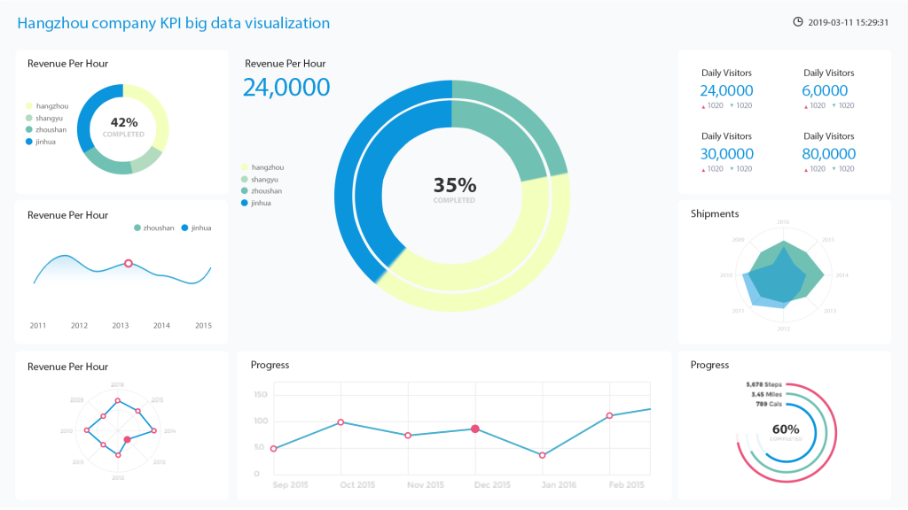

目前，很多研究者将导航首次使用超大触摸屏的用户产品看的尤为重要。并且很多导航运用可视化大屏之后就会更加吸引用户进入设计并与之交互。Datafocus对自身的要求更加严格，要求设计师确保用户在访问不同内容时实现不同交互体验。关于如何运用可视化大屏，接下来就一起来看看相关经验。

1. 采用一般网站导航模式

很多时候，一些导航栏设置在屏幕上方或侧边栏中。当用户访问不同的内容或页面时，就导致很多内容不能实现可视化。

1. 在这些屏幕上尽量减少基于键盘的输入

很多人在使用键盘的时候可能会变得笨拙和缓慢，这样不仅消耗用户额外的体力，并且在很大程度上会将可视化变得不灵敏。因此，应该尽量避免此类操作，如果确有基于键盘的输入，应该设置一个键盘切换命令，以获得更好的使用体验。

第三、不要创建太多的选项

其实并不是可视化大屏屏幕越大就越好，大屏幕会导致用户选择的余地越大，需要耗费的时间也就越多。与其这样，还不如大家将按钮和交互看作是如何让用户快速做决定的一个游戏。简化设计的好处是减少设计元素和视觉混乱，创造一个更清晰实用的界面，从而使用户操作更便捷。

第四、充分考虑用户隐私

用户的隐私是一个值得考虑的问题。用户在公共场所中使用大屏设备，特别是需要输入一些重要信息时，并不希望其他人知道自己在做什么。但是屏幕越大，其他人就越有可能看到用户输入的内容。

以上，就是关于可视化大屏选择和使用中的一些实用经验，基于上述的内容，datafocus一直致力于不断的改进和完善中，目的就是优化用户体验和完善自身的不足。
