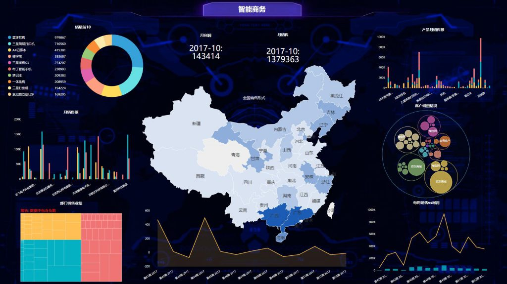

随着互联网的快速发展，大数据时代如期而至，很多大中型企业也越来越注重大数据的分析和利用。可视化大屏在设计运用的时候都少不了datafocus。而大家对于可视化大屏的功能特点都知道多少呢，今天就来一起看看你最熟悉哪部分吧！

1、数据集设计

数据集是针对数据源的定义，对于数据源进行独立定义，一个报表的前端呈现本身也可能涉及到多个数据源。数据集设计，其实就是返回一个二维的数据集合，而却还可以有多列。我们需要通过配置的方式来进行实现，不过是先选择数据源，然后在自定义SQL语句，最后返回具体的数据集对象。在SQL过程中我们可以对字、段、标题、名称等进行转义。其实更加解耦的方法就是数据集可以直接选择具体的WS服务，由服务返回一个二维的数据集对象，这种方式可以进一步实现报表平台和底层数据库的解耦。

2、单面板设计

单面板设计简单来说就是将前端的展现方式，究竟是折线图、饼图还是雷达图等，通过后端的数据集进行绑定。在这个过程中重点就是要确认具体的图表呈现的一些关键配置，包括X、Y轴显示、图表名称、图例是否显示等关键配置，都需要在单面板设计中配置完成。

3、大屏设计

对于大屏设计，实际上里面又有几个关键点，首先就是大屏展示需要有一个CSS模板，这个模板决定了所有的单面板图表的配色风格，包括具体的底色、前端的色系选择等。选择模板就是确保最终的大屏展示各个单面板风格能够完全保持一致。

大屏面板设计，业界基本上采用的是Gird布局模式即可，每个单面板你唯一要确定的就是横向跨几行，纵向跨几列即可。类似于上面的图，我们采用4\*4Grid进行布局，中间的地图展示则是横向跨3行，纵向跨两列。

4、大屏整体的展示动态刷新能力

在以上完成设计后，我们整个大屏展示效果也就出来了。虽然我们在大屏设计中没有考虑动态查询功能，但是大屏监控仍然需要动态进行刷新。因此在设计大屏的时候需要具备动态刷新能力，考虑到后续具备一定的扩展能力，我们需要能够将关键的一些变量参数传递到图表展现中。

以上这些有关可视化大屏功能特点的总结介绍，作为设计者的你们都应该熟记掌握，而运用者对于其功能、特点也应该更加熟悉。想要了解更多可视化大屏的相关知识，那就点击进行收藏吧。
