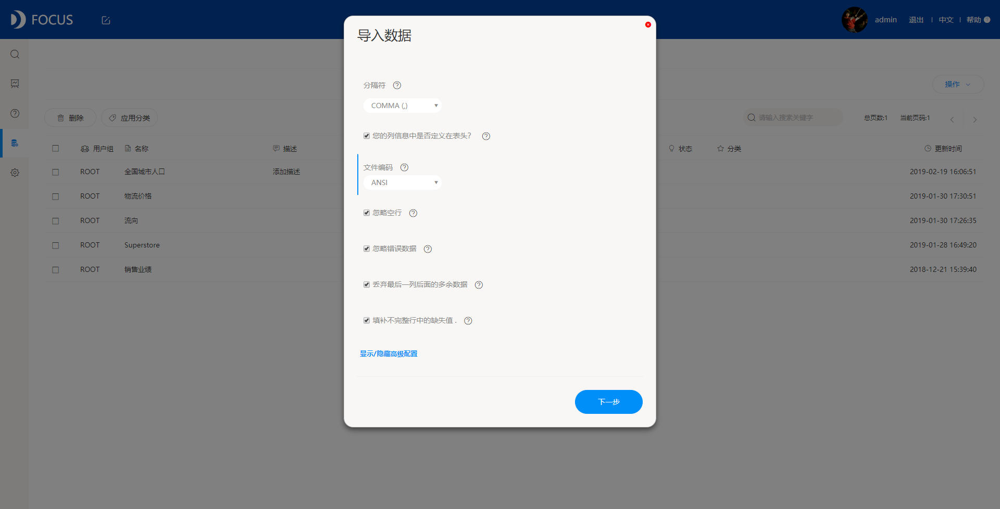

在数据信息时代，我们对大量的数据进行挖掘分析，并渴望从中获取有价值的信息。如何让用户更直观的察觉到数据之间的差异，快速地做出相应的策略与决策，减少相应的时间成本，这是一大要事。

随着信息技术的发展，数据可视化工具大量涌现，完美解决上述问题。但是新的问题出现了，这么多的可视化工具，我应该选择哪一个？这里给大家推荐几款现今最受欢迎的数据可视化工具，可供参考。

Tableau

Tableau是一款很强大的可视化工具，其图表动态效果以及图表样式做的很好，可视化效果一流。Tableau不仅可以制作简单图表，还可以绘制地图等高级图形，用户可以直接将数据拖拽到系统中，但由于是国外的软件，学习资料大部分为英文，故学习起来稍有点困难。

DataFocus

DataFocus是一款专业的数据分析工具，也是一款专业的可视化工具。其是国内第一个采用搜索交互方式的可视化工具，其图表丰富，同样可以制作地图，经纬图等高级图形，且制作方式比tableau简单，但是效果相差无几。DataFocus操作非常简单，故学习成本很低，普通的业务人员就可以很快上手使用。

Excel

你没听错，是我们常用的Excel，大家一直都在用Excel处理数据，但是很少用Excel来展示数据，Excel其实是一款入门级的数据可视化工具，当然其可视化效果肯定没有前面两款专业的可视化工具好，功能也没有前面那两款强大，包括图表样式也没有前面的多，那为什么还要介绍Excel呢？主要是因为其覆盖面广，熟悉度高，对于简单的可视化要求也能够基本满足。
