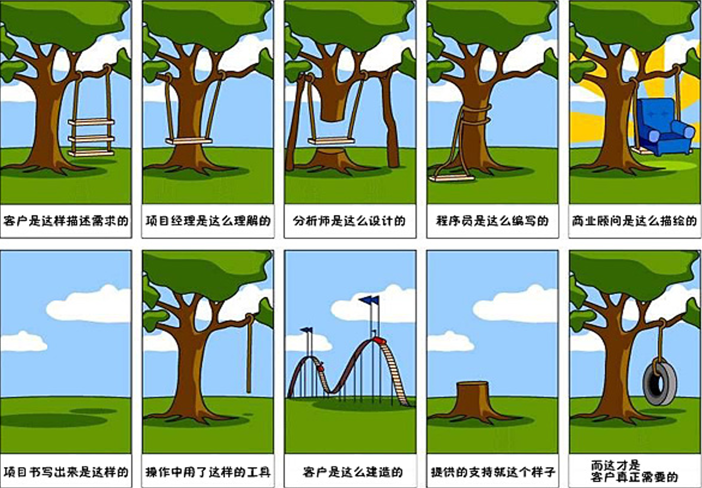

数据可视化是将数据分析的结果用一些图形来展示，以显示这个结果代表的趋势、数量、占比等。尤其是很多朋友在用过DataFocus工具后，都被其“美貌”所吸引，也导致很多朋友误以为有些数据被掩盖了，而更有人则怀疑这只是将朴实的数据分析结果给变得花哨了，只是为了给老板看而给老板看，甚至老板看了以后只是冷漠的一声回应后继续按经验决策。所以，可视化真的是花哨么。

我们认为，很多人都没有搞清楚数据可视化的真正含义，和信息图甚至美术混合在了一起。信息图是指数据的可视化表现形式。主要应用于必须要有一个清楚准确的解释或表达甚为复杂且大量的信息，例如在各式各样的文件档案上、各个地图及标志、新闻或教程文件，表现出的设计是化繁为简。数据可视化实际上是一种技术，将企业的各种报表excel数据结果，导出成容易理解关键信息的图形。而认为可视化是一种花哨的观众，可能理解错了其根本含义。举个例子，数据可视化就像把数据烹饪成一些美味可口的佳肴，比如某些数据原来是五花肉，可视化将它变成容易和喜欢食用的红烧肉，但是如果烹饪过度，就会变成焦肉，吃力不讨好。

所以我们首先应该理解一个目标，可视化一定是想让数据的分析更简单，一定是积极的。让需要花好几个小时去解读和分析的数据，变成1分钟能看懂的图形；让各种复杂算法靠边站，只留下最直观的图形以供人对比；让不懂数据的领导不再拍桌子骂你的数据看不懂，而是能一眼就看出问题和优点。如果股市里不再是K线图，而是一大张表格上面密密麻麻的数据，那会是怎样；如果函数的关系呈现不再是一张图形，而是密密麻麻的数字结果，那会是怎样。而像是有名的艾瑞咨询、电商数据等门户网站，各类数据报告也是以可视化的方式呈现，让读者一眼看出趋势、占比、变化等。

因此，可视化最终的目的，并不是花哨，而是压缩信息，提取有效结果，让决策者的决策依据更为清晰明了。
