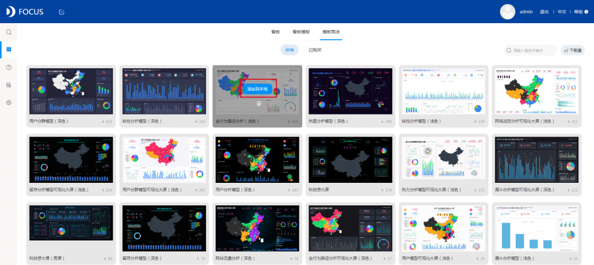

在进行数据分析、数据图表绘制或数据可视化之前，必须要对数据的类型以及数据之间的关系有所了解。

通常在其他一些数据分析教程中，会看到将数据分为两个大类，分类数据和量化数据（维度和度量），但是为了更好的进行数据分析和呈现，建议将数据分为四个大类：

分类数据：可以进行分组或排序，通常都是文字类型（可以分为有序和无序，均为离散数据）

量化数据：可以测量，所有的值都是数字（可以是连续数据或离散数据）

时间数据：以时间作为数据内容（既可以作为连续数据，又可以作为离散数据）

地理数据：用作地理位置的标示（地名／经纬度信息，属于离散数据）

当然，从严格的分类角度讲，时间和地理数据应该都属于分类数据（维度），把它们单独分离出来的目的是为了更好的进行可视化分析和展示。

在此，再简单讨论一下离散和连续。“离散”和“连续”是一个数学术语，但是不要害怕，定义其实很简单。连续意指“构成一个不间断的整体，没有中断”；离散意指“各自分离且不同”。

把数据当作离散数据，并作为标题时，数据点都会落在刻度上，并进行区隔。通过数据的分类和特点，就有了数据可视化的一些基础信息，这对于我们选择图形来说，相当于有了一个筛选条件。所以，DataFocus解决的就是帮助0基础的决策人员或者分析人员，直接用搜索的方式筛选出相应数据并进行智能可视化展现。
