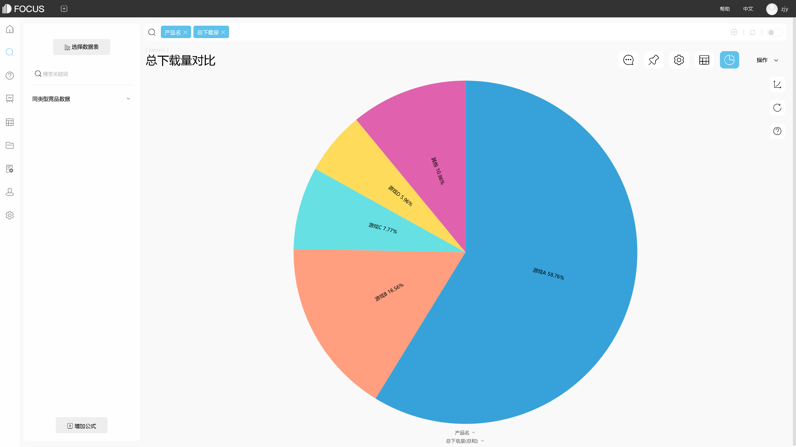

人们常说可视化，但是有多少人真的了解可视化。可视化是什么？官方解释，可视化是利用计算机图形学和图像处理技术，将数据转换成图形或图像在屏幕上显示出来，再进行交互处理的理论、方法和技术。通俗的说，就是将数据用更好看的图形来展示。

为什么要进行可视化？因为无论什么行业什么部门，每天都会接触大量数据，都会从数据中获取不同的信息，而可视化的目的，就是为了能够更直观地展示数据所传递的信息，以及蕴含的规律，人类对于图形这一类信息的接收能力远大于单纯的数据表格。数据可视化可以加深和强化受众对于数据的理解和记忆。

怎么样实现数据可视化？借助于既是数据分析工具也是数据可视化工具的DataFocus。DataFocus实现数据可视化非常简单，其采用拥有专利权的自然语言搜索的方式，系统会自动对搜索的内容进行识别，实时的返回结果，并且自动以最适图形来展示结果。可视化图表样式非常丰富，有30多种图表样式，满足条件的图表样式之间可以任意切换，相应地还支持图表个性化设置，包括主题颜色（DataFocus中的主题配色符合大多数人的视觉审美），字体样式颜色，线条粗细样式等等。

可视化将数据变得更生动，通过图表样式和色彩的搭配，满足了受众的视觉感受，同时将数据蕴含的信息更加深刻而精简地传达给阅读者，使整个信息传达的过程更加轻松便捷。而选用一款轻便易学而又实用的可视化工具就变得十分重要。
