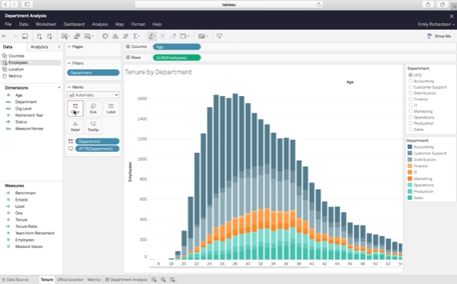

DataFocus和Tableau都是比较好的自助式商业智能软件，功能都很强大，是企业数据分析不可或缺的利器，但是这两款软件肯定也有不同之处，也有各自的长处以及短处，就比如Tableau的功能更全面更深入，但是也更适合专业的数据分析人员，而DataFocus则是专注于面向普通的业务人员，数据分析的过程更人性化更智能，也更简单易用。下面就对这两款商业智能软件做一个对比评测。

一、产品理念

DataFocus是近年新崛起的一款商业智能软件，其旨在降低数据分析的门槛，人人都能数据分析，其通过NLP技术，进行搜索分析，系统以图表的形式进行回答，用户只需在搜索框内输入关键的词句，便能制作出丰富多样的可视化图表。

Tableau源自美国斯坦福大学，是知名度很高的商业智能软件。Tableau将数据运算和美观的图表完美的嫁接在一起，可视化功能做得很好。Tableau功能比较强大，对数据要求比较高，倾向于较专业的数据分析师，只要数据预先处理好，就可以制作很多绚丽多彩的信息图。

二、产品功能

1、数据整合

DataFocus和Tableau都支持多源数据，支持市场上常用的数据库类型，也都支持本地导入数据。

DataFocus支持定时更新，也支持全量或者增量更新。Tableau支持增量更新，但是不支持定时更新。

2、数据处理

DataFocus自带轻量级ETL，支持新增公式列、多表互相关联、筛选过滤、分组统计、上卷下钻、行列转换、复杂指标搜索分析等功能。

Tableau支持SQL处理，缺乏较为完整的数据处理能力，所以Tableau对分析的数据要求较高。

3、数据分析

DataFocus采用拥有专利权的自然语言搜索式分析，简单高效，搜索关键句式，即可实时得到分析结果，无需任何代码，且可灵活变更各个维度，分析结果可视化展示，图表样式多达30多种。

Tableau支持拖拽生成图表，其在可视化效果上比DataFocus做的更美观一点，但是在数据分析上，数据处理上，DataFocus能具有优势。

