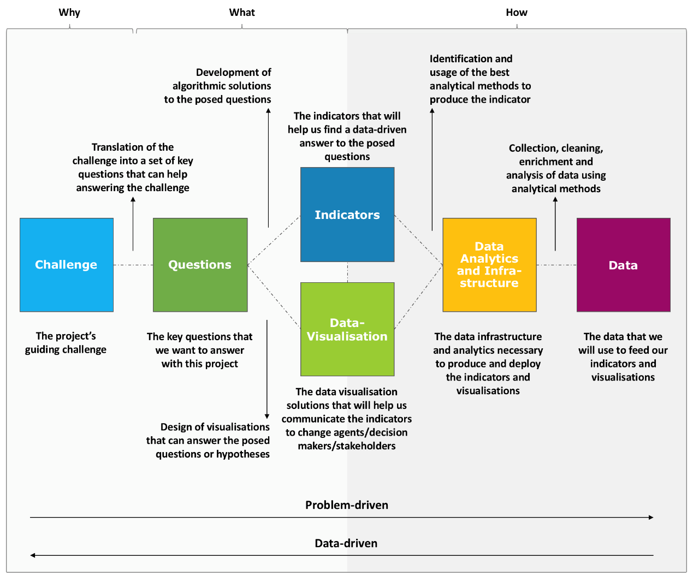

你面前有这样一个的场景。您或您的团队刚刚了解了一种令人兴奋的分析数据方法，发现了一种看起来非常有前景的新数据集，或者对新的数据可视化工具印象深刻。可以理解的是，您觉得应该组建一个数据科学项目，并向您的组织展示您如何探索可能性。不仅如此，一旦您交付项目，您将向组织提供一组全新的数据驱动见解。这一切都会非常完美。

当然，组织中始终抱怨数据的质量、数量和可用性的决策者将抓住这个机会，采用您的项目结果，并更接近真正的循证管理。不幸的是，在投入大量资源和大量资源之后，新的闪亮数据分析解决方案往往没有按预期进行。如果这个故事听起来很熟悉，那是因为它是一个非常普遍的景象。供应商，顾问和一长串文章都将重点放在新分析，数据可视化以及数据量和质量不断提高的优势和尚未开发的潜力上。所有这些都会产生兴奋和行动的冲动，然而，事情往往没有那么简单。

感受到采取行动的冲动并不是一件坏事，我们需要它来实验。问题在于我们在数据科学项目中，就像在驾驭一辆战车，我们需要将“站在战车前方才能完美的驾驭它”。我们渴望尝试新的工具和数据，我们忘记应该成为什么样的真正驱动因素：通过提供最佳的数据驱动的决策支持，帮助我们的利益相关者解决非常具体的挑战。**本文呼吁回归基础，重新审视我们项目的驱动因素。我的主要目的是提供一些有用的提示，以增加数据科学项目的成功和长期采用的机会**。为此，我使用了一套简单的指南，目的是在设计和规划的早期阶段重新校准我们对基础项目驱动因素的关注。

在继续之前，请注意：遵循以下建议肯定会让您在开始时放慢速度。这是一件好事。数据科学项目很容易跨越数月，影响到大量人群，最终嵌入到昂贵的系统中，这些系统充满了难以解决依赖关系的复杂网络。因此，最好尽可能地预先加载概念和系统级设计工作，以便以后避免难以逆转的错误。

指南的主要构建块如下图1所示。总体而言，我们的想法是从左到右开始这个过程，首先从问题驱动的方法开始，首先关注“为什么”，然后关注“什么”，之后只关注“如何”。一旦从左到右是迭代完成，我们就可以转向数据驱动的方法，数据和工具的可能性成为我们设计和实施决策的更重要部分。

图1：数据科学项目的问题驱动指南概述，包括其关键构建块和关系

拟议的指南由六个模块化但相互关联的构建块组成，可归纳为：

1. 该项目的指导性**挑战**应该成为我们最终评估成功的目标
2. 我们想要通过这个项目回答的关键**问题**
3. 该**指标**（他们经常可以在形式算法表示），这将有助于我们找到一个数据驱动的答案提出的问题
4. 该**数据可视化**解决方案，这将有助于我们沟通的指标来改变代理/决策者/利益相关者
5. 生成和部署指标和可视化所必需的**分析和数据基础架构**
6. 的**数据**，我们将用它来养活我们的指标和可视化

我们应该尽可能早地在项目中澄清六个构建块及其接口中的每一个。当我们在项目的设计和实施过程中获得新信息时，我们应该对这些信息如何影响整体调整和项目范围持开放态度。

通常，第一个构建块中的更改会产生更多级联后果，这些后果会在列表中进一步发生变化。出于这个原因，我们应该特别注意设计过程中早期的总体挑战和关键问题的定义。
