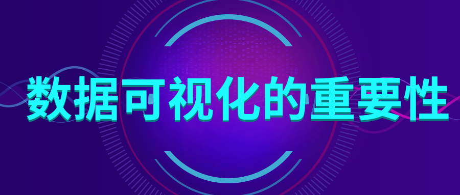

现如今进入大数据时代，很多企业都开始或多或少的利用大数据所产生的价值。对于企业来说，大数据能够起到的角色和分量因企业本身而异。但是有一点可以肯定的是，现今的决策者已不断在利用数据分析辅助决策，已达到让决策更精准的目的。并且也有很多企业组建了数据分析团队，比如很多电商企业就会频繁的利用数据报表来诊断店铺问题，亦或者有很多企业利用DataFocus、Power BI等基于AI的智能数据分析工具来辅助决策。

但是很多企业在数据分析这个工作上都是“一次性买卖”，比如今天有一个需求“北京地区近三个月的销售前十商品”，分析人员收到需求后进行各类数据导入，数据分析，可视化后交给需求方，需求方拿到以后进行决策，并将结果反馈给数据分析部门。看似是没有问题的很有效率的决策模式，但恰恰漏了最后一步，叫做“沉淀”。所有的工作或流程一定有东西沉淀下来可以作为公司或部门今后的财富。类似于阿里等公司都会有针对各类项目或工作结果沉淀下来的“智库”，以为以后的工作和新人留下价值。

那么如何实施呢，其实很简单。首先是数据分析过程的文档管理。像是很多传统的以IT为基础的数据分析，就有模型说明书、需求规格、功能设计文档、评审、测试、会议纪要等文档的归集，而对于业务部门，则有分析需求调研报告、数据分析需求确认书、需求变更申请、数据分析结果确认书、分析周报等等。这些都可以进行归档整理。

而对于DataFocus等BI工具来说就再简单不过，可以一键保存搜索得到的answer，并可以设置自动更新以更新新的数据得到新的可视化结果。就算上一个数据分析人员离职了，保存下来的answer和看板也能让新人迅速进入工作。
