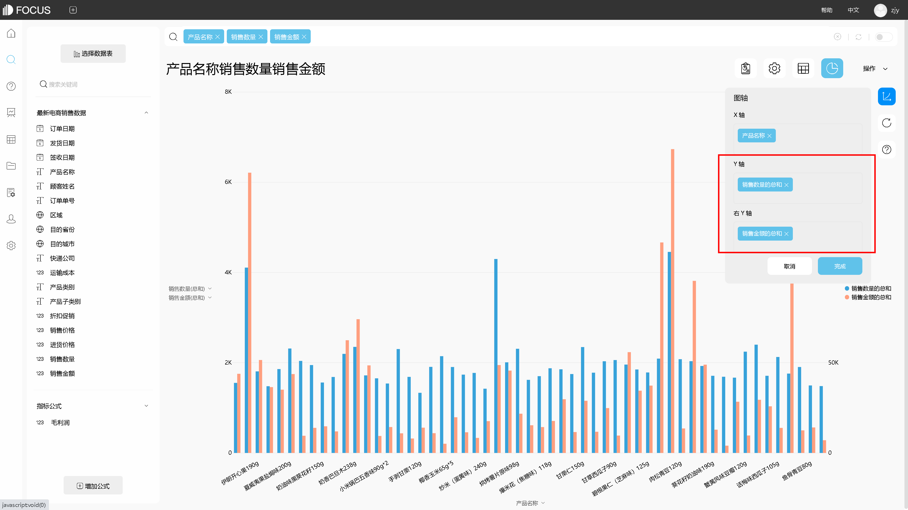

虽然许多BFSI组织开始通过收集大量数据资产来破坏其分析领域，但这些公司处于不同的大数据成熟水平。在许多情况下，这些初始数据项目引导业务利益相关者提出一个非常简单的问题：**_“_这些数据如何帮助我们解决业务问题_？”_**

随着客户数量的增加，它会显着影响组织提供的服务水平。现有的数据分析实践简化了银行和其他金融服务组织的监控和评估过程，包括大量客户数据，如个人和安全信息。但是在大数据的帮助下，银行现在可以使用这些信息实时跟踪客户行为，提供任何特定时刻所需的确切资源类型。这种实时评估将反过来提高整体绩效和盈利能力，从而使组织进一步进入增长周期。

确定可以最有效利用大数据资源的更多领域涉及业务案例和技术能力的协调，这揭示了改进业务流程的机会。银行和其他金融机构可以从三个主要领域获得高级分析的好处：客户体验，运营优化和员工敬业度。

**客户体验**

BFSI行业中几乎所有数据计划的步伐都与公司规模直接相关，因为它通常需要为企业组织进行额外的基础设施投资。但是，尽管组织规模庞大，以客户为中心的目标在大多数与数据相关的活动中起着主要作用。

关注客户需求非常重要，因为今天的客户对他们与银行或信用合作社的互动方式抱有很高的期望。他们的购买过程非常复杂且非线性，因此财务参与者必须能够仔细了解客户的偏好和动机。

要实现客户的360度视图，一系列客户快照已经不够用了。公司需要一个中央数据中心，将客户与品牌的所有互动结合起来，包括基本个人数据，交易历史，浏览历史，服务等。

根据[麦肯锡的](http://www.mckinsey.com/business-functions/marketing-and-sales/our-insights/digitizing-the-consumer-decision-journey)数据，使用数据做出更好的营销决策可以将营销效率提高15-20％ - 考虑到每年全球每年营销支出1万亿美元，这个数字高达2000亿美元。

以数据为燃料的分析可以为BFSI部门的人员提供客户见解，并帮助创建客户细分。此信息收集和评估需要对组织的基础架构进行额外投资，以及跨组织的多个功能区域的人员之间的输入和调整 - 但是以客户为中心的文化，流程和基础架构几乎总是转化为增加的转换和收入。

**运营优化**

虽然大数据已经在BFSI的许多领域得到应用，除了一些早期采用者，风险管理尚未释放其力量。

大数据技术可以提高风险模型的预测能力，以指数方式改善系统响应时间和有效性，提供更广泛的风险覆盖，并通过提供更多自动化流程，更精确的预测系统和更低的故障风险来节省大量成本。风险团队可以近乎实时地从各种来源获得更准确的风险情报。

风险管理有许多领域，大数据可以应用并带来价值，包括欺诈管理，信用管理，市场和商业贷款，运营风险和综合风险管理。

使用大数据的系统可以检测欺诈信号，使用机器学习实时分析它们，并准确预测非法用户和/或交易。大数据提供了提供与财务风险相关的不同因素和领域的全球视野的能力。

**员工敬业度**

对于大数据所受到的关注，许多公司倾向于忘记一个可能对其业务产生巨大影响的潜在应用 - 员工体验。如果做得好，它可以帮助跟踪，分析和分享员工绩效指标。将大数据分析应用于员工的绩效可以帮助您识别和承认最优秀的员工，以及挣扎或不快乐的员工。这些工具允许公司查看实时数据，而不仅仅是基于人类记忆的年度评估。

当您拥有合适的工具和分析时，您可以正确地衡量一切，包括个人绩效，团队精神，部门之间的互动以及整体公司文化。当数据与客户指标相关时，它还可以使员工在手动流程上花费更少的时间，在更高级别的任务上花费更多时间。

除了构建和设计初始技术解决方案之外，数据专家还可以帮助为新的大数据项目设定适当的目标，并将分析专业知识注入企业的组件，以实现内部和外部的最大利益。通过与大数据和其他全球趋势保持一致，BFSI行业将更好地掌握其内部和客户的需求，并能够及时提供改进的服务并优化运营成本。虽然大规模的大数据实施刚刚开始在BFSI行业发展，但组织越早采用大数据实践来更好地跟上这个数字世界。
