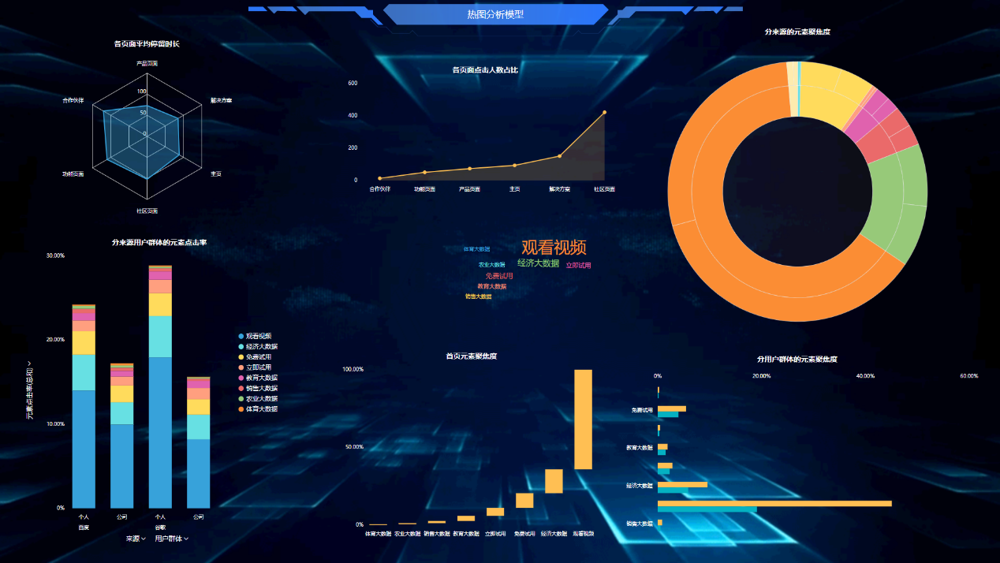

国家不断提倡加快实施和发展大数据，社会各界也不断提出“大数据”概念，但是数据分析的核心就是该如何实现“大数据”的价值？

大数据在百度百科上的定义是：大数据（big data），指无法在一定时间范围内用常规软件工具进行捕捉、管理和处理的数据集合，是需要新处理模式才能具有更强的决策力、洞察发现力和流程优化能力的海量、高增长率和多样化的信息资产。从定义中可以看出大数据存在三个特点：数据量大、种类繁多、更新速度快。但别看大数据很纷乱嘈杂，但其中包含着非常巨大的利润价值，如果只是对大数据收集、分类、存储，那么就无法发挥其巨大的价值，只是一堆无用的数字。

那么定义也说了，常规软件已经无法管理处置大数据了，我们该利用什么样的工具帮助提取大数据的价值呢？这取决于“大数据分析”。“大数据分析”可以通过数据找出导致企业现状的原因，然后通过建模预测或是影响因素分析进行预测或优化，促进企业持续改进。

因此，为了迎合企业的需求，商务智能系统陆续诞生，成为大数据分析的利剑。商业智能BI在大数据处理方面主要包含三个方面：

1、建立数据仓库，进行数据清洗

根据分析最终结果的不同，所需的数据内容也存在差异。以一款很实用的商业BI工具DataFocus为例，DataFocus可以连接企业的数据库，然后从中筛选出需要的表格、字段，将其进行存储到系统中，并可以进行定时更新，方面得出企业数据的可视化看板。

2、数据处理

这是商业智能最主要的功能，通过数据分析和数据挖掘，发挥大数据的价值，将数据转化为可见的信息，从而帮助管理者做出科学的判断。

3、数据展示

DataFocus工具通过一张张可视化大屏进行数据展示，其中还内设一级看板、二级看板，可以将多张看板的数据从属关系分清楚。可视化效果也是非常炫酷的。

通过以上3点，我相信已经可以将大数据的价值基本呈现出来了。

