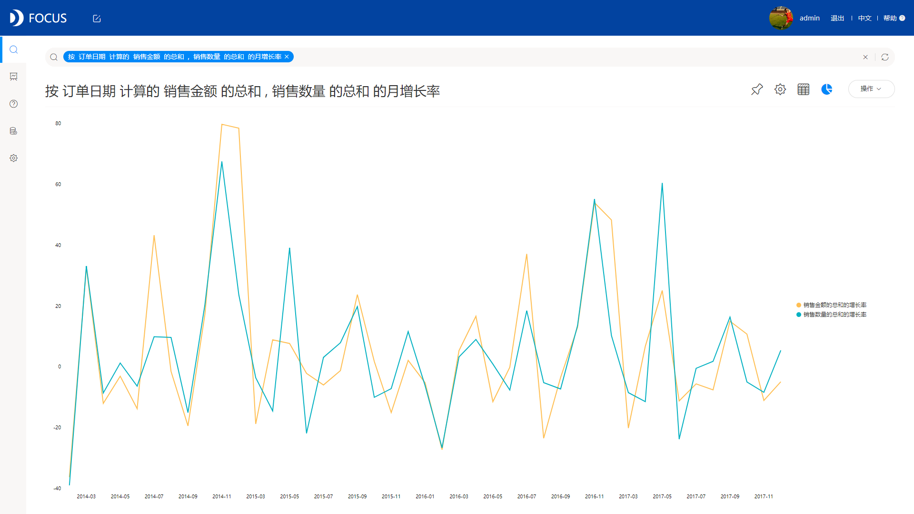

我在网上发现了一款操作简单还使用感不错的可视化工具，想和大家分享一下我的使用心得，接下来我将利用DataFocus中最新研发的一款图表类型——词云图，发给大家进行介绍，主要是介绍词云图的操作步骤，希望对大家有所帮助。

01：先打开DataFocus数据可视化工具，在页面左侧的功能模块类表中选择搜索页面，选择你所需要的数据源，找到这个数据源并勾选确定；

02：选择一个measure列，一个attribute列，也就是一列是文本、一列是数据加入搜索框，点击图表类型，选择高级图形中的词云图，这样一个简单的词云图就已经制作完毕了；

03：制作完成后，接下来就是图表配置的部分了，可以设置修改词云图的主题颜色，共有5款主题颜色可以进行选择。还可以勾选隐藏图表标题，去除词云图下方的比如“产品名称”或“销售金额”的文字。设置完毕后点击保存命名该历史问答即代表该词云图创建完毕。

操作的步骤其实非常简单，词云图作为现在这个时代非常常见的图表就像是为了互联网而诞生的图表类型，可以在DataFocus系统中如此简单的表达出来，确实是非常实用。希望对使用DataFocus的各位或是想使用词云图的各位能有所帮助。
