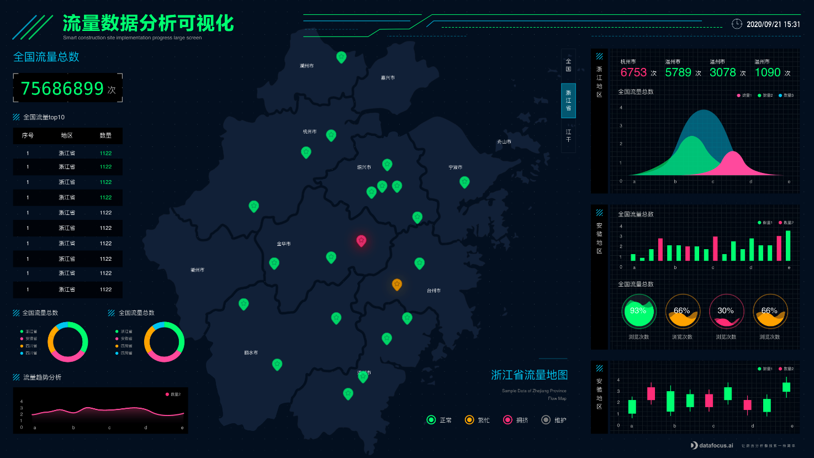

在数字化转型浪潮中，很多企业上线了大量的ERP、OA、SFA等信息化应用，业务数据也以指数级的速度在快速增长。为了挖掘数据价值，企业普遍开展了数据应用实践，并用于指导业务。但是，这些数据应用大多面向的是专业的IT人员，在可理解性、可阅读性方面存在着较高的专业门槛，数据价值难以实现普适性的传递。

而通过敏捷式BI+数据大屏的整合式解决方案，能够让枯燥的业务数据转化成为鲜活的数据图表，让决策中心变身为“数据指挥中心”，即使没有专业数据分析能力的决策者，也可以从图表中获得丰富而即时的信息，从而支撑业务决策。

从数据到业务的“驾驶舱”将数据以图表的形式来呈现并不新鲜，使用Excel等传统的办公软件就可以轻松做到，将这些图表投射到大屏之后，就生成了一个简单的数据大屏。但是，这种数据报表却只能进行静态的展示，无法实时的反映当前的业务状态，如果要更新，必须耗费大量的时间重新制作一份报表，数据大屏存在的意义几乎荡然无存。

因此，DataFocus等数据分析与可视化解决方案提供商采取的方式是将数据大屏与敏捷BI整合在一起。在后端，敏捷BI可以支持企业通过自助式的数据分析来轻松的获得数据可视化结果，其可以与企业各种业务的数据库进行衔接，业务系统的数据变化将实时地反馈到图表中，无需人工干预。这些图表在经过精心编排之后，会实时投射到大屏之上辅助企业决策。

单个的图表只能反映局部的数据，而想要利用数据综合指导企业的业务与管理，就需要对于这些数据图表进行综合编排。为此，业界提出了“数据驾驶舱”的概念，不同的驾驶舱对应着不同的数据模块，可以按照需求进行配置。例如，在“业务分析”这一驾驶舱中，就可能包括销售额分析、预付款分析、线索分析、合同管理、业务成本等不同的模块，这些模块包含不同的数据图表，还能够根据更细粒度的维度进行下钻。

