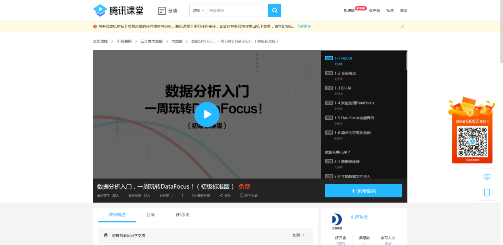
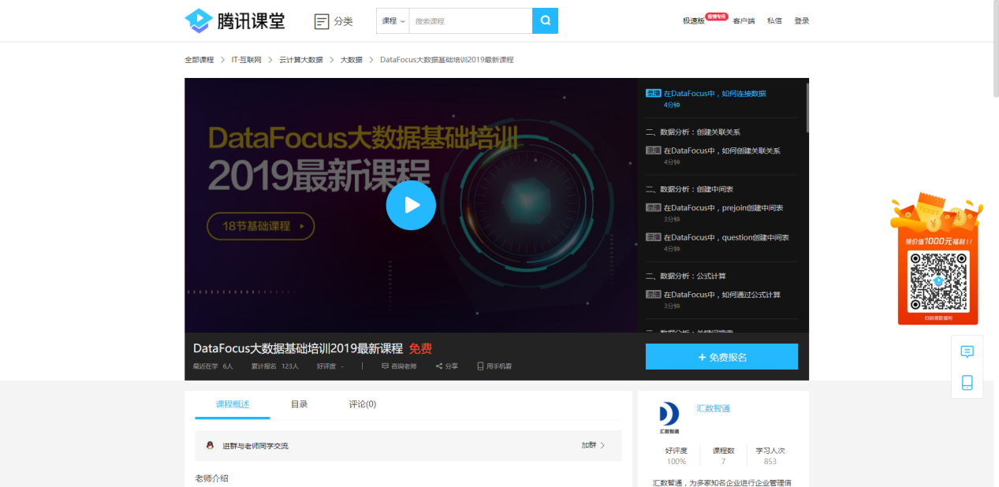

如果想要对大数据有一个比较明确的概念并且能够上手实操的程度，需要学习的内容至少包含两部分：一部分是专业知识的学习，另一部分是对分析工具的掌握和应用。

先来简单例举一下需要学习的数据分析方面的专业知识。最主要也是最基础的就是统计学，主要包含一些数据分析的基础专业知识，包括抽样、T分布、正态分布、回归分析、相关性分析、方差分析、参数检验等等；其次是一些与统计学相关联的数学知识，包括微积分、概率论、线性代数等；最后还有一些比较简单的编程语言的学习，包括C++、R语言、SQL语句等等。

当然，如果光会纸上谈兵也是毫无用处的，我们需要将学习到的学科专业知识灵活运用到实际场景中进行数据分析，因此，我们需要借助一些数据分析的工具帮助我们进行结果展示。比如我们需要利用Word或者PPT得出一份完整的数据分析报告；其次，利用SPSS、SAS、Matlab、R等工具进行一些专业的分析，呼应上文中的统计学内容，做一些线性回归分析、方差分析、参数检验等的内容；最后，最实用也是操作难度比较低的就是借助一些BI工具实现数据可视化。

Office软件学校里面基本都会教学，网络上也都是铺天盖地的技巧分享，这里就不推荐什么学习课程了；专业的分析软件在日常生活中没有太多的使用场景，而且一般学习的难度比较大；主要阐述一下数据可视化的工具，近些年越来越多的可视化工具层出不穷，有很多都是分析能力一般，只是商家用来博眼球的。这里推荐几款比较实在的可视化工具，不差钱的土豪们可以选择Tableau、FineBI，研发周期很长，口碑在整个圈子里都是数一数二的，虽然价格是真的不便宜，但贵也是有贵的道理的；追求性价比的可以参考Datafocus、PowerBI，数据分析能力不输前两个，而价格却是远远低于前者。其中Datafocus的官网还有非常全面的使用手册和视频教程，轻轻松松就能学会操作~~~

