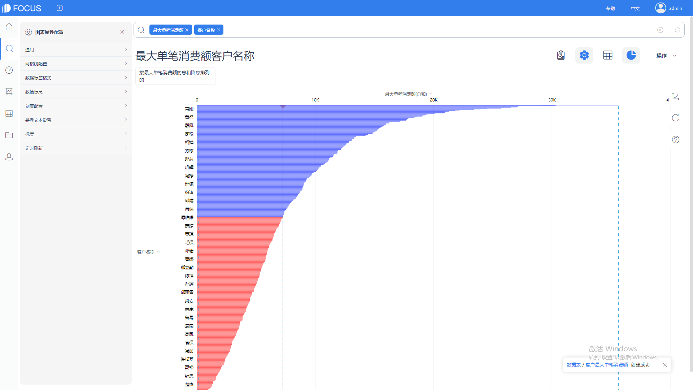

**实战经验分享：10分钟完成销售大屏**

在如今大数据发展的时代，企业积累了大量数据，分析师会利用这些海量数据，深入分析，旨在发现数据的规律，从而依据分析结果制定企业计划以及决策。对于一个数据分析师来说，如何进行数据分析是很重要的一部分，但是也不能忽视如何展示分析结果这部分，只有两部分相互结合，才能算是完整的数据分析。今天主要分享如何快速制作一个销售大屏，满满的干货不要错过哦。

职业原因，平常会接触使用到各种各样的分析工具，可视化工具，今天主要用到的一款分析工具——DataFocus，是我用过这么多工具里面排在前几名的，性价比是最高的。

要制作销售大屏，首先需要准备一份销售数据（虚拟数据，如有雷同，纯属巧合）；

其次，将数据导入DataFocus中，在数据管理页面，点击操作—导入数据，选择相应的配置之后，可看到要导入的列名以及预览部分数据，字段类型系统自动识别，也可以自行更改，开始导入；

导入数据之后，在搜索页面选择刚刚导入的数据源；

数据源选中之后，在开始分析之前，我们需要先把分析的思路理清楚，首先对于一份销售数据，我们需要分析下整体的一个增长趋势，故我们需要有一张增长率的图表；

其次，需要了解整体的销售利润情况，且要求是具体数值，此图以KPI形式显示；

接着分析销售在全国的业务分布，业绩情况；

再来了解具体每个商品的销售情况，前10畅销款，商品的月销售额；

销量Top10

月销售额

然后可以分析下企业内部各部门的销售业绩情况；

部门销售业绩

最后，再分析下客户的购买情况，了解哪些是重要客户，需要及时跟踪，哪些是即将流失客户，针对性地制定有效营销策略，重新吸引该部分客户；

最后，分析都已完成之后，转到数据看板页面，选择已加入图表的可视化大屏，之后在大屏中进行一系列的美化设置，即可完成销售大屏，

销售大屏

10分钟即可完成销售大屏，且过程中不需要任何IT知识，也没有复杂的操作点，大家看完本文有没有学到一点呢！
