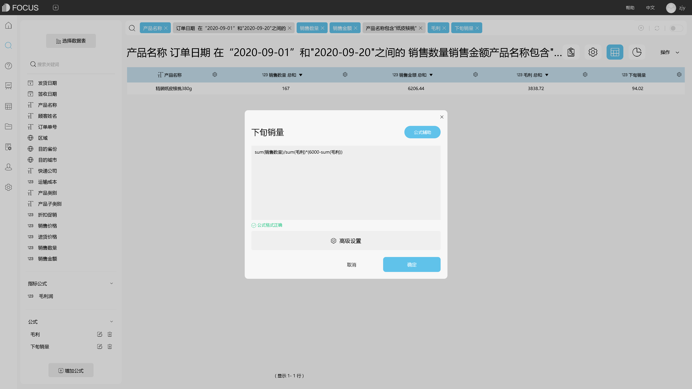
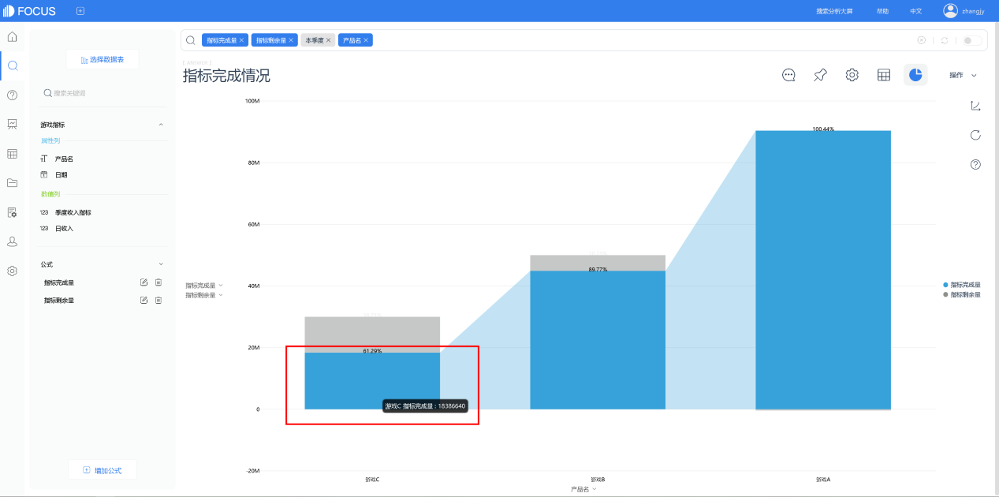
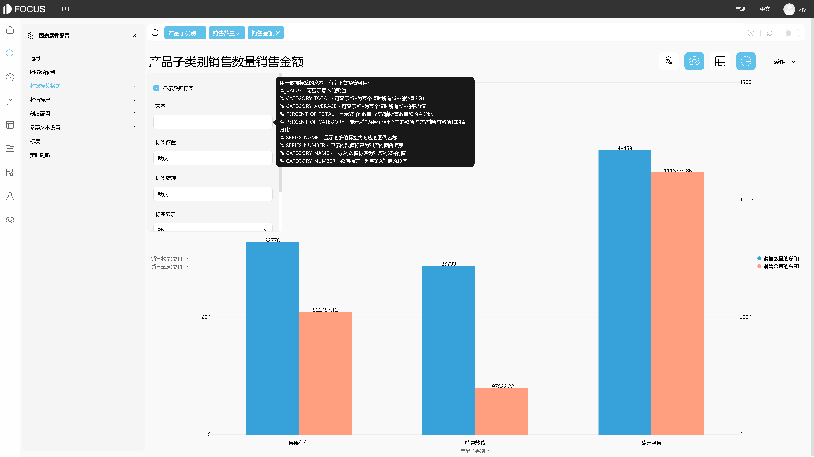
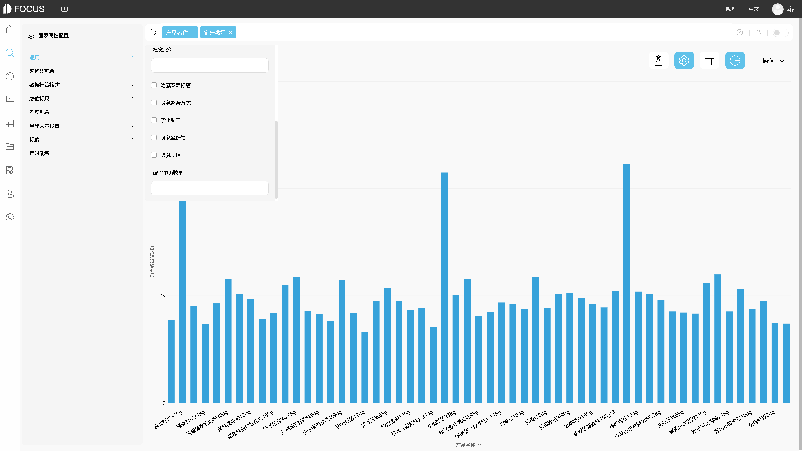

**一、案例背景**

客户关系管理能力是指企业以实施CRM为导向，在经营活动中配置、开发和整合企业内外的各种资源，主动利用、分析和管理客户信息，迅速满足客户个性化需求，从而建立、发展和提升客户关系，并形成竞争优势的知识和技能的集合。精准化运营的前提是客户关系管理，而客户关系管理的核心是客户分类。

**二、案例目标**

利用DataFocus数据分析工具，搭建RFM模型，对客户进行合理分类。通过改善三项指标的状况，从而为更多的营销决策提供支持。

**三、数据介绍**

根据分析需要，我们选择使用一张业务数据表。

**销售记录表.csv（部分）**

<table><tbody><tr><td>订单ID</td><td>销售时间</td><td>客户ID</td><td>客户类型</td><td>付款方式</td><td>消费金额</td></tr><tr><td>20170001</td><td>2017/1/1</td><td>B120</td><td>B</td><td>支付宝</td><td>10396</td></tr><tr><td>20170002</td><td>2017/1/1</td><td>N135</td><td>无</td><td>支付宝</td><td>672</td></tr><tr><td>20170003</td><td>2017/1/1</td><td>B124</td><td>B</td><td>支付宝</td><td>2356</td></tr><tr><td>20170004</td><td>2017/1/1</td><td>N222</td><td>无</td><td>支付宝</td><td>2172</td></tr><tr><td>20170005</td><td>2017/1/1</td><td>A140</td><td>A</td><td>支付宝</td><td>1064</td></tr><tr><td>20170006</td><td>2017/1/2</td><td>A113</td><td>A</td><td>支付宝</td><td>7088</td></tr><tr><td>20170007</td><td>2017/1/2</td><td>A130</td><td>A</td><td>支付宝</td><td>15844</td></tr><tr><td>20170008</td><td>2017/1/3</td><td>B153</td><td>B</td><td>支付宝</td><td>9988</td></tr><tr><td>20170009</td><td>2017/1/4</td><td>A159</td><td>A</td><td>支付宝</td><td>9160</td></tr><tr><td>20170010</td><td>2017/1/4</td><td>N231</td><td>无</td><td>支付宝</td><td>5304</td></tr><tr><td>20170011</td><td>2017/1/4</td><td>N166</td><td>无</td><td>支付宝</td><td>1696</td></tr><tr><td>20170012</td><td>2017/1/5</td><td>A149</td><td>A</td><td>银行卡</td><td>1344</td></tr><tr><td>20170013</td><td>2017/1/5</td><td>B123</td><td>B</td><td>银行卡</td><td>5896</td></tr><tr><td>20170014</td><td>2017/1/5</td><td>B128</td><td>B</td><td>银行卡</td><td>14440</td></tr><tr><td>20170015</td><td>2017/1/6</td><td>B105</td><td>B</td><td>微信支付</td><td>4072</td></tr><tr><td>20170016</td><td>2017/1/6</td><td>B118</td><td>B</td><td>微信支付</td><td>12404</td></tr></tbody></table>

1. **案例分析**

**（一）创建新的中间表**

首先，需要从原始数据表中整理出客户ID/最近一次消费间隔/消费次数/消费金额四个字段，建立一张新的中间表。

- 利用公式添加“最近一次消费间隔”、“消费次数”字段；

- 搜索“客户ID”、“消费次数”、“最近一次消费间隔的最小值”、“消费金额的平均值”，并将数据按客户ID升序排列，保存为“RFM分析数据”中间表。

**（二）构建RFM模型**

1、模型含义：

RFM模型是衡量客户价值和客户创利能力的重要工具和手段。该模型通过一个客户的近期购买行为、购买的总体频率以及花了多少钱三项指标来描述该客户的价值状况。一般的分析型CRM着重在对于客户贡献度的分析，RFM则强调以客户的行为来区分客户。

RFM是一种探索性分析，RFM的含义如下：

**R（Recency）：**客户最近一次交易时间的间隔，最近一次消费时间越近的顾客是最有可能对提供的商品或是服务也最有反应的群体，在互联网产品指标中代表最近一次登录。

**F（Frequency）：**F代表客户在最近一段时间内交易的次数，最常购买的顾客，也是满意度最高的顾客，在互联网产品指标中代表登录频率。

**M（Monetary）：**客户在最近一段时间内交易的金额。消费金额是所有数据库报告的支柱，客户的交易度量越大越好，在互联网产品指标中代表在线时长。

2、数据来源

选择使用“销售记录表”数据表中的“销售时间”、“客户ID”、“订单ID”、“消费金额”业务字段。

1. 业务数据处理过程

3.1 RFM分箱

整理出所需要的R/F/M数据字段后，给这三个分析字段设定打分规则，然后分别算出三个字段值的过程，这个过程就叫分箱。

一般分为3~5级别。级别数量可以根据自己客户体量来调整。具体打分规则，有两种：

1.简单的固定范围，有你自己定义每个级别范围的阈值，但是随着业务的增长，分数范围可能需要经常进行调整。

2.按层次分级，即把所有记录按照从小到大排序，然后按照大小的位置来给分。因为范围是从数据本身中挑选出来的，它们均匀分配客户并且没有跨越等级，更推荐这种分级方法。

在DataFocus中可以使用“排名前XXX的XXX”自然语言搜索，根据客户量对R/F/M进行均匀分配。

分箱结果如下：

<table><tbody><tr><td><strong>赋分</strong></td><td><strong>R</strong></td><td><strong>F</strong></td><td><strong>M</strong></td></tr><tr><td>5</td><td>&lt;37</td><td>&gt;7</td><td>&gt;5687</td></tr><tr><td>4</td><td>37-95</td><td>5-7</td><td>4545-5687</td></tr><tr><td>3</td><td>95-172</td><td>3-5</td><td>3826-4545</td></tr><tr><td>2</td><td>172-337</td><td>3</td><td>3088-3826</td></tr><tr><td>1</td><td>&gt;337</td><td>&lt;3</td><td>&lt;3088</td></tr></tbody></table>

3.2 用户分类

- 添加公式进行RFM打分；

- 计算参考值：要判断水平高低肯定要有一个判断标准，可以是R、F、M的平均值/中位数/标准差校正后的值。在DataFocus中可以直接在搜索结果页面，改变聚合方式就可以算出平均值；

- 和参考值比较：和计算出的参考值进行比较。根据和参考值比较结果进行01赋值，当R/F/M得分>R/F/M平均值时，赋值为“1”，反之则赋值为“0”；

- 根据和参考值比较结果进行用户分类。

最终根据上述比较就会得到8个分类的结果（R2种结果\*F2种结果\*M2种结果=8），即按照下列分类规则对用户进行分类。

<table><tbody><tr><td><strong>R</strong></td><td><strong>F</strong></td><td><strong>M</strong></td><td><strong>客户级别</strong></td></tr><tr><td>1</td><td>1</td><td>1</td><td>重要价值客户</td></tr><tr><td>0</td><td>1</td><td>1</td><td>重要唤回客户</td></tr><tr><td>1</td><td>0</td><td>1</td><td>重要深耕客户</td></tr><tr><td>0</td><td>0</td><td>1</td><td>重要挽留客户</td></tr><tr><td>1</td><td>1</td><td>0</td><td>潜力客户</td></tr><tr><td>1</td><td>0</td><td>0</td><td>新客户</td></tr><tr><td>0</td><td>1</td><td>0</td><td>一般维护客户</td></tr><tr><td>0</td><td>0</td><td>0</td><td>流失客户</td></tr></tbody></table>

至此，RFM模型构建完成。

1. **RFM模型可视化看板**

1.客户价值分类（可选择树状图）

是整个RFM模型的核心，直观显示了8个客户群的人数及占比，可以联动到其它组件来查看具体某客户群下的情况。

2.客户类型人数（可选择条形图）

显示各客户类型的具体人数。

3.交易金额组成（可选择环形图）

由于我们最关心的是各客户群的价值贡献，所以研究不同人群的交易金额占比，可以得到哪个人群的贡献值较大，对于我们的价值更大。

4.不同类型客户人均消费（可选择折线图）

显示不同评级客户的人均消费情况。

5.客户交易明细（可选择柱状图）

显示各客户类型下的客户交易明细。可以快速锁定我们关心的客户群体，确定他们的具体特征及名单。最后只要根据这个分析的结果来采取针对性的业务决策。

6.综合数据看板

将所有指标都整合在同一个可视化大屏中，直接观察各项指标增减变动情况及变动幅度，如下图所示。

**五、分析结论**

消费进度、消费频度、消费额度是测算消费者价值最重要也是最容易的方法，这充分的表现了这三个指标对营销活动的指导意义。RFM模型可以用EXCEL搭建出来，但在工具智能化时代，DataFocus将原数据表进行有效的数据预处理，很好地支持了客户聚类分类的功能，接洽RFM模型的自动搭建，这些技术在对客户细分特征时更为准确。
