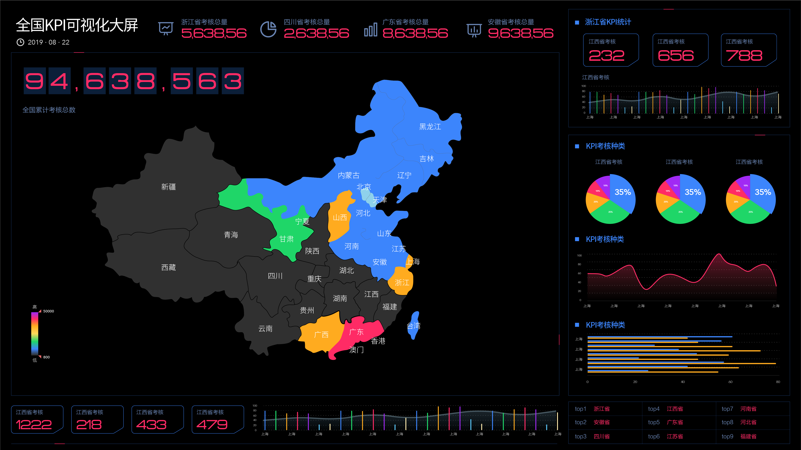

在这个大数据时代，很多行业都开始挖掘企业自身的大数据价值，而在数字化竞争越来越白热化、同质化的今天，对于企业的客户尤其是C端客户，如何让辛辛苦苦引进来的新客变成老客，老客不流失成了一大难题，尤其是电商行业。不仅如此，在数字化交易的背景下，越来越多的商家开始使用诸如DataFocus、集客CRM等做数据分析，以想要做数据化营销。但无论工具怎么先进，分析还是得靠数据分析师的人脑和思维，以思维驱动工具。思维驱动的意义就在于看到数据的呈现，能够了解其背后含义，并剖析其影响因素，从而辅助决策。那么本篇我们就以真实案例来列举一些常见的客户发展数据，讨论意义并剖析影响因素。

（由于保密性考虑，数据呈现仅以文字描述），以下是某真实母婴电商企业数据。

数据呈现：

1、从总体数据看，近18个月新客增长幅度小，增长明显的月份主要靠平台活动，日常新客增长明显不足。

2、老客增长与新客大体相同，也是靠活动支撑才出现明显增长，日常增长度小。一定程度上说明老客日常的维护和互动刺激不足。

3、预流失客户增长呈直线上升趋势，且最近半年增长速度快。一定程度上说明店铺对于客户回购的引导不足。

数据意义：

折射出店铺一段时间内的新老客增率，评估店铺引流的力度和老客维护的效果。

影响因素：

1、运营推广、流量渠道合理性 2、老客维护力度 3、活动节奏的把控

以下是以新老客维度向下钻取后的数据呈现。

数据呈现：

1、新老客占比大致呈现7：3比例；老客客单价普遍高于新客

2、从总体上看，新客占比下降、老客占比呈上升趋势

3、同比，4、5、6月老客占比有所增加，但客单价却降低；环比，近3月的老客占比呈直线上升趋势

4、在18个月内，购买3次及以上客户占比5.45%，比例偏低

5、回购周期20天内，新客回购占比大于老客；21天以上，老客回购占比大于新客

数据意义：

评估指定时段新老客的变化，有无提升；一定程度上衡量老客维护是否有成效。

影响因素：

1、流量推广招新 2、店铺活动 3、流量及新客增率 4. 产品性价比 5、服务体验 6. 定价策略

数据分析结束后，真正有价值的应是实际的策略调整和执行，我们可以参考一下方法进行执行和实施。

1、增加流量，提升新老客增长率

引流方式多样化；优化现有流量结构

2、调整新老客占比

保证流量和新客的稳定增长；做好老客维护

3、增加购买频次

重点关注回购率高的地区，挖掘利基市场的潜力；做好会员体系

4、缩短回购周期：

新客7天礼、满月礼；老客会员日活动、主题活动；控制官方活动节奏，并做好SMS、EDM营销
