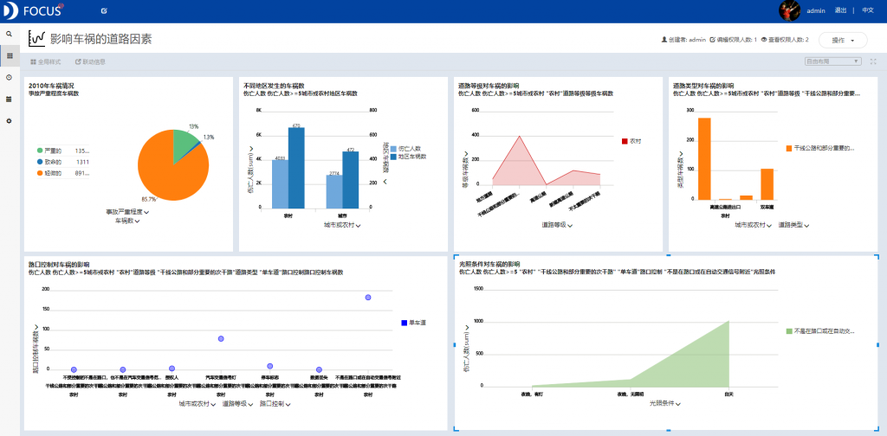

建议首先确定好未来的职业方向，再针对性地进行学习。大数据的路线包括：数据分析，数据挖掘，数据产品，数据工程等等，每个方向侧重点不同。

1. 数据分析/数据运营/商业分析，是业务方向的数据分析师。绝大部分人最初选择的岗位，但不同公司岗位职责可能有很大差异。
2. 数据挖掘/算法专家，是技术方向的数据岗，属研发部门或数据部门。
3. 数据产品经理：一种是具备强数据分析能力的PM，一种是公司数据产品的规划者。
4. 数据工程：偏技术，程序员走这条道路更有优势。

下面我们来谈谈大多数人选择的“数据分析”。

数据分析是指用适当的统计分析方法对收集来的大量数据进行分析，提取有用信息和形成结论而对数据加以详细研究和概括总结的过程。这一过程也是质量管理体系的支持过程。在实用中，数据分析可帮助人们作出判断，以便采取适当行动。

数据分析的流程即一个数据分析项目的实施步骤，可大致分为：数据获取——数据存储与提取——数据预处理——数据建模与分析——数据可视化。一般情况下需要学习的内容如下：

1. 数据获取：需要了解公开数据集的渠道，爬取网站数据。
2. 数据的存储、提取：SQL（数据库）实现数据存储、查询、提取；数据库的分组、聚合；SQL建立多表联系。
3. 数据预处理：用Python进行数据预处理。
4. 数据建模与分析：统计学基础数据；统计量的描述与展示；假设检验；常用的回归分析；基本的分类、聚类算法；提升分析精度：特征工程。
5. 数据可视化：用Python进行可视化分析；分析结果展示、数据报告撰写。

每个模块的知识最好都有所涉猎，当然，像学会查询提取SQl中数据、用Python进行数据清洗、可视化分析等等，都需要花费大量时间去学习。而使用Excel进行存储、分析，在应对万以内的数据时，一般没有问题，一旦数据量大，就会力不从心。

现在市场上有很多数据分析工具，借助它们，也能够尽快提升业务水平。以datafocus系统为例，一款专业数据分析工具，使用者不需要代码和SQL语言基础，且其有独特的搜索式分析方式，操作简单易学。

应用该分析工具进行数据分析时，可将从各渠道获取的数据以文件形式存储到本地或数据库，再导入或连接datafocus系统，甚至在系统中创建。并在系统中直接完成数据的预处理、建模与分析，以及制作数据可视化大屏。为数据分析之路，省时、省力、省心。
