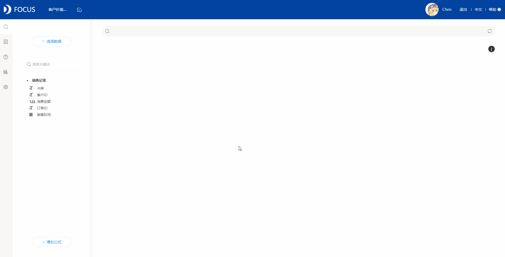

前几天，从事企业软件行业十几年的老炮——乐乐同志碰到了DataFocus的产品经理小陈。乐乐早前听说过DataFocus的产品发布会，然而他对此一致耿耿于怀。乐乐世纪之初，刚大学毕业就投入软件行业：做过项目，干过实施，码过代码，干过架构，可以说ToB软件行业他可是门清，从OA到ERP，从进销存到CRM，从供应链到MES，横跨各行业、各部门，几乎是无所不包，他当然有理由质疑！小陈有点紧张，惴着惶恐的心情，她和乐乐展开了对话。且让我们来看，大戏拉开。

乐乐开门见山，劈头就问：“你知道**BI是怎么定义的**吗？”

“百度百科上是这样说的：**BI（Business Intelligence）即商务智能，它是一套完整的解决方案，用来将企业中现有的数据进行有效的整合，快速准确地提供报表并提出决策依据，帮助企业做出明智的业务经营决策。**”怕说漏嘴，小陈希望引用权威可以滴水不漏。

“别百度百科了，不靠谱！”乐乐一脸不屑。

“哦，对，我们应该来看看维基百科的定义，维基百科上是这样说的：**商业智能（BI），包括企业所使用的策略和技术数据分析的商业信息。BI技术提供业务运营的历史，当前和预测视图。商业智能技术的常见功能包括报告，在线分析处理，分析......”**

“好吧，不和你扯这些了。你也知道BI都有几十年的历史了，你知道**BI产品都有哪些功能**吗？”不等小陈说完，乐乐打断了她。

“我们都知道，**BI产品主要解决企业的数据应用问题。它至少应该包含数据抽取、数据仓库、建模，数据整理、可视化、权限控制等几大模块。至于钻取、联动、大屏展现，分享、邮件通知等等**，虽然细节琐碎，但也都是必不可少的功能。这些功能都是历年来BI软件厂商经过一代又一代的产品迭代，逐渐响应企业的需求提出并开发出来的，可以说都是很有代表性的功能点了。”小陈细细的数说着BI的功能点，还没等她讲完，

乐乐显得有些不耐烦，直接打断了她。“经过几十年的进化，这些沉淀下来的功能点恰恰说明BI已经是一款成熟的产品。就像鞋子，你能有什么变革呢，总不是穿在脚上，难道还要戴在头上不成？”

“BI的这些功能点确实大部分是经过数十年的商业化洗礼慢慢进化出来的，反应了企业的经营方式中所需的管理辅助，这些都是不可或缺的功能点。但是换个角度来说，不要拘泥于具体的功能表现形式，我们应该追根溯源搞清楚，这些功能所希望满足的是企业的何种需求，对企业有什么帮助，体现了什么价值？搞清楚了这些，我们就不会被封印在形式上，而是从企业需求的本质出发，为企业打造更有效、更有力的工具。”小陈慢慢的有了自信，侃侃而谈起来。

**“Business inteligence，顾名思义，商业智能，本身都是一个智能的定义。虽然我也认为一直以来的BI产品所宣称的商业智能，其实并不智能，有些甚至弱智。但是DataFocus有什么优势呢，智能体现在哪里呢？”乐乐依然不依不饶。**

“所谓的人工智能，有个笑话说是先人工后智能。说科大讯飞的同声传译人工智能，之所以能做到那么好，是因为有人工干预，科大讯飞也解释明白了，说我这个是人工智能没错啊。言归正传，一切智能的东西都是从自动化做起的。都是把人类长期从事的低技术含量的重复劳动进行自动化，最终将人类从这些工作中解放出来。”小陈逐渐放松下来，她继续说道：“DataFocus也不例外。在它出现之前，大量的**BI产品通过写sql语句，通过写模板、拖拽表字段进行开发。工程师、分析师可能同一个sql，同一类sql语句要写很多次，如果碰到业务部门需求非常频繁，甚至整个掉到这一类开发工作中不可自拔。**我们认为这就是低技术含量的重复劳动。我们**通过datafocs的搜索式分析，将这一类重复劳动自动化，用户只需要用类似自然语言提问，就可以直接获得结果。从这个角度说，datafocus比现有的bi产品智能太多。**”

“你们不要提重新定义,你这样提很有点陈词滥调。乔布斯当年说的是重新发明了手机，其实手机还不是那个样子，现在搞互联网的有点儿进步就重新定义个啥，太不知天高地厚！”乐乐说完佛袖而去。留下小陈一脸懵逼~
