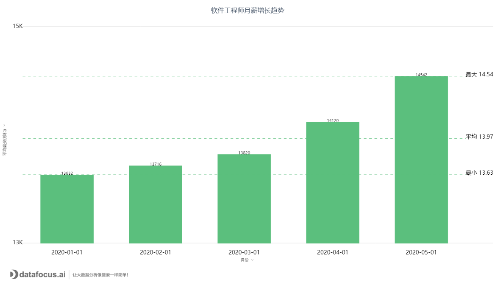

在本篇的文章中我们主要通过BI分析+的主要特点来入手，具体根据BI分析+中的datafocus

作为一个参考。从datafocus的各个层面了解BI分析+的特点：

1、BI分析+严格遵循ROLAP技术和MD的模型来分析

ROLAP技术主要自用数据库来表达，用数据仓库存储的技术。在市场调研中显示BI分析+目前主要采用ROLAP技术。

2、MD模型又称为多维数据模型，主要是规范数据库模型的。

3、BI分析+应用平台的模块结构化

在这个部分主要分为四个层次即应用平台层、中央控制层、分析处理层、数据库层等四个部分组成模块结构。

4、BI分析+应用分析平台的技术标准

BI分析+应用分析平台的技术标准是采用MVC设计结构，采用了OPP这种完整的封装技术。

5、BI分析+支持模板分析和即席分析

模板分析是给用户提供可视化的工具，允许用户操作和选择、过滤等操作。模板分析的优点是能够满足预先设定的分析报表业务、而且报表的形式强、能够提供图形设计界面。

即席分析是给用户提供灵活操作的界面，允许用户快速的深层多维分析表、统计图形等。即席分析的优点是方便求证数据的准确性，操作灵活、能够满足对数据分析的需求。

从BI分析+的技术层面分析了它的主要功能，datafocus在BI分析+界内的使用率比较高，使用的范围也比较广泛。
