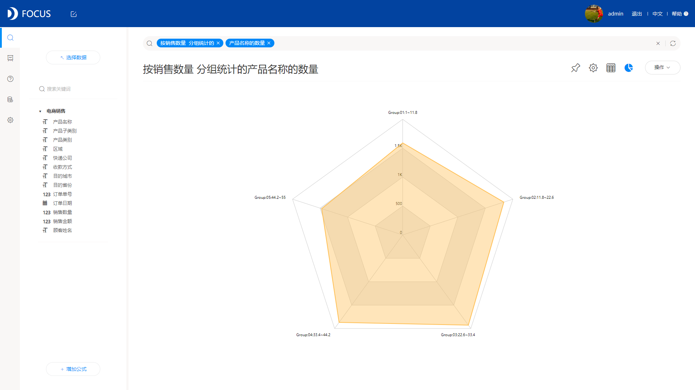

数据可视化工具包含许多非常先进的技术。这些技术方法可以通过使用图像，图形和计算机视觉来可视化数据。在进行数据分析时，有许多类型的数据，那么主要用什么类型的数据可视化工具进行数据分析？今天，DataFocus将为您提供详细的介绍。

市面上常用的数据分析工具可以简单的分为两大类。一个是探索性数据分析，另一个是定性数据分析。它们与其他同类产品不同，分析功能非常强大，交互方式也非常丰富，允许用户及时掌握信息，发现问题，找到答案并采取行动。  
1.分析定性数据。数据可视化工具可以分析非数字数据或数据，例如照片，单词和观察。它也被称为定性研究，定性数据分析或定性研究数据分析。 如Tableau这类老牌的传统数据分析工具就有这这一类的鲜明特征。  
2.分析探索性数据。这种方法由美国着名统计学家命名。它是对传统统计假设检验方法的有效补充。它是形成一个值得假设的测试。也是新一代可视化工具的一个主要特征。注重敏捷、探索和智能，比起工具，更像一个辅助的帮手，常常在可用性上做到极致，比如新一代的DataFocus数据分析工具。  

  
近年来，数据可视化工具基本上基于视觉元素，例如图形，表格或地图。可以通过分析动态分析数据，例如钻孔，过滤，跳跃，链接和突出显示。它可以提供各种数据表示形式，以及各种图形渲染形式，还可以支持商业逻辑动态脚本引擎和丰富的人机交互等。可以说它是一个非常强大的工具，能够为公司的发展提供很多帮助。
