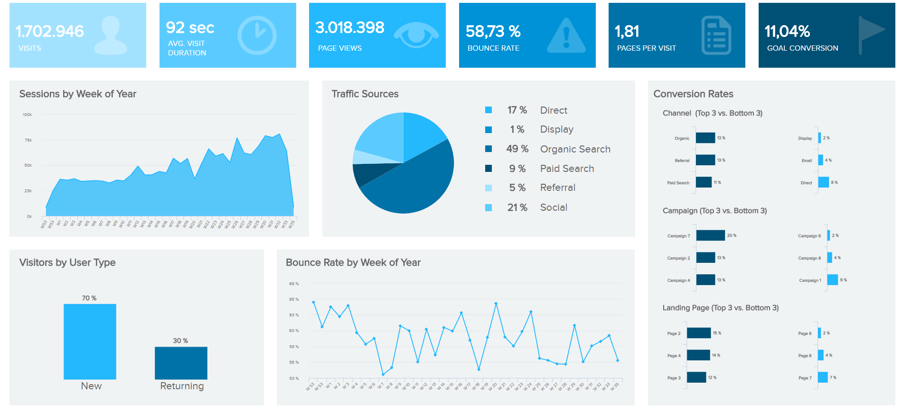

几年前，在阿姆斯特丹战略竞争情报会议的大数据专题讨论会上，向观众提出的一个问题是每个 BI 从业者都必须解决的话题： 为什么人们更关注数据集，而不是正确的商业智能问题？换句话说，在使用大数据和[商业智能软件](https://www.datafocus.ai/infos/best-bi-tools-software-review-list)时，团队经常发现自己专注的是数据，而不是数据可以解决的问题。发生这种情况的一个原因是，尽管组织数据具有挑战性，但它可能仍然比分析业务问题更直接。

正如《思考，快与慢》一书所详述的那样，人类的大脑通常会用一个更容易回答的问题来代替一个更难回答的问题。例如，不是回答“从这个数据集中有什么见解？”，而是回答：“我怎样才能确保这个数据是高质量的？”。这并不是说[数据质量管理](https://www.datafocus.ai/infos/data-quality-management-and-metrics)不重要，也不是说坏数据不存在挑战。但真正的挑战来自将调查结果转化为可操作的见解，将其应用于业务问题，并衡量结果。

在本文中，我们将介绍 7 个可以用来提出正确的商业智能问题的技巧。这些技巧将有助于将您的 BI 工作与降低成本、现有工作的更高 ROI 和新的收入来源等好处联系起来。

## 1) 专注于与您的商业战略相一致的问题

第一步是确保所有实施商业智能的团队成员都及时了解公司的整体战略和目标。您提出的问题、您收集的数据以及您收集的见解都应该成为更大计划的一部分。

正如BI 和决策系统咨询公司 Northwood Advisors 的创始人Myron Weber所说，“建立与战略一致的度量标准和关键绩效指标，然后使用 BI 软件提供可见性和驱动责任，使活动和结果与预期战略目标保持一致”。

为了让团队在商业智能方面保持一致并在同一页面上，拥有一组共同的目标和描述这些目标的通用词汇是有所帮助的。这就是 KPI 派上用场的地方。

### 你的 KPI 是什么？

我们在博客的许多地方都写过[KPI](https://www.datafocus.ai/infos/kpi-examples-and-templates)，但简而言之，KPI 是反映业务关键方面潜在成功或失败的重要指标。为每个部门和每个职位建立 KPI 是至关重要的。随着时间的推移，跟踪这些 KPI 也很重要，这样您就可以了解您的公司是否正在实现其战略目标。

对于任何部门或职位，不要设置太多的 KPI 也很重要——俗话说，“如果你有太多的优先事项，你实际上就没有了。” 这些kpi就像一颗“北极星”，您的公司可以使用它来定位自己，并提供商业决策的成功或失败的背景。

## 2) 提出可以为您提供可行见解的 BI 问题

提出非常具体的问题，以产生可操作的见解，这是有效的商业智能遵循的最佳实践。您希望您的洞察力尽可能地详细，以便您的 BI 问题可以转化为对您的 KPI 产生切实影响的行动。

因此，例如，不要问“我们的电子邮件营销进展如何？” 相反，您应该问这样的问题：“与去年本季度相比，根据电子邮件注册、点击率和电子邮件营销产生的收入的 KPI，我们本季度的电子邮件营销情况如何？”。

请注意，这个问题有：

- 提到的具体时间范围
- 用于反映现实的 KPI
- 相对成功的比较时间框架

这可能是一个非常有用的策略 - 例如，假设您已经采用了三个月的由外部营销机构领导的新电子邮件营销策略，并且您正在尝试决定是否续签他们的合同。使用上述示例中的所有细节，您将能够说出是否应该继续外包您的电子邮件营销或将其收回内部。

这是另一个示例，使用的术语略有不同。不是问，“本季度的销售情况如何？” 您应该问：“根据总收入、客单价和新客户的 KPI ，本季度的销售额与我们的预测相比如何？”注意到这里的主题了吗？

引出可操作见解的问题包括 KPI 的使用、特定时间段的使用，以及与其他指标（如之前的时间段或预测）的对比，以给出详细而有用的答案。

### 时间框架问题

一个重要的提示：您需要使用适当的时间框架来比较，才能获得现实的见解。

为了说明这一点，这里有一个夸张的例子：你开始了一个新的内容营销策略，然后两周后，你问，“在过去的两周内，使用新的电子邮件注册、平均花费在网站上的时间和生成的反向链接的kpi，这个新的内容营销策略是如何工作的?”

这是一个在错误时间框架下提出的惊人问题。实际上，内容营销需要超过 2 周的时间才能看到效果，甚至可能需要 2 个季度才能看到可衡量的结果。但是，如果您做的是 B2C 销售，那么您可能会在制定新策略后的一两周内看到销售额的变化。上下文至关重要。

### 一个好问题引出另一个问题……

如果您使用一个很好的问题得到了一个明确的答案，那么您现在有机会通过进一步的问题收集更多定义明确的商业情报。例如，如果您认为外包您的电子邮件营销运作良好，那么您可以问：“是什么因素导致该策略运作良好？” 虽然比第一个更难回答，但它可以带来非常有力的见解。

我们将在本文后面讨论使用“为什么”的问题时进一步讨论这个问题。

## 3) 确定投资回报机会的问题

商业智能和大数据分析中最热门的话题之一是投资回报率。一项研究表明，企业在 BI 上花费的每一美元的平均投资回报率为 13.01 美元，高于 2011 年 10.66 美元的平均投资回报率。该研究调查了使用不同 BI 解决方案的各种规模和行业的公司。

与其问一些宽泛的问题，诸如“如何提高投资回报率”？不如深入研究并具体化。也许您的流失率比您想象的要高。如果是这样，请询问您的忠实用户与流失用户的区别，然后分析您的整个历史数据，找出一些客户离开的原因以及如何留住他们。

你的问题要具体，要与你可以运用洞察力提高利润的机会相关。

## 4) 确定新收入来源机会的问题

提出能够带来新的收入来源的问题可能是一种非常有价值的策略，可以向高级管理人员展示您从 BI 上花费的时间和金钱获得了多少投资回报。毕竟，对于企业高管来说，“收入高于一切”的刻板印象往往是正确的。

艾默生物联网和商业技术公司总监 William Duncan 在他的 LinkedIn 帖子“提出正确的问题以使大数据和商业智能得到回报”中提供了一些可用于创收的示例。

这里有几个：

- “我的产品和服务有哪些机会可以被不同的方式使用，从而扩大我的市场？
- 还有哪些产品和服务卖给了类似的客户，我可以用作交叉销售平台，来扩大我的销售额？
- 在未来几个月和几年内，我的客户计划做什么，我可以通过我的产品/服务实现，从而增加我的销售额？”

## 5) 识别成本削减机会的问题

[数据分析软件](https://www.datafocus.ai/infos/data-analysis-software)通常可以通过提供使您的团队能够识别成本节约机会的见解来收回成本。

一些关于使用 BI 降低成本的最佳案例研究发生在零售和时尚领域。商业智能提醒公司削减过多的库存，并精简其供应链。

时尚就是一个很好的例子，因为它是一个很难预测成功的行业。借助最新一代的工具，商店可以汇总趋势，并将它们与过去的销售信息、社交媒体/时尚博客相结合，从而更准确地预测下一季所需的库存。精心设计的[KPI 仪表板](https://www.datafocus.ai/infos/best-kpi-dashboard-examples)使零售商能够一目了然地了解数据。

## 6）以“为什么”开头的问题

“如何”问题比“为什么”问题更容易自信地回答。早些时候，我们概述了如何有效地提出“如何”的问题——例如，根据某些 KPI、时间框架和/或预测，我们业务的这个特定领域是如何进行的？

这些类型的问题只会有那么几个答案：事情进展顺利、进展不佳或者中立。虽然它们很有用，但它们不像“为什么”那么强大。“为什么”比“如何”更难回答，但它可能更有力，因为它可以向您展示业务成功和失败的潜在原因。

例如，知道您的销售额在本季度有所增长是很有用的。但是知道为什么这些销售额上升会更有用，因为这样您就可以专注于导致当前销售额增长的原因。

然而，重要的是要意识到，每当你回答“为什么”的问题时，你都必须做出假设。现代企业是具有大量活动部件的复杂动态系统，因此在回答“为什么”时，您必须意识到很多时候您可能会出错。至少，与原因相关的 BI 可能是不完整的。

### 突破矛盾和困惑

“为什么”在不同 KPI 之间看似矛盾的领域也非常有用。例如，假设贵公司本季度的收入增加了，每位客户的收入增加了，但本季度的新客户数量减少了。为什么会这样？

可能的原因有很多，包括但不限于：

- 您的客户关系团队表现非常好，但您的销售团队表现不佳。
- 您的新营销策略无法准确描述您的产品或服务的价值——一旦客户体验了您的解决方案，他们就会上瘾。但新的营销策略一开始就加大了销售的难度。
- 经济不景气，导致销售枯竭，但您的服务非常出色，以至于您正在加深与现有客户的关系，他们的也花了更多的钱。

这些原因中的任何一个都有可能，或者都不是，很难确定。这是企业面临的挑战之一——你很少能确定“为什么”，但你_可以_做出合理的最佳猜测，并不断测试这些猜测。

从这里，您可以对您的数据提出额外的问题，以“测试”这些假设。例如，第一个假设是客户关系很好，但销售做的很差，你会问，“这个假设是真的吗？” 并检查 KPI，例如：

- 与上一季度相比，您本季度的客户流失率
- 与上一季度相比，您本季度的销售成交率
- 您的销售团队每周与多少潜在客户接触
- 您的团队获得的客户满意度评分

## 7) 如何更好地了解您的客户？

您可以提出的最有价值的问题之一是：我们如何才能更好地吸引客户？从你对“参与”的定义开始。一旦有了基线，就可以使用 BI 工具来发现客户行为模式，这可以帮助您进行更多销售、开发新功能或增加客户参与度，所有这些都将直接带来更大的利润。

数据是一种资源，但只有正确使用它才有价值。正确的 BI 问题是利用数据获得最大利益的最佳方式。这是一个摘要：

1. 提出重要问题
2. 提出具体问题，从而得出可操作的见解
3. 提出具有潜在投资回报率的问题
4. 提出可以带来新收入来源的问题
5. 提出可以削减成本机会的问题
6. 问一些有助于你理解“为什么”的问题
7. 作为可以帮助您更好地了解客户的问题

当正确的商业智能问题与正确的工具相结合时，利润就会随之而来。
