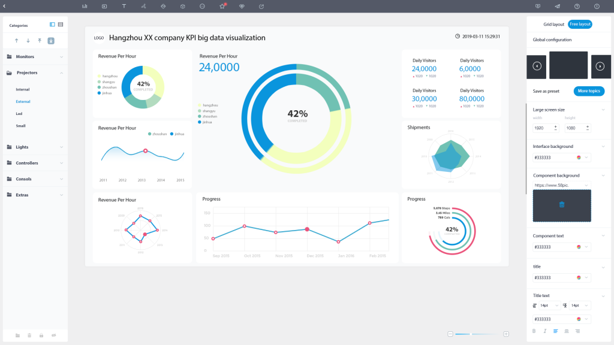

大数据时代，各大企业都开始应用大数据完成商业目标，教育行业也不例外。DataFocus所服务过的教育行业客户，基本已经实现数字化转型，利用数据分析辅助决策。教育行业，数据量相比其它行业来说是较大的，而数据背后的意义轻则影响教育质量，重则影响对人才的培养。大数据在教育行业是如何应用的呢？

首先，教育的形势发生了变化。在这个时代，老师的职能不再仅仅是按部就班的将知识传授给学生，摇头晃脑的背书，而是像当今电商推崇的CRM一样，因材施教并针对每个学生辅以个性化的教学方案。也就是说，以前是大家吃“大锅饭”，不一定每个人都能管饱，也有人可能撑死，现在用大数据的力量将每个人喂得刚刚好。也就是说在了解学生的认知能力和知识结构的前提下，将知识进行迁移、整合并进行传授。

再者，现在的教育能够精准的满足学生的需求，能将各类知识及时的输送给学生。就像电子化的销售一样，某个学生要什么，就能精准化的给予。类似于DataFocus的搜索即分析，搜索即需求，需求即想要。现在的教学系统能够根据学生的实际情况智能匹配课程和难度，并控制时间，最大效率的让学生进行学习。

第三就是对于培训方来说，教育广告的精准投放。举个例子，英语流利说是个非常“有毒”的APP，用户量每天都在增长，通过朋友圈的分享，每个人经过测试后都能得到一套AI计算过的学习方案，以提升英语水平。

究其所以就是在大数据时代，用户就是数据，每个用户都有其客户画像。一些教育及培训机构可以通过数据分析，将用户进行锁定进行广告的投放。比如培训APP的课程偏好，学习时间，付费痛点等等，都是大数据的功效。

大数据技术还可以在教育平台上跟踪和关注老师和学生的教学、学习过程，记录师生互动行为，并将这些行为分析后应用到以后的互动当中，不断优化。尤其是现在的一些数据采集和分析系统，能够将学生的数据可视化，为教育管理机构、学校、老师和家长提供最直接、客观、准确的教育结果评价等。

总而言之，大数据的支持，是当今教育的必然趋势。
