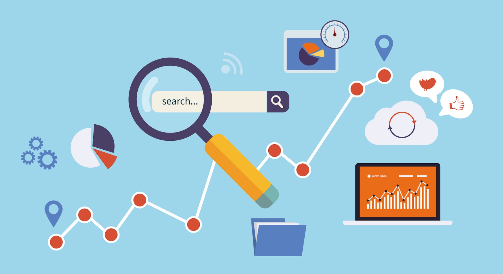

图1：搜索引擎（图片来源于网络）

不知道从什么时候开始，搜索框无处不在。现在当你想要搜索一个问题的时候，冒出来的第一个平台，可能不是“百度一下你就知道”，而是去各个细分平台进行搜索。

这是一个很有意思的变化。比如很多人刷抖音，而我有一个朋友就跟我说，她在抖音上学做菜。糖醋排骨怎么做，面食花样做法，几乎搜啥有啥。而且用视频方式学做菜，比图文轻松易懂多了。用丁香园搜索医学问题，用

现如今，搜索引擎的定义早已不再局限于狭义的搜索引擎本身了，搜索可以说是在我们生活中方方面面都在普遍使用。**百度CEO李彦宏也在第6届乌镇互联网大会上再次强调：搜索在人工智能时代也将焕发出巨大的潜力。**

图2：抖音搜索框（图片来源于网络）

**搜索引擎的泛化，并不让人意外。搜索行为的本质是获取信息，而这也是信息获取最敏捷的方式之一。**

从数据到信息，人类想尽办法提高对数据的利用效率。比如，几年前开始流行的敏捷BI的概念，就在数据分析领域大行其道。

2013年，大数据时代来临。企业急需更高效的数据分析平台，于是满足市场期望的"敏捷BI"出现了。

在对数据进行分析的过程中，传统BI的做法是，IT人员事先根据分析需求来进行建模，提前汇总好数据，业务人员在前端查看分析结果报表。这种做法很成熟，持续了很多年，但是报表静态、分析维度僵化、耗时较长、响应速度缓慢。

**造成这些问题的本质原因是，过去的技术架构对海量数据的计算能力不足，需通过建模、二次表、Cube 提前进行数据运算汇总。**

与传统BI不同，敏捷BI采取轻量建模的方法，数据连进来直接可以进行分析，并且业务人员可以实时调整分析的维度和度量的计算方式，极大增加灵活性。

图3：敏捷BI（图片来源于网络）

敏捷BI不必在开始时花很长的时间构思大而全的分析指标体系，而是低成本快速进行数据探索，几分钟就做好一个分析结果。

可是敏捷BI的发展真的到此就结束了吗？如果止步于此，我觉得远远称不上真的敏捷，因为完全跟不上人脑的思维反应速度！

还记得我们上面提到的搜索吗？试着重现一下你是如何通过搜索找到想要的信息的。

比如你想要购买一件新年礼物，你可能会相继输入：

1）新年 礼物

2）适合给男朋友的新年礼物

3）男朋友 新年 礼物 500-1000元

4）男朋友 新年礼物 500-1000元 实用 有趣

这才是符合我们思维习惯的找到信息的方式！！和选择礼物一样，别指望一开始你就能找到正确的数据分析维度，你需要经过多维度的探索，才能够找到问题的突破口，得出具有深刻洞见的图表。**而这些敏捷BI，其实只不过是在已经知道分析维度的前提下，进行的数据分析而已。真正的敏捷，是随时响应、推翻、再次响应你的数据分析过程，直到找到正确的方向。**

**所以，把搜索框搬到数据分析系统中，才是敏捷数据革命的未来？**

Bingo！

图4：搜索式数据分析（图片来源于网络）

而这个产品已经被创造出来了：DataFocus，首个中文搜索式数据分析系统。将搜索技术创新性地运用到了数据分析领域，创造出了同时支持中英文自然语言搜索、属于数据分析领域的搜索引擎。

DataFocus Cloud使用起来像谷歌、百度搜索一样简单，就是搜索即可，完全跟得上思维的响应速度。
