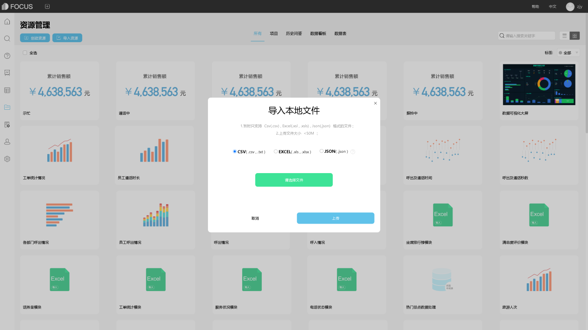

今天，随着商业形式的快速变化，许多传统公司认为他们的肥胖极不稳定并且充满了隐患。许多企业经历了轻微的资产转型，并试图利用互联网引发业绩增长的第二个曲线。转型的基础是数据。数据管理可以为公司绩效目标，就业战略，战略方向等提供科学参考。DataFocus今天就来带大家来讨论一下一种常用的数据管理模式。

数据管理是指使用分析工具科学地分析客观和实际数据并将分析结果应用于生产，运营和销售的管理方法。根据管理层面，它可以分为四个层次：业务指导管理，运营分析管理，业务战略管理和战略计划管理。根据业务逻辑，它可以分为销售数据管理，商品数据管理，财务数据管理，人员数据管理，生产数据管理和物流数据管理。

数据分析工具主要有Excel，SAS，SPSS，Matlab，如果没有学习过上述的工具，也可以选择诸如DataFocus这种高功能简操作的数据分析工具。

根据业务逻辑，数据管理分为四个层次。

1. 业务指导管理：通过数据采集，数据监控，数据跟踪等手段查看业务，通过数据分析，数据挖掘等方式构建业务管理模型，增强业务。业务指导管理的范围包括销售，人力资源，生产，财务，客户服务和其他业务单位。主要管理模块包括目标和预测管理，利润和费用管理。
2. 运营分析管理：分析和管理人员，货物，领域和财务。包括绩效考核管理，库存分析管理，供应链分析管理，客流分析管理，基金分析管理，客户关系管理（CRM）。
3. 管理策略管理：指通过业务环节的相应数据分析制定或修改策略的目的。数据的战略管理是企业战略合理化的保证。包括消费者购买行为分析，会员客户策略，商品定价策略，品牌定位策略，竞争策略管理，资源分配策略等。
4. 战略规划管理：是通过企业内外部数据制定企业长期规划的过程。包括宏观经济分析，行业环境分析，内部资源分析，企业竞争力分析，战略目标规划管理和战略可操作性评估。

如果希望了解敏捷数据分析或者BI解决方案，请移步DataFocus官网，我们诚挚的欢迎您的咨询来访。

