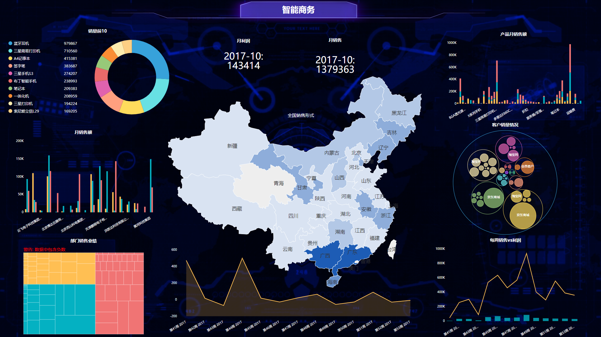
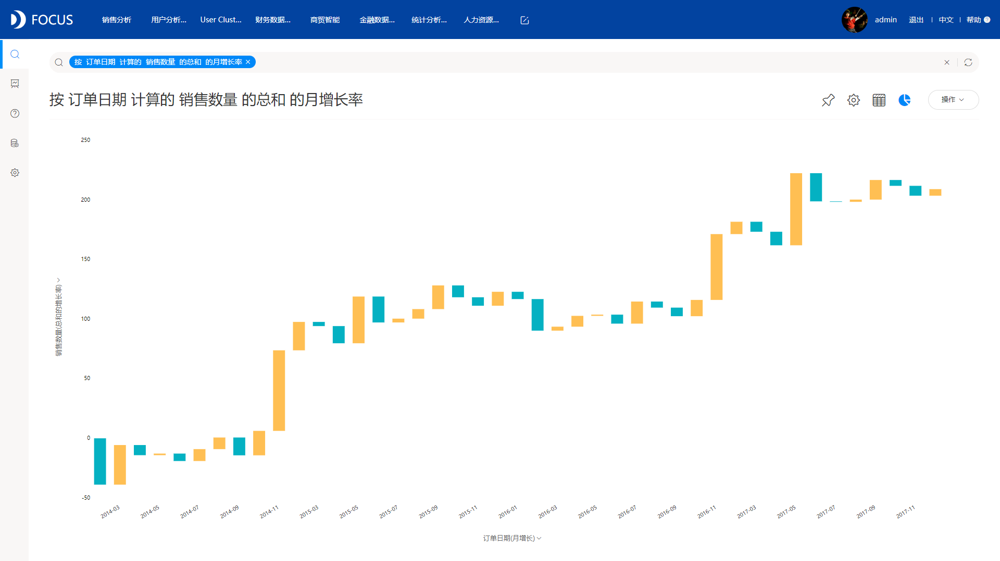

现代社会发展迅速，企业多变的业务逻辑、复杂的数据整合以及需求的快速响应，传统的BI工具已经无法跟上企业数据分析的快节奏，于是，自助式BI工具逐渐崛起，渐渐取代传统BI在企业中的位置，成为主流工具。

自助式BI工具，相较于传统BI，无论是在效率，功能，操作上，都略胜一筹，企业如果能利用好自助式BI工具，就能拥有一个强有力的后盾，可以实时掌控数据，更好地支持管理层制定计划策略。下面介绍几款主流的自助式BI，帮助大家快速理解和应用。

Tableau

Tableau大家应该很熟悉，可能很多人也试用过，是一款国外的老牌BI，发展时间较长，在可视化上做的很好，可视化效果美观，但是其对计算机硬件要求高，而且部署比较复杂，对数据有一定的要求，需要先对数据进行预处理，而且国内中文的学习资料不是很多，如果英文不是很好的话，学习这款工具稍微有点吃力。Tableau的交互方式采用的是拖拽式，基本很多自助式BI的交互方式都是拖拽式或者直接代码实现。

Qlikview

Qlikview与Tableau相似，其也是采用的拖拽式，而且同样对于硬件要求较高，但是它的前端交互性比较灵活，Qlikview拥有专利技术AQL构架，在分析一定数据量的时候，可以避免使用数据库和OLAP，可以更加灵活。它也有一些缺点，比如对于某些复杂的需求，也必须通过写脚本的方式实现。

DataFocus

DataFocus是国内的一款新型自助式BI，采用的交互方式与上面两个不同，采用的是搜索式，它是国内第一个用中文自然语言进行搜索分析的BI工具，具有专利权，也正因为这种搜索的方式，所以DataFocus的操作比其余两个更简单，效率更高，更加智能，可视化虽然没有tableau做的那么美观，但是也在中等水平以上，可以满足企业日常的可视化需求。

