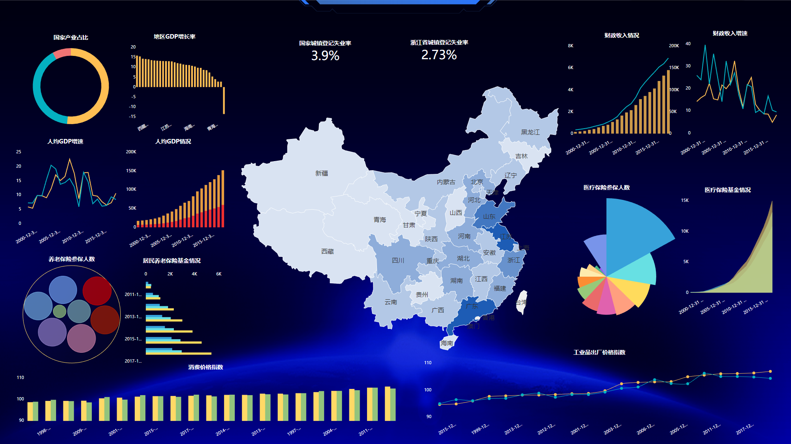

现如今，在市场大环境下消费群体普遍趋向年轻化及差异化。在90后消费群体愈发具备购买力的同时，其消费思维也与其从小到大接受的文化熏陶形成强关联纽带，二次元文化（简称ACGN）便是其一，并且蕴含着越来越大的市场蓝海。丰富的小众周边变现、IP应用变现、情怀营销变现等模式也层出不穷。

针对这一部分新兴群体，数据人其实是喜闻乐见，因为若是精准的数据分析抓准了这一部分潜在消费群体的胃口，并且能够摸清其人群画像，对于很多目标客户群体与此重叠的企业来说是非常有价值的。很多BI企业如DataFocus、Power BI等也为很多企业做过针对这类群体的数据分析，以为企业提供决策参考。

本篇就让我们以数据分析来窥探二次元人群画像，数据来自于我们的调研以及一些合作伙伴的权威的报告。首先是年龄分布，2018年的二次元人群分布95后数据量最大，占57%。85后和90后分别占16%和21%。而在淘系平台的二次元用户最近一年在二次元上的花费1000-5000元的人群占35%，为占比最大的群体。而消费500-1000元、100-500元以及5000-10000元的人群各平均占比18%左右。

而根据报告显示，关于二次元人群标签方面，拥有下列四类人群标签的人群占比最大，分别是“宅”（25%）、“萌”（13%）、“腹黑”（11%）、“腐”（10%）。每一个标签背后都是可被数据洞察的“数据化”群体，拥有很明确的人群特点。令人意想不到的是，二次元用户主活跃平台数据分析结果显示，最活跃的是QQ群和贴吧，分别占35%和27%。我们熟悉的微博、微信等平台平均占比不到15%。因此，传统的“三微”营销或许并不是非常适合这部分人群。

就算在微博平台本身的二次元群体，也有KOL数量不断壮大的趋势。KOL账号现已超过2.3万个，覆盖粉丝规模超过2亿，其中大多是cosplayer（37.4%）、漫音CV（6.0%）、动漫作者（34.1%）以及资讯号（25%）。其中72.5% 的博文为图文类，阅读量高并适合微型漫画传播，对于企业号吸粉和留粉有着非常好的效果。

所以，我们可以总结出数据分析后的二次元人群画像特点。可以分为三个方面，从情感上：想象力丰富、文化表达欲望强烈；从理念上：视觉化、娱乐情怀化；从表征上：年轻化、个性化并具有优越感。
