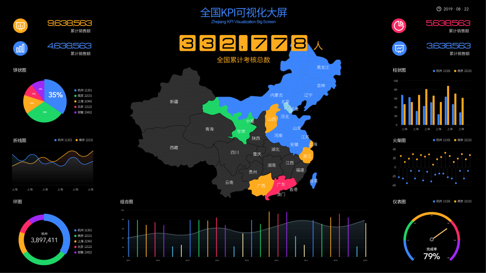

在新零售行业，随着数字化交易的大量进展，越来越多的客户被数据化，并且导入到了企业的客户数据库。而我们都知道，以阿里为首的新零售平台每年都有各类狂欢节日，甚至店铺也有自己的会员日等节日。很多企业都会在活动前后进行数据分析预测，活动实时分析，以及活动后数据复盘，包括转化率分析、好评率分析等，有的企业有专门的数据分析团队，也有的企业使用DataFocus等BI工具进行分析。

而对于双十一大促等大型营销活动来说，冲刺营销是抓住客户剩余购买力或抢占客户先行购买力的重要手段。很多商家也会针对历年数据进行时段、人群的数据分析，根据DataFocus与新零售商家们多年的合作经验以及对于各类真实数据的综合性分析，给出以下实施思路。

要想做好冲刺，无论是10号晚上还是11号晚上，要考虑的因素很多。如客户习惯夜间购物还是白天购物；店铺0点的活动力度如何；0点店铺本身有没有销售目标的要求等等，甚至还要考虑到第三方营销通道拥堵的问题。

根据我们和某商家合作的数据分析结果建议，冲刺可以分为4波，时间可根据自身店铺情况进行调整，此处以效益较大的10号晚冲刺为例。

早上10点，第一波，主要针对主推商品的敏感客户，精准传达优惠力度；

下午1点，第二波，主要针对休眠了一年到2年的客户群体，这些属于惰性客户；

晚上8点到11点，第三波，主要引导有夜间购物习惯的客户，同时也为引爆0点铺垫流量。

11号1点之后，是最后一波，是针对预售人群，通过付尾款的利益点刺激客户付尾款。

最后要注意的是，10号当天人群唤醒通知，需结合店铺运营活动节奏（如互动活动、官方晚会、直播等），类目商品属性，做实时数据分析，在此数据分析基础上做人群微调以及细化。另外关于营销通道拥堵的问题，尤其是用某些第三方软件的商家是从下午4-5点开始发短信的，很有可能造成拥堵，所以建议提前安排plan B。

