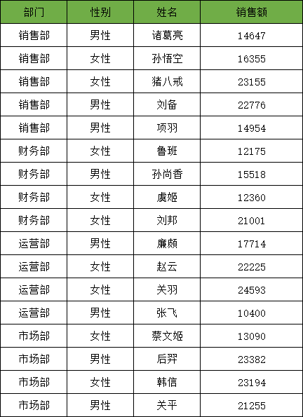
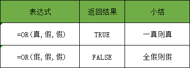
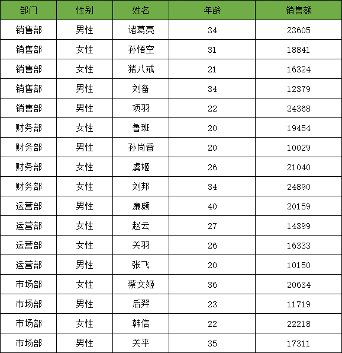
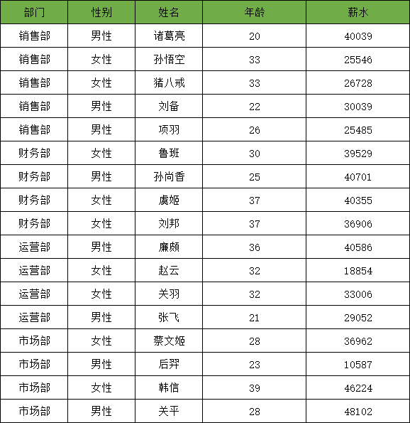
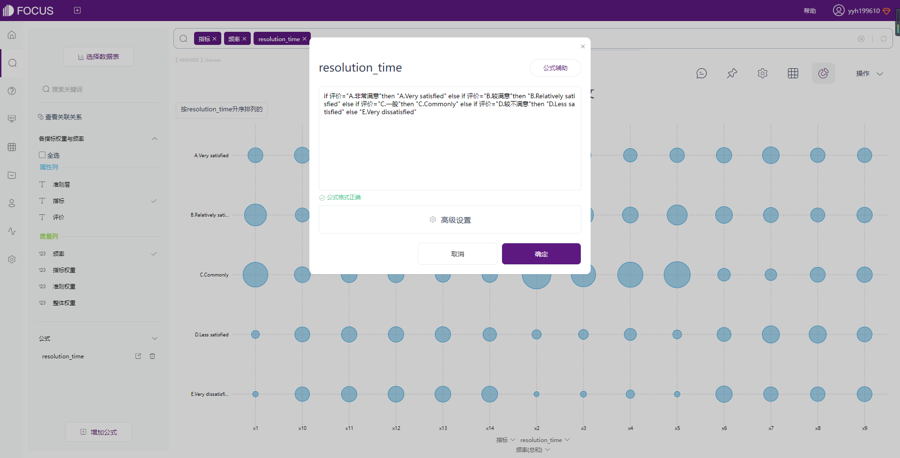

数据分析过程中，逻辑函数算是数据分析师必须掌握的，并且有着高频需求。

这些函数学习起来也不难，其中AND、IF、OR、IFERROR这四个必须精通。AND和OR函数一般与IF函数搭配使用，IFERROR函数主要是用来处理错误值，都很重要。

接下来我们就来了解一下在Excel以及搜索式BI分析软件DataFocus中逻辑函数的妙用吧！

### IF和AND函数

AND函数一般用于检验参数是否为真。

如果参数全为真，则返回TRUE；如果参数有一个为假，则返回FALSE。

比如AND（1>0,2<5,4>1）则返回为TRUE，AND（1<0,2<5,4>1）则返回为FALSE。

在常用的逻辑判断中IF函数经常和AND，OR连用，用来判断某种条件是否满足。

若满足，则返回一个值；若不满足，则返回另一个值。

具体语法如下：=IF(AND(判断条件1,判断条件2),"判断条件为真的返回值","判断条件为假时的返回值")

例如销售部的数据分析使用场景下，要判断各个员工是否达成销售额目标，则可以利用公式来分析。

假设判断目标为销售部男性员工，销售额目标值为20000。那么分析逻辑就是，如果员工"性别"为"男性"并且“销售额”大于等于"20000"，则返回“是”,否则的话返回“否”。

Excel的公式：=IF(AND(D4="Female",F4>=20000),"是","否")

如果在BI软件中则更方便，DataFocus的公式：if "性别"＝“男性" and "销售额">="20000" then “是”　else "否" ，这就更像是人类语言的公式。

### IF和OR函数

OR函数同样也能检验参数真假。

只不过，在OR函数中，如果有一个对的，函数返回为TRUE；如果参数全为错，则函数返回为FALSE。

当IF和AND嵌套使用时，只有AND函数中所有条件都满足时才会返回TRUE;而IF和OR连用时，只需要满足OR函数中的一个条件就会返回TRUE。

语法如下：=IF(OR(判断条件1,判断条件2),"判断条件为真的返回值","判断条件为假时的返回值")

例如查看市场部年龄大于30或者财务部年龄大于30的员工销售额是否达标，则可以使用这样的分析逻辑，如果员工“部门”为”市场部”或者”部门”为“财务部”并且"年龄"为">=30"并且“销售额”大于等于"40000"，则返回“是”,否则的话返回“否”。

Excel的公式：=IF(And（OR(A4＝市场部,A),"是","否")

在搜索式BI分析工具DataFocus中用到if else公式：if 年龄＞＝30 or 销售额>=20000 then “是”　else "否"

### IFS函数

IFS函数可以检查是否满足一个或多个条件，并返回与第一个TRUE条件对应的值。使用IFS函数可以实现对数据的分箱处理，我们举个例子进行说明。

在人力资源部门中，HR想要对员工工资进行分箱处理，以便对员工进行一个归类。假设20000元以下为“低薪”，20000-40000为“中等”，40000以上为“高薪”，而快速实现这个功能我们就可以用到IFS函数。

公式：IFS(F5<=20000,"低薪",AND(F5>20000,F5<=40000),"中等",F5>40000,"高薪")。

在搜索式BI分析工具DataFocus中用到的是**if else公式**：if 薪水<=20000 then "低薪" else if 薪水>40000 then "高薪" else 中等

### IFNA和IFERROR函数

数据中可能会出现各种错误类型，如#DIV/0！、#VALUE！、#N/A、#NUM！、#REF！、#NAME？等等。如果不想要显示出这些错误，那么就可以用到IFNA函数和IFERROR函数。

IFNA函数可以将解析出来的的#N/A进行赋值，即当函数解析为#N/A时，该函数可以指定其返回值；而IFERROR函数可以判断指定的表达式是否有错误，如果有错误，返回指定的值，否则返回表达式本身的值。

比如在人力资源部门，我们可以通过IFNA函数查找部分员工的工资，当没有该员工信息时，则返回“查无此人”。

公式：IFERROR(VLOOKUP(D4:D9,A4:F19,6,0),"查无此人")。

同样的，我们通过IFERROR函数查找部分员工年龄，当没有该员工信息时，则返回“查无此人”。

公式：IFNA(VLOOKUP(H4:H9,A4:F19,6,0),"查无此人")。

而在搜索式BI分析工具DataFocus中用到的是**ifnull和isnull公式**，

ifnull：如果值1为null返回值2，否则返回值1

公式为 ifnull(cost, 'unknown')

isnull：如果值为null返回true否则返回false

isnull(null) = true

### 函数转换为关键字段

其实公式理解透了，运用起来都还挺快的。但还有更快的方式，那就是**把公式保存并转换成关键词，需要用到的时候直接搜索关键词就可以数据分析**。

而DataFocus就能做到这一点。不论是多长多复杂的公式，保存起来下次直接套用就可以了。

需要分析时，在搜索框一搜保存的关键词，系统就自动以匹配的图表显示。

现在新用户注册商业分析师版还可以免费试用14天！据说已经有很多大厂的商业分析精英都在使用。可以点击[这里](http://datafocus.ai)查看~

### 小结

以上就是Excel中常用的逻辑判断函数以及常见的使用场景，希望对你有所帮助~

**觉得内容还不错的话，欢迎点赞、评论、转发哦！**
