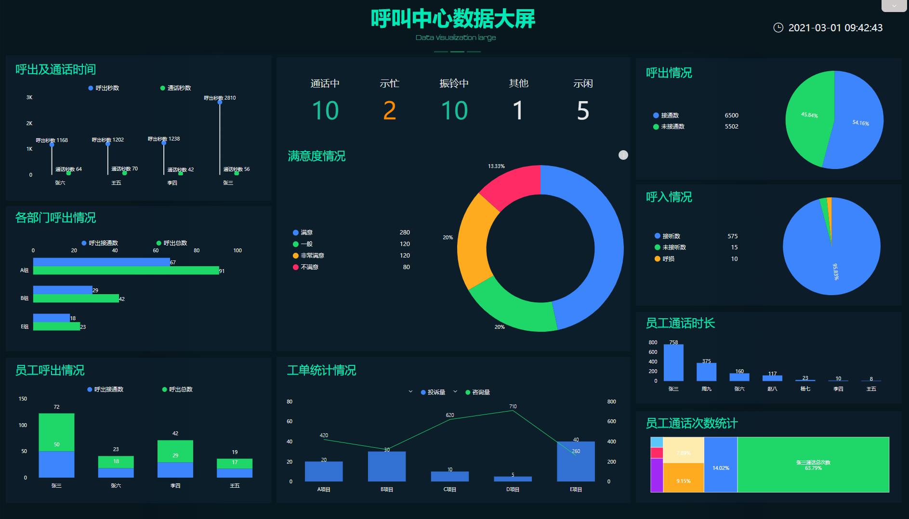

对于大多数企业和政府机构来说，数据不足不是问题。事实上，情况正好相反：通常有太多的信息可供做出明确的决定。

有这么多的数据要整理，你需要从您的数据更多的东西：

您需要知道这是回答您问题的正确数据; 您需要从这些数据中得出准确的结论;和 您需要数据来指导您的决策过程 简言之，您需要更好的数据分析。有了正确的[数据分析](https://www.datafocus.ai/)过程和工具，曾经大量不同的信息就变成了简单、清晰的决策点。

为了提高数据分析技能并简化决策，请在数据分析过程中执行以下五个步骤：

第 1 步：定义您的问题 在组织或业务数据分析中，您必须从正确的问题开始。问题应该是可衡量的、清晰的和简洁的。设计您的问题，以符合或取消您特定问题或机会的潜在解决方案的资格。

例如，从明确界定的问题开始：政府承包商的成本正在上升，不再能够提交具有竞争力的合同提案。解决这一业务问题的众多问题之一可能包括：公司能否在不影响质量的情况下裁员？

第 2 步：设置明确的测量优先级 此步骤分为两个子步骤：A） 决定测量什么，B） 决定如何测量它。

A）决定测量什么 以政府承包商为例，考虑您需要提供什么样的数据来回答您的关键问题。在这种情况下，您需要了解当前员工的数量和成本，以及他们花费在必要业务职能上的时间百分比。在回答此问题时，您可能需要回答许多子问题（例如，工作人员目前是否未充分利用？如果是这样，哪些流程改进会有所帮助？最后，在决定衡量什么时，一定要包括任何利益相关者可能提出的任何合理异议（例如，如果员工减少，公司将如何应对需求激增？

B）决定如何测量它 思考如何测量数据同样重要，尤其是在数据收集阶段之前，因为您的测量过程要么备后，要么在以后诋毁您的分析。此步骤要问的关键问题包括：

你的时间框架是什么？（例如，年度与季度成本） 你的衡量标准是什么？（例如，美元对欧元） 应包括哪些因素？（例如，年薪与年薪加员工福利成本） 第 3 步：收集数据 随着您的问题明确定义和测量优先级的设置，现在是时候收集您的数据了。在收集和整理数据时，请记住以下重要点：

在收集新数据之前，请确定可以从现有数据库或手头来源收集哪些信息。首先收集此数据。 提前确定文件存储和命名系统，以帮助所有受任务的团队成员协作。此过程节省时间并防止团队成员两次收集相同的信息。 如果您需要通过观察或访谈收集数据，请提前开发面试模板，以确保一致性和节省时间。 将收集的数据整理在日志中，并随身即添加任何源注释（包括执行的任何数据规范化）。这种做法验证了你在路上的结论。 第 4 步：分析数据 在从第 1 步收集正确的数据来回答您的问题后，是时候进行更深入的数据分析了。首先，以多种不同的方式操作数据，例如绘制数据并查找相关性，或在 Excel 中创建枢轴表。枢轴表允许您按不同的变量对数据进行排序和筛选，并允许您计算数据的平均值、最大值、最小值和标准偏差 -只需确保避免统计数据分析的这五个陷阱。

在操作数据时，您可能会发现您拥有所需的确切数据，但更有可能的是，您可能需要修改原始问题或收集更多数据。无论哪种方式，这种趋势、相关性、变化和离群值的初始分析都有助于您将数据分析集中在更好地回答您的问题以及其他人可能提出的任何异议上。

在此步骤中，数据分析工具和软件非常有帮助。维西奥、米尼塔布和斯塔塔都是高级统计数据分析的好软件包。然而，在大多数情况下，没有什么能比得上微软Excel在决策工具方面。如果您需要审查或介绍 Excel 为您的数据分析完成的所有功能，我们推荐此哈佛商业评论课程。

第 5 步：解释结果 在分析您的数据并可能进行进一步研究后，终于该解释您的结果了。当你解释你的分析时，请记住，你永远无法证明一个假设是正确的：相反，你只能拒绝这个假设。这意味着无论您收集多少数据，机会总是会干扰您的结果。

在解释数据结果时，请问自己以下关键问题：

数据是否回答了您最初的问题？ 这些数据是否有助于您抵御任何异议？ 你的结论有什么限制， 你没有考虑过什么角度？ 如果你对数据的解释在所有这些问题和考虑下都得到了支持，那么你很可能得出了一个富有成效的结论。剩下的唯一步骤是使用数据分析过程的结果来决定最佳操作方案。

通过在数据分析过程中遵循这五个步骤，您可以为您的企业或政府机构做出更好的决策，因为您的选择得到了经过严格收集和分析的数据的支持。通过实践，您的数据分析将更快、更准确， 这意味着您可以做出更好、更明智的决策，以最有效地运行您的组织。

想要从您的数据中得出最准确的结论？立即试用DataFocus，并了解正确的[数据分析](https://www.datafocus.ai/)如何推动您的组织取得成功。
