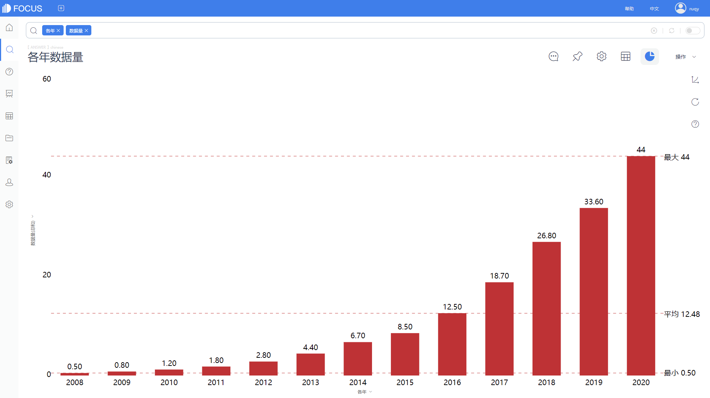
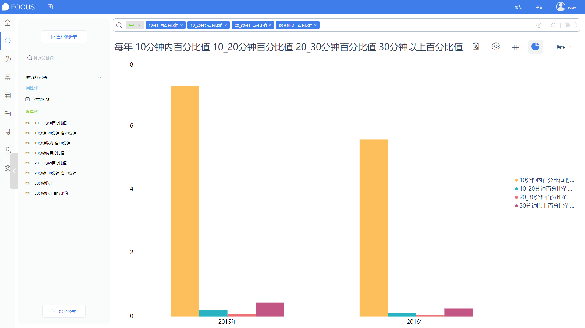

数据可视化既是一门技术，又是一门艺术。优秀的数据可视化作品可以高效、精准地传达信息。本篇用3章的篇幅，浅显地讲述相关知识点，目标是让读者对数据可视化有一个基本的了解，初步认识数据类型，以及数据可视化的一些常用技巧。本篇的知识储备尚能应付书本后续的数据分析及可视化实践。但如果要深入研究建议读者更广范的去阅读爱德华\-塔夫特（Edward Tufte）等人专门论述数据可视化的书籍。

## 数据可视化的意义

### 触手可及的数据

经过三次信息化浪潮的洗礼，将生活的点滴进行数字化记录和存储的现象已经变得司空见惯。将一天中的美好瞬间记录成数字化图片，比如录下小宝宝刚刚学会走路时的可爱影像，或者用 Apple Watch 记录下心跳，用于开展有规律地运动和饮食，或者用便携式电子设备记录下血糖数值，科学指导用药。到如今，虚拟现实（VR）和增强现实（AR）已经开始模糊数字化世界和真实的世界，新兴起的脑机接口技术则将人类推向了人机融合的未来。人类正在朝着比特化生存的大路狂奔而去，未来难以确定，但是有一点可以肯定的是，您的生活正在被量化。

相比于个体的人来说，企业组织则早就是数字化革命的先锋。从最早的业务电算化，到业务信息化的发展过程中，企业就创建了大量基于软件和互联网的业务系统。如今ERP（Enterprise Resource Planning，企业资源计划系统）、CRM（Customer Relationship Management，客户关系管理系统）等信息系统更是企业的标配，一些大型企业集团经过20多年的信息化建设，甚至形成了几十种、数百种业务信息系统，而这些用比特记录的业务系统的点点滴滴正在形成庞大的数据池。

据 IDC（International Data Corporation，国际数据公司）预测，全球数据总量在 2020年达到44个ZB（如图1-1），我国数据量将达到8060个EB，占全球数据总量的 18%。物联网、5G技术的普及，让工业4.0水到渠成。精益生产越来越普遍，企业将更加注重效率，通过数据分析，挖掘提升组织效率成为必然。

图 1-1 IDC预测全球数据总量

### 数据资产的价值

大部分人会选择将宝贵的生活记录保存下来，以便空闲的时候回顾精彩人生。这样一年大概会产生100GB的数据，其中大部分是图片、视频或音频。而一个中小型企业组织，每年则会产生1TB的数据，大型企业集团一年的数据增加量甚至会突破1PB。如此大量的数据，仅仅是被记录存储就耗费巨大，企业付出昂贵的代价仅仅是为了保存这些数据吗？

有人说，数字化时代“数据就是石油”。企业业务系统所形成的数据大部分与企业的生产、经营、市场活动息息相关，这些数据记录着企业的业务规律，承载着客户关系。但如果仅仅是把数据记录存储起来，那么这些数据将成为企业永远的成本。只有对数据进行有效的整理和挖掘，这些数据才会从沉默的费用成本变成有效的资产。如果辅之以高效的数据分析平台，业务人员随时随地可以进行数据分析，从数据中获得对企业有业务启示的生产经营规律、市场线索，那么这些数据将变成具有高度变现能力的流动资产，才会真正变成企业的业务增长引擎所必需的燃油。

### 数据可视化的意义

在过去，很多人或许对数据可视化并没有很直接的观感，因为跟其打交道的数据应用模式无非就是EXCEL或是固定的数据模型或工具。但是随着大数据时代的到来，数据量和数据复杂性增加，模型的复杂性也随之增加。此时对于企业来说，内部业务系统之间的数据流通和分析结果的可视化是非常关键的工作，同时也是一个跨越性的挑战。

数据的可视化可以将复杂的分析结果以丰富的图表信息的方式呈现给读者。然而只有分析人员对目标业务活动有深刻的了解，才能更好地进行可视化展现。正如耶鲁大学统计学教授爱德华·塔夫特（Edward Tufte）所说：“图形表现数据，实际上比传统的统计分析法更加精确和有启发性。”对于广大新闻编辑、设计师、运营分析师、大数据研究者来说，他们都需要从不同维度、不同层面、不同粒度的数据统计处理中，以图表或信息图的方式为用户（只获得信息）、阅读者（消费信息）及管理者（利用信息进行管理和决策）呈现不同于表格式的分析结果。

数据可视化技术综合运用计算机图形学、图像、人机交互等技术，将采集、清洗、转换、处理过的符合标准和规范的数据映射为可识别的图形、图像、动画甚至视频，并允许用户与可视化数据进行交互和分析。而任何形式的数据可视化都由丰富的内容、引人注意的视觉效果、精细的制作三要素组成，概括起来就是新颖而有趣、充实而高效、美感且悦目三个特征。

不仅如此，很多基于数字化交易的企业，数据量每天都在急速增长，并且来源多而杂乱，因此找到准确、精细、相关的数据变得更加困难和重要。可视化能够让决策者精准地洞察数据反映的结果，如趋势、占比等，而不需要去手动读取那些困难的表格。

举一个例子，对于气象行业来说，有效利用大数据可视化至关重要。天气模型会利用大量数据进行分析呈现，消费者收到的最终预测通常是几种模型分析的结果。企业也是一样，当预测变得越来越复杂的时候，一种让决策者能够理解并快速采取行动的方式，或者说获取数据分析结果并传递有效信息，是企业成功的必要条件。但是，很多决策者得到了这些结果，在没有可视化的情况下，仍是需要分析人员解释的。比如很多以数据分析服务为业务的乙方公司，有非常多个不同的数据源关联各类具有不同数据属性的复杂模型，那么如何以一种使其易于操作的方式向甲方解释？这也是数据可视化存在的必要性，通过正确的图形，甲方可以快速获取并解读不同维度的复杂数据结果。

所以，无论是哪种职业和应用场景，数据可视化都有一个共同的目的，那就是准确而高效、精简而全面地传递信息和知识。可视化能将不可见的数据现象转化为可见的图形符号，能将错综复杂、看起来没法解释和关联的数据，建立起联系和关联，发现其规律和特征，获得更有商业价值的洞见和价值，并且利用合适的图表直截了当，且清晰而直观地表达出来，实现数据自我解释、让数据说话的目的。而人类右脑记忆图像的速度比左脑记忆抽象的文字快100万倍。因此，数据可视化能够加深和强化受众对于数据的理解和记忆。

我们可以从决策者角度来感受一下可视化的魅力。这里我们使用一种非常便捷的可视化的工具——DataFocus，它易于使用并且可提供多种角色的决策场景，可以使商务人士的数据决策独立、灵活和多样化。

比如原来我们看到数据表格是这样的，如表1-1：

表1-1 付款周期统计数据表

图1-2是将表格经过可视化之后获得的结果：

图1-2 付款周期可视化结果

我们可以看到，可视化不仅可以做到让数据结果美观易读，更能根据数据可视化需求从大量数据最难过提取决策者想要的数据维度，达到“想要即呈现”的目的，不必花额外时间从复杂的数据表中寻找、提取及分析解读。

### 小结

数据飞速增长是正在发生的事实。人们的生活逐渐步入数字化时代，高度信息化的社会使得人们每天必须消费大量信息。科学研究表明，人类的大脑对图像信息的获取速度远高于数据处理速度，因此数据可视化将成为人类工作生活的基本技能——高效的可视化数据可以让人充分利用碎片时间，更加快速、准确地获取和处理信息。
