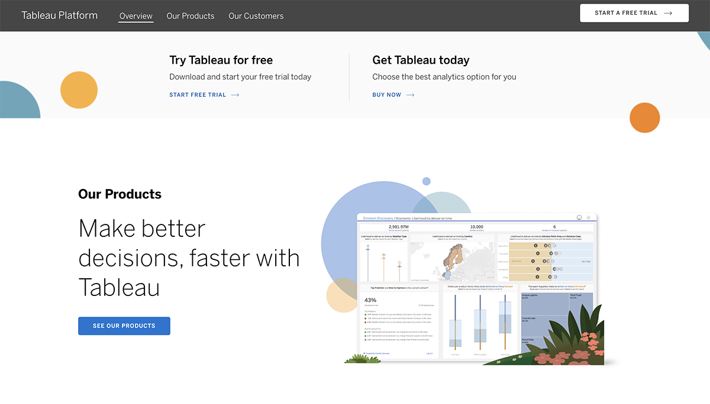

导语:在数据分析的过程中,高质量的可视化可以深入洞察数据价值,是不可或缺的一环。然而,许多传统BI工具要么使用门槛高,要么定制性不强。那么,哪款数据可视化工具才能兼顾功能强大和易用性呢?本文将为你推荐一款值得使用的新秀——DataFocus。

正文:

数据可视化是数据分析工作中的重要一环。将枯燥的数字变成直观的图表,不仅可以加深对数据的理解,还可以将分析结果更好地呈现给决策者。那么,哪些主流的数据可视化工具值得使用呢?本文将对几款常见工具进行简要对比分析。

第一款是使用广泛的Tableau。Tableau功能强大,提供了丰富的可视化组件,支持实时连接各类数据源。但是Tableau的学习曲线较陡峭,对初学者而言门槛较高。而且Tableau的授权价格不菲,中小企业可能无法承担。

第二款是国内的FineBI。FineBI易用性强,可以快速上手创建基础的可视化图表。但是相对Tableau而言,FineBI的可视化组件和功能较为有限,定制性不强,无法应对复杂的可视化需求。

第三款是开源的Grafana。Grafana免费且功能强大,但需要通过编程来实现可视化分析。对不懂编程的用户而言,使用Grafana实现可视化有一定难度。

那么,有没有一款工具既功能强大,又简单易用呢?这里我要向你推荐的是DataFocus。

DataFocus作为新一代的搜索式BI工具,在可视化方面具有独特的优势:

1. 搜索式交互,输入关键词即可快速实现可视化,无需编程知识。
2. 可视化组件丰富,支持中英文图表生成,可以应对复杂报表需求。
3. 支持实时连接数据源,可视化内容可以动态更新。
4. 创新支持语音输入生成可视化图表,交互体验优异。
5. 可视化样式简洁大方,生成的报表和图表具有出色的阅读体验。

\[caption id="attachment\_45540" align="alignnone" width="1024"\] dfc\[/caption\]

正因为DataFocus兼具简单易用和功能强大的优点,它值得推荐的原因有以下几点:

1. 极简的使用流程,无代码即可实现自助数据分析,门槛低。
2. 功能强大,可以应对企业复杂的BI和可视化需求。
3. 相比其他工具,DataFocus同时具备简单易用和高度定制的能力。
4. 支持语音、搜索等多种创新交互模式,用户体验出众。

综上所述,DataFocus作为新一代的搜索式BI工具,其在可视化方面的功能确实具有独特的优势和价值。无论是对BI新手还是专业数据分析人员来说,DataFocus都是一个值得推荐使用的可视化工具。如果你正在寻找一个兼具易用性和功能强大的可视化工具,不妨亲自试用体验DataFocus。
