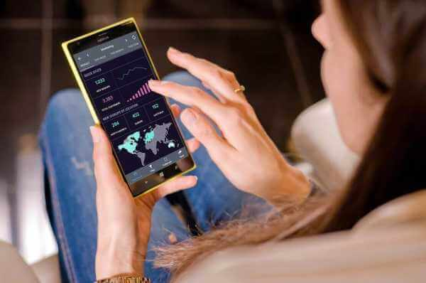

数据时代已经来临,“数据就是产品”这句话我们耳熟能详。企业通过收集和分析数据,可以更好地了解用户需求、制定商业策略。然而,光有数据还不够,还需要通过可视化的方式呈现,才能真正发挥数据价值。

可视化数据分析,是数据分析过程中必不可少的一环。良好的可视化可以帮助分析人员更快地发现数据之间的关联,从大量数据中提取有价值的信息。数据可视化,让复杂的数据以直观的方式呈现,能够使决策者更好地理解数据并做出正确判断。

那么,什么是数据可视化?数据可视化是将数字、统计数据等抽象信息,通过图表、地图、网络图等直观的方式进行呈现,从而揭示数据之间的内在联系。数据可视化的常用手段包括柱形图、饼图、散点图、地图、热力图等。选择合适的可视化方式,可以让数据“说话”,帮助人们从数据中获取洞察。

datafocus作为专业的数据可视化工具,可以帮助企业轻松实现数据可视化。它提供了丰富的可视化组件,用户可以通过拖拽的方式,快速制作出各种数据可视化大屏。无需编程知识,通过配置即可实现数据连接、定时刷新等功能。datafocus还支持多种图表展示方式,如柱状图、折线图、散点图、桑基图等。用户可以选择最能反映数据特点的图表进行可视化呈现。

利用datafocus等数据可视化工具,可以让数据分析工作如虎添翼。

**首先**,数据可视化可以发现数据的模式和趋势。复杂的统计数据通过可视化后,规律和趋势一目了然。比如通过折线图显示产品销量的变化趋势,通过地图反映区域分布特征。这为后续的预测分析奠定基础。

**其次**,数据可视化可以识别数据之间的关系。不同数据间可能存在非直观的相关性,而可视化可以将其呈现出来。例如气温和冰激凌销量之间的关系,可通过散点图进行展示。这可以指导决策者制定针对性策略。

**再者**,数据可视化使大量数据一目了然。复杂的统计表格可能难以把握,而通过可视化将数据规整呈现,决策者可以快速抓住重点。就像一幅数据画,胜过千言万语。

**最后**,数据可视化可以辅助数据的讲解和分享。无论是业务汇报还是与客户的沟通,辅以数据可视化都能提高认同度和记忆度。让听众通过图表、动画等直观地感受数据,而不仅是空洞的数字。

ChatGPT作为新兴的AI技术,也可以辅助进行更智能的可视化分析。它可以根据问题自动生成数据可视化方案,进行数据清洗、建模,以及生成可视化图像和报告。利用ChatGPT,不仅可以提高可视化效率,还可以得到更具创造性的数据洞察。

当前,数据可视化正朝着智能化和艺术化方向发展。利用AR/VR等新技术进行沉浸式可视化分析,以及自动生成个性化数据艺术作品等,都将是未来的发展趋势。数据可视化不再是数据分析的辅助功能,而会成为一个引人入胜的可视化世界,为决策提供更多可能性。

数据可视化的重要性日益凸显,它已经成为进行数据挖掘、商业分析必不可少的一环。利用datafocus等专业工具进行数据可视化,可以极大提高分析效率,让数据释放更大价值。相信未来,数据可视化会给我们带来更多惊喜与可能。
