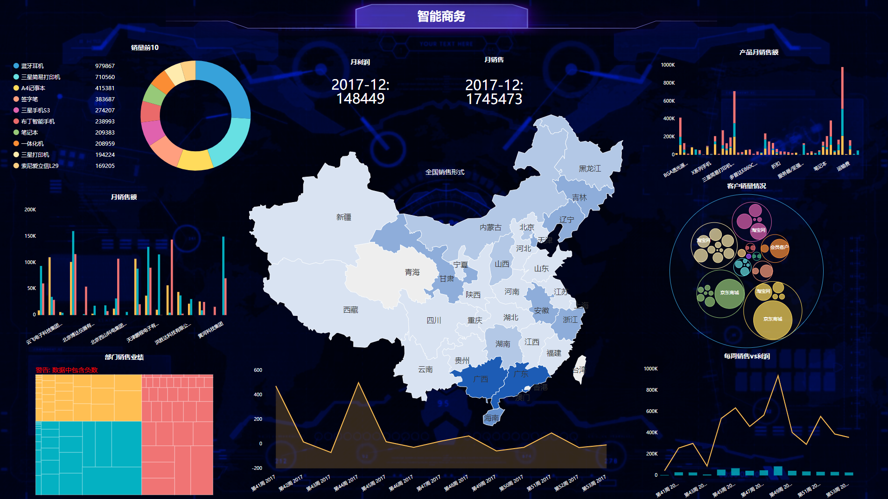

现在是一个数据时代，人人都在谈“大数据”，不管身处什么行业，各个企业都开始注重自己的数据，想要好好利用这些数据。但现实情况是，很多数据都分布在企业不同的系统中，如企业的客户管理系统、生产系统、销售系统、采购系统、订单系统、仓储系统和财务系统等，所有数据被封存在各系统中，让完整的业务链上孤岛林立，信息的共享和反馈难，使企业无法适应当今快速多变、全球化竞争的市场环境，企业的生存和发展将面临极大的挑战。企业要想实现精细化管理，挖掘大数据背后隐藏的价值，那就必须打破数据孤岛的情况。

数据孤岛，存在于每个企业。如何快速低成本地打破这种僵局？借助数据平台，建立一个数据中心，将各业务系统中的数据集成在同一平台上，形成一个巨大的数据仓库，供企业管理者和决策者分析利用，为企业创造价值效益。

而DataFocus就可以充当一个这样的数据平台，其可以整合企业中不同业务系统内的数据，将数据汇总到同一个数据仓库内，从而可以对所有的数据综合进行分析，随着数据汇合的越来越多，“滚雪球”的效果愈加明显，似乎数据整合的越多，可挖掘的价值就越大。这些数据在我们面前展开了一幅宏伟的蓝图，可以通过数据将企业内的所有人与物串在一起，形成一个可以用数字描绘的虚拟世界。

在企业汇总数据，挖掘数据，利用数据的过程中，DataFocus充当了一个数据仓库，数据分析系统，数据报表系统，数据可视化系统，其功能强大，完美解决了企业的痛点，而且DataFocus的实用性非常好，无需专业的IT人员，普通的业务人员也能使用，大大降低了企业的成本支出。

如果你们正面临相同的问题，不妨试一试DataFocus。
