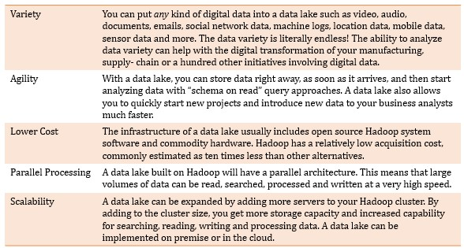

DataFocus可以让用户通过私有化部署方式建立属于自己的DataFocus数据分析系统，让您立即拥有：1个大数据仓库+1个数据可视化系统+1个数据分析引擎+1个报表系统。完美建立您的数据湖泊。那么如何建立一个好的数据湖呢？

数据湖基于一个简单的想法：您可以大规模存储和分析大量原始数据。但为什么数据湖？以下是IT领导者对此想法感到兴奋的五个原因：

不幸的是，许多公司最终得到的是数据沼泽，而不是数据湖。数据沼泽是一个地方：

- 您找不到所需的具体数据
- 您不知道任何给定文件的来源
- 您不知道任何给定文件中包含或排除的内容
- 您有文件或对象的多个副本
- 您不知道任何文件的质量特征
- 整合来自不同来源的数据通常是不切实际的

经过短短三个月的实际运营，许多数据湖泊退化为数据沼泽，无法用于商业目的。结果是IT运营的噩梦，其中投资丢失，关键业务目标受到损害。

那么，您如何创建一个不会变成沼泽的数据湖？

想想一个水库，这是一个在受控条件下储存水直到需要的地方。水库不会变成沼泽，因为它们是受管理的。什么进入他们并出来是受控制的。建造水库是为了尽量减少生物和化学污染，并遵循最佳做法进行维护。如果一切正确，你实际上可以喝水库里的水。

为了避免数据沼泽，建议基于系统方法，声音架构和一组最佳实践来构建数据库。

**系统方法**

大多数人如何处理数据湖的创建？他们说，“我们会随着时间的推移弄明白。”但是，一旦有关数据湖的存在，员工就会开始向湖中添加数据。数据会非常迅速地进入，每个用户都会以自己的方式做事。在你知道它之前，你将拥有众所周知的数据沼泽。

更好的方法是预期出现重大问题，提前确定解决方案并与用户协同工作。

我们以共享数据为例。想象一下，您希望获得与您的业务相关的所有社交媒体推文的副本。如果是为一名员工获取推文，则您不希望其他人必须前往其他供应商并再次购买。有效的数据共享是数据库的商业价值的基础。

用户能够找到数据湖中已存在的数据并了解数据以确定其是否适合使用，这一点也很重要。这项工作需要考虑数据共享的架构和最佳实践。您还需要一些工具，以便于搜索数据及其相关元数据。

组织应该预测数据湖项目开始时数据共享的重要性，以便在整个组织内共享和重用数据。考虑到所有因素，成功的数据湖方法将预先确定基本问题，并通过集成架构和基本最佳实践解决这些问题。

**建立架构**

如上所述，数据库架构的一个组成部分是管理元数据以鼓励和支持数据重用。以下是其他主要功能：

**数据提取：**将数据从新数据源引入数据库必须简单有效。特别是，应该避免自定义编码和脚本。

**将数据归档为源：**许多数据库要求最初收到的数据副本可用于审计，可追溯性，可重复性和一些数据科学技术。因此，需要一种自动且有效的方式来存档源数据的副本，通常具有无损压缩并且有时以加密形式。

**数据转换：**为了准备分析数据，给定数据库中所有必要转换的集合可能很大。应该以最少量的自定义编程为目标。

**数据发布：**应完成数据提取，数据转换和元数据捕获，以便可以使用数据。“发布”行为使数据为特定类别的报告，仪表板或查询做好准备。

**安全性：**数据库应该管理对数据对象，某些服务（如Hive或HBase），特定应用程序以及Hadoop集群本身的访问。安全体系结构和策略应该保护边界，处理用户的标识和授权，控制对数据的访问，满足加密，屏蔽和标记化的需要，并遵守日志记录，报告和审计的要求。

**运营和管理：**当数据库全面运行时，将有许多数据管道同时运行，每个数据管道都在摄取，转换和发布数据。还将有通过提取和下载或通过交互式报告和查询来消费数据的过程。

**最佳实践**

在创建数据管道（摄取，转换和发布）时，最佳做法是正确执行必要的步骤以使数据始终可用。这意味着在每个触摸点捕获元数据，在每个步骤正确处理异常，完成适当的数据质量检查，有效处理不正确的数据以及正确的数据，以及根据指定的标准执行任何数据转换或规范化。

应在整个数据库中一致地应用适用的标准和模板。这样，您的数据将为严格的分析提供适当的基础，从而实现重要的业务决策和操作。

准备培养你的水库？数据湖现在如此普遍，以至于您的组织可能很快就会有一个，如果还没有。然而，在短短三个月的实际操作中，大多数“随时随地计算”数据湖将无法用于商业目的。

您可以拥有一个成功的数据集，而不是没有人使用的数据库，在这个数据库中数据组织良好并提供越来越多的价值。
