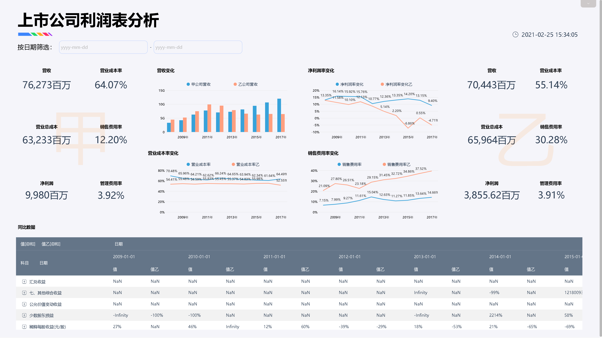

机器学习这个概念最早是由IBM公司发明的。大家都知道，IBM最善于发明各种新概念，比如智慧地球，也是他的发明。但是，不能望文生义，Machine Learning，并不是说机器会学习，正相反，和人比起来，计算机差距最大的地方，就是不善于学习了。

虽然如此，但是在某些特定领域，只要你定义了足够好的问题，机器学习算法还是能如你所愿，展现它的能力的。比如，如果可以运用DataFocus进行销量的预测，并且获得比较好的效果。那么，接下来我们来谈谈，如何定义好问题？

总体来说，机器学习能应付的问题只有这么4类问题：

1. 屋子里进来一个人，是男的还是女的？

这是个分类问题。机器学习模型可以通过算法训练，很熟练的区分不同的类别。类似的额问题还包括，这个涡轮叶片运行1年会不会坏掉？如果搞个商场大促销，是直接打折，还是发优惠前，销售量大？

1. 生产线的传送带送来了又一个轮胎，它合格吗？

这属于模式识别的问题。从一系列正常的模式中，识别出异常值。比如欺诈监测，故障预警，等等，都属于这类问题。

1. 你的淘宝小店，明天销量会是多少呢？

这是典型的预测场景了。关于数值的预测，你简直随处都可以遇到，比如，明天温度会是多少？下一分钟，股价会变成多少（尽管这很难预测）。

1. 火车站广场上的一群人，哪些是男人，哪些是女人呢？

这是一类典型的聚类问题。给你一坨东西，给他们归个类。比如有些分拣机器人，就得具备这种能力，苹果和橘子得分开装箱，它们干得非常好。

DataFocus的机器学习算法集成平台，可以帮你解决很多问题，前提是你得提出一个好问题。当然了，你的问题如果是：怎么样提高我的利润率？或者，怎样增加我的销售收入？DataFocus是拒绝回答的。
