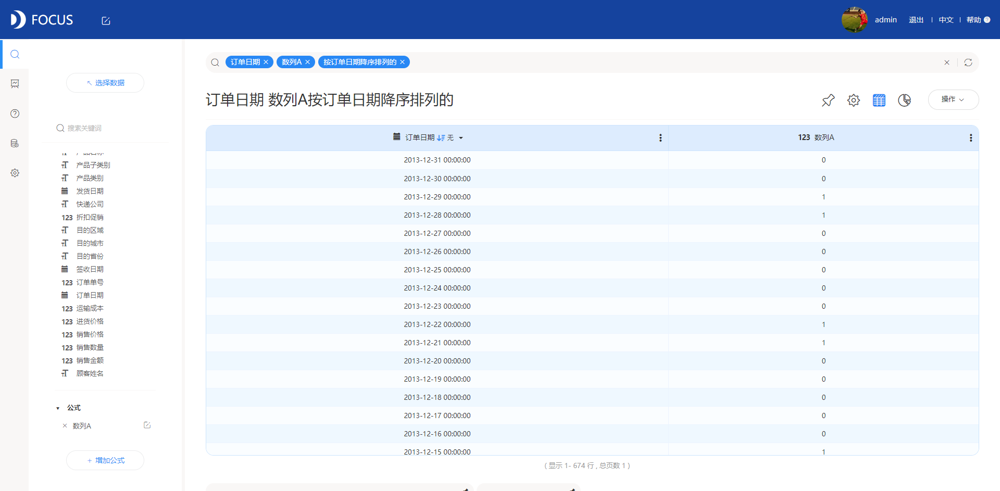

在数据分析中，同样的数据场景采用不同的图表会带来很大的信息差距。正确的匹配数据与图表不仅要有对数据结构的理解、业务的理解，还需要对图形语言学的一定了解和实际可视化项目中的经验，每一个元素背后都有着很深的学问，这里总结了一些常用图表的特性，可以帮助用户更高效的选择合适的图表类型。

数据场景千千万，每个不同的场景都有不同的数据结构、数据记录数和业务需求，这里先不论具体的业务要求，单说不同的数据结构和数据量，大致能够分为四类数据场景：对比/结构分析/分布/关联。

今天先来说一说结构分析场景。

部分相较于整体，一个整体被分成几个部分。这类情况会用到构成型图表，如五大区域的销售量占比、公司利润的来源构成等。

1、单层结构

单层结构无疑是用饼图最合适，但是饼图分类一般不适合过多（10以内最好），过多会显得杂乱没有章法，条目较多时，还是建议条形图。除饼图外，环形图、玫瑰图均可。

2、多层结构

多层维度分析就需要分层结构的图表，常用于需要凸显出重点地区或分部的情况，同时把握总体和重点部分，可以使用旭日图和树形图。

或者在可以使用配合DataFocus的上下钻取功能的情况下，环形图也是很好的选择。在整体和部分模式下随意切换，体验更佳。

3、累积比较

对于累积变化的情况，推荐堆叠式的图形，比如面积、堆叠柱状图、堆叠条形图等。

1. 累积增长

若想表达两个数据点间数量的演变过程，可使用瀑布图。开始的一个值，在经过不断的加减后，得到一个值。瀑布图将这个过程图示化，常用来展现财务分析中的收支情况。

