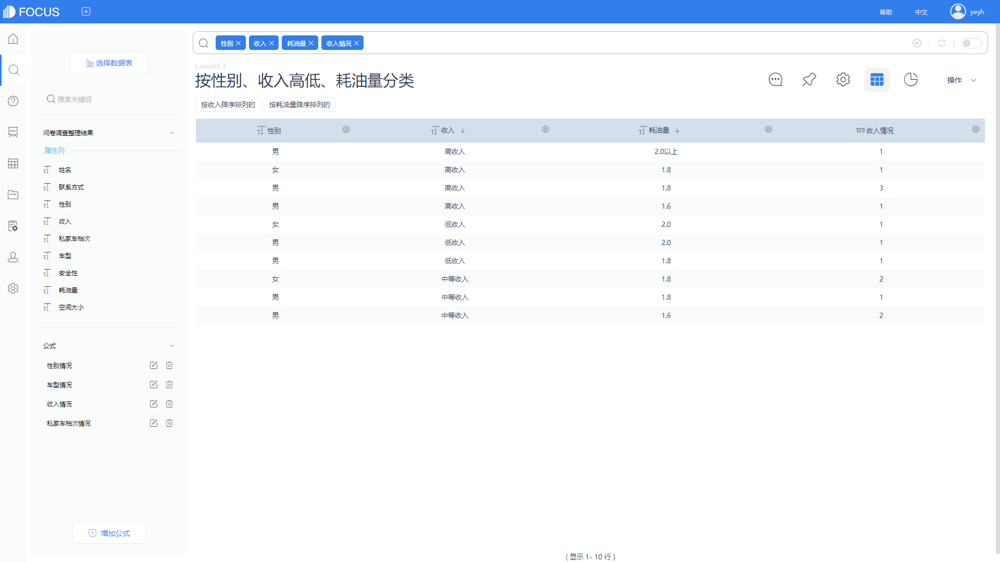

**目的 ：**研究工商管理类岗位招聘薪资分布，为该专业人才更好进行自身定位以及职业规划提供一定数据依据。

**摘要 ：**工商管理是研究工商企业经济管理基本理论和一般方法的学科，主要包括企业的经营战略制定和内部行为管理等多个方面。本文通过工作性质、学历要求、工作经验、职位岗位、城市差异对岗位薪资进行相关探索，得到全职类岗位的薪资最高；薪资的高低和学历的高低呈正相关；工作经验三年以上的人才薪资较高等结果。因此认为提升自己的知识层面，拿到本科及以上学位证书；做好职业规划，为自己定一个目标，向着目标谦虚努力，累积经验等措施可以帮助自己拿到更高的满意的薪资。

**关键词：**datafocus,全职招聘,本科,薪资分布

一、案例背景

工商管理专业的应用性很强，它的目标是依据管理学、经济学、会计学等基本理论，通过运用现代管理的方法和手段来进行有效的企业管理和经营决策，保证企业的生存和发展。市场上需要的人才需要具备现代企业管理等方面的知识和能力，具有管理能力、创新能力、研究能力和终身学习能力高素质、应用型高级专门人才。本文使用某一招聘网站的工商管理类岗位招聘信息对工商管理类岗位招聘薪资分布进行研究，意为该专业人才更好进行自身定位以及职业规划提供一定数据依据。

二、案例问题

本次研究数据有2113行数据，用EXCEL来进行分析会操作缓慢，使用datafocus产品就可以快速处理大量数据，因此可以极大的减少人力和时间。

三、案例分析

进入datafocus 产品系统，从数据管理页面中导入数据源“工商招聘”，并在数据看板页面创建新的数据看板，命名为“工商管理类岗位招聘薪资分布”。

1.各类工作性质的薪资分布

首先大致了解不同工作性质的薪资分布情况，此统计图选择使用饼图。

图 1 各类工作性质的薪资分布

从图1中可以看到，全职类岗位的薪资最高，其次为兼职类岗位，最低的薪资岗位是实习岗位。

2.全职招聘中最低学历要求的薪资高低走向

基本上工作招聘岗位以全职类居多，且工资高，接下来，使用面积图展示在全职招聘中最低学历要求的薪资高低走向。

图 2 全职招聘中最低学历要求的薪资高低走向

如上图2所示，薪资的高低和学历的高低呈正相关，学历越高，薪资越高。因此认为文凭和知识层面还是能一定程度影响到工作收入。

3.全职本科招聘中不同工作经验要求对薪资的影响

由上述可知全职本科学历的人才更能得到较为可观的薪资。接着对工作经验相关要求进行进一步探索，使用条形图对比全职本科招聘中不同工作经验要求对薪资的影响。

图 3 全职本科招聘中不同工作经验要求对薪资的影响

由图3可以看到，基本上工作经验越丰富的人才，其薪资越高。但其中工作经验1年以下和工作经验1-3年的人群没有多大的薪资差异，而一旦工作经验超过3年，其薪资即大幅度的增长。

4.各类职位在10年以上经验要求下的薪资情况

由3可知，工作经验在10年以上的人群其薪资最高。通过气泡图可以清晰的看到各类职位在10年以上经验要求下的薪资情况。

图 4 各类职位在10年以上经验要求下的薪资情况

如图4所示，客户服务总监、品牌经理、首席运营官COO，人力资源总监这4个岗位薪资较高。

5.最高薪资职位的地区差异

筛选出上述4个薪资较高的职位，比较其在各地区的薪资差异。

图 5 最高薪资职位的地区差异

由图5可以看到， 北京的客户服务总监平均薪资最高；在人力资源总监职位中，济南的平均薪资最高。

将这5个结果图导入“工商管理类岗位招聘薪资分布”数据看板中，排版结果如下：

图 6 数据看板

四、结论

1\. 全职类岗位的薪资最高，其次为兼职类岗位，最低的薪资岗位是实习岗位。

2\. 薪资的高低和学历的高低呈正相关，文凭和知识层面还是能一定程度影响到工作收入。

3.基本上工作经验越丰富的人才，其薪资越高。工作经验三年以下的薪资和工作经验超过3年的薪资有一个大的幅度提升。

4\. 在工作经验10年以上的本科全职类招聘中，客户服务总监、品牌经理、首席运营官COO，人力资源总监岗位的薪资较高；北京的客户服务总监平均薪资最高；在人力资源总监职位中，济南的平均薪资最高。

五、对策与建议

工商管理做为管理学的重要分支，是一门应用新个很强的学科。目前在中国刚刚加入世界贸易组织的大环境下，中国的企业和商业亟需与世界标准接轨，在这个融合的过程中，工商管理专业类的人才的发展很重要。因此，专业人才应该更好进行自身定位以及职业规划，定一个目标相关岗位，做足准备，摆正心态；加强自己的专业知识，掌握其他相关专业的相关技能，耐心学习积累经验。
