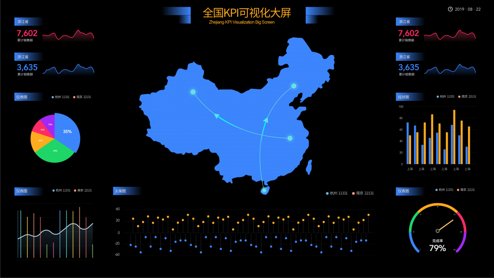

我们以前讲过新零售的人货场重构，旨在基于大数据环境，使用AI等现代化技术赋能企业管理和决策。那么对于大数据来说，智能或是专业的分析是必不可少的。很多企业已经开始使用DataFocus、Tableau等大数据分析工具对企业大数据进行分析和洞察，以提供最精准的数据结论或可视化视图来辅助决策。那么对于很多TO C企业来说，客户数据是企业大数据的重要组成部分，对于客户数据的利用效率关乎整个企业的运营成果。我们以前介绍过客户的生命周期，本文将对于活跃老客进行详细的数据分层分享。

首先我们要明确为什么要进行分层，目的是为了更好的培养老客户，促成转化。我们可以看我们平时针对活跃老客的基本服务和高频营销数据，比如很多商家都在做的每年4-5次纯优质客户关怀，包含短信、邮件、挂历、春联、小样等，以及每月优质活动。这些数据的响应率和反馈情况如何。

然后就可以基于以上数据分析结果开始细分。有人会问了，上述分析结果筛选出的客户群体已经非常优质了，还需要继续细分吗。虽都优质，从数据角度来说，洞察永远是无止尽的，可更精细化营销。如根据产品客单价分布图，确定客户客单价分布图，日常营销分别给予不同的策略和思路。

举个例子，数据来源于我们合作的某温州耐用品商家真实数据。

其产品类目分钱包、皮带、手拿包、拉杆箱;

价格分别100-500、100-800、200-1500、300-3500；

可以简单粗暴的进行人群数据交叉组合：

低档：100-200钱包、100-300皮带、200-400手拿包、300-600拉杆箱；

中档：200-350钱包、300-550皮带、400-1000手拿包、600-1500拉杆箱；

高档：350-500钱包、550-800皮带、1000-1500手拿包、1500-3500拉杆箱。

随后看每一个档位的每一个分组的销售数据和服务数据即可，就能更加精细化的切中客户的利益点。毕竟数据分析最后的价值还是决策和实施。
