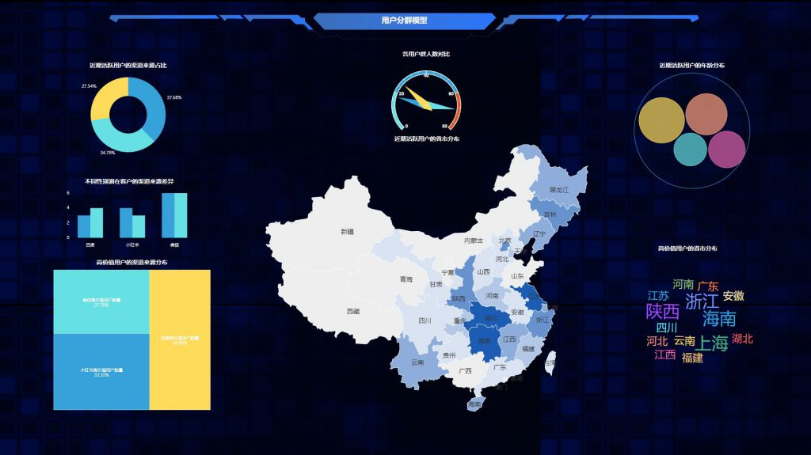

我们常认为决策者都需要利用大数据来辅助决策，但其实从动机来说，对于大数据辅助决策真正感兴趣并且会实施的，还是民营企业或新兴企业的决策者。这种动机和年龄、状态等因素无关，只和其企业成长环境相关。

最近一段时间有相当多的企业进行大规模调整，比如腾讯进行了大规模架构整改，而有一大票高管在此洪流中不幸失业后却找不到工作尤其是大企业。因为他们成长环境非常的稳当，没有来自外部竞争的压力，大数据只是他们好奇的一个阶段。DataFocus在接触一些大企业的过程中，他们也只会说“wow你的搜索式分析是骗人的吧，不可能的吧”以产生兴趣，但不会去实施，后来就没有了下文。他们并不想用新的东西去动摇原本的稳定。

因此，很多网校请所谓高管来讲大数据管理，他们只讲得出见到的案例，对于实施一窍不通。而新兴企业却积极在各个地方尝试，不放过任何一个新玩意儿。企业管理每时每刻都在发生变化，很多管理者只是空有数字化决策的形式甚至空置了一个系统，罔视数据甚至反感数据挑战他的经验权威。

因此，管理者应该顺应潮流，与时俱进，用数据思维武装自己，使管理决策更加科学合理，从而更加理性地处理商业环境中的各种关系。随着数据技术的发展，企业所面临的外部环境会更加复杂，需要处理的数据也会越来越多。如果企业还停留在传统的思维模式中，那么在市场竞争中必然会出现一个利用数据快速决策、高效处理问题的竞争者。不重视数据的公司只会在商业竞争中处于被动地位。
