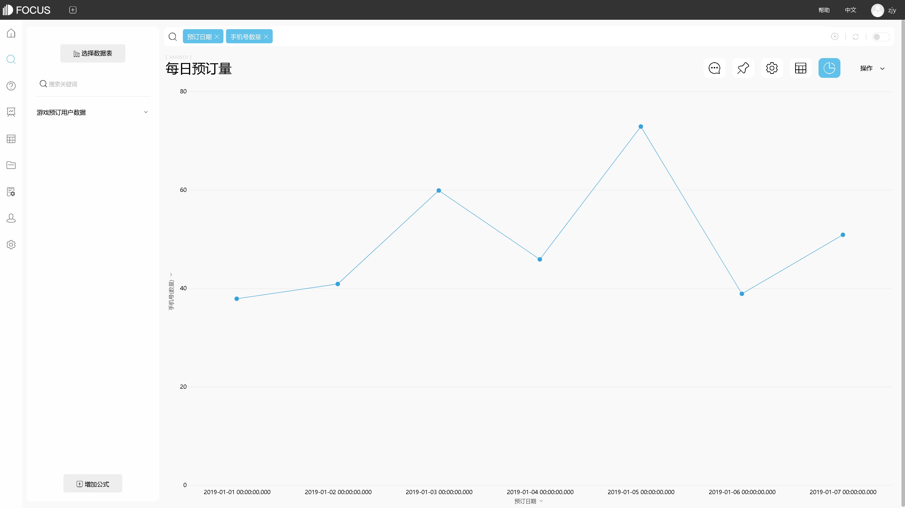

产品发行预热期的“预订用户分析”

例如国内的游戏行业，从产品立项到封测期间，一般都会有三四个月的推广宣传，以时间节点为轴线制定市场预热宣传方案。在预热期阶段，为了找到核心用户并预估数量、协助管理人员进行战略定位和帮助营销人员完善预热宣传方案并进行有针对性的投放，往往需要分析预订用户、预估预订用户转化率以及分析竞品等等。

今天，我们通过一份模拟的游戏数据并借助DataFocus系统先来了解下在游戏发行预热阶段的“预订用户分析”。

# 一、数据的获取

游戏产品的预订、预售、预约活动，主要是为了了解核心用户的数量和市场关注度。能从预订数据中获得的信息，主要是手机号码和操作系统数据，信息较少，不足以了解目标用 户的特征，因此需要对预订用户进行调研。主要调研渠道是用户在游戏官网提交预订(预约、预售)的手机号码后，填写的问卷调查信息。而根据预订用户的手机号码，可以关联到该用户在公司内其他游戏中的登录和付费数据。

因此，预订用户分析的数据，可来源于用户预订的数据、用户预订后参与调查问卷的数据、预订用户在公司其他游戏的登录和付费数据 三部分。

# 二、数据处理与分析

收集到调查结果数据后，需要去除问卷中无意义的数据、逻辑互斥的数据，再根据前期设计思路进行数据分析。

## 2.1 预订用户情况

### 2.1.1 预订用户量

在用户预订数据中可以获取到“预订日期”以及预订的“手机号”，统计每日的手机号数量，可以查看到每日游戏预订情况，了解游戏的热度。

图 1 每日预订量

### 2.1.2 各渠道预订量情况

用户的预订数据中可以获取到游戏用户的预订渠道，了解各渠道预订量占比。

如下图，在DataFoucs系统的搜索框中，直接输入数据的列名，并使用关键词“数量”统计出用户数。

图 2 各渠道预订量占比

可以看到，数据中预订用户的主要来源是PC官网和移动官网，分别占39.66%和26.72% 。

### 2.1.3 预订用户操作系统

由预定用户的操作系统信息，了解玩家的系统分布情况。如下图，由此预测游戏正式上线后，Android和IOS的用户比例接近6：4。

图 3 操作系统比例

## 2.2 预定用户来源分布

### 2.2.1 老用户来源

将预订用户的手机号码和公司内各游戏的登录账号进行关联，可以了解到预订用户中也是公司其他游戏的用户的情况。

以DataFocus系统为例进行分析：

- 先将预订用户数据和公司内各游戏的登录账号进行关联

图 4 关联

- 在搜索模块，使用公式对预订用户进行分类。

图 5 用户分类

- 再搜索分析出预订用户中新老用户占比。

图 6 新老用户占比

- 搜索分析出老用户的来源。（因为对两个数据表进行了左关联，所以使用“不为空”排除新用户数据。）

图 7 老用户来源

由此可知，在新游戏的预订用户中，约64%的用户同时是公司其他游戏的用户。老用户来源主要是卡牌类，排名第一的游戏占24.55%，说明这类游戏的用户和新游戏的用户有一定重合度。

### 2.2.2 新用户来源

预订用户中的新用户平时主要玩的游戏信息，则需通过调查玩家来获取。由此可以推断出该游戏外部用户的主要来源。

图 8 新用户来源

由图中可知，数据中新用户主要来自《乖离性百万亚瑟王》、《炉石传说》和《LOL》，分别占13.28%、10.33%、9.23%。

除此之外，还会分析来自公司其他游戏的预订用户付费情况；分析预订用户喜好、预订用户人口属性、预订用户地域分布；在游戏测试后，分析不同类型用户质量等等。更多精彩分析，等待大家去实现哦~
