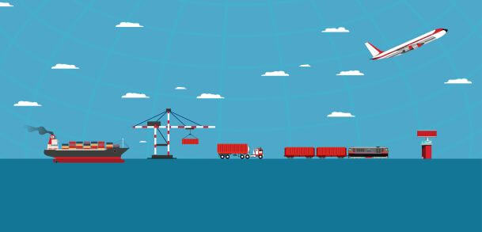
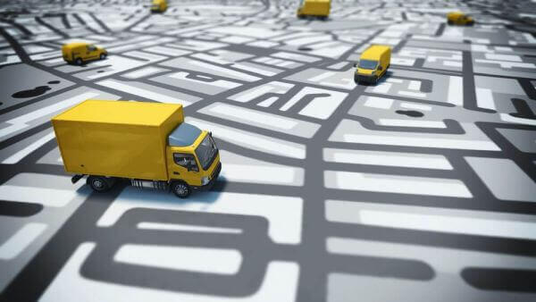

大数据正在彻底改变许多商业领域，[物流分析](https://www.datafocus.ai/infos/logistics-analytics)就是其中之一。物流的复杂性和动态性，以及对许多活动部件的依赖，可能在供应链中的任何一点造成瓶颈，使物流成为大数据的完美用例。例如，大数据物流可用于优化路线，简化工厂功能，并为整个供应链提供透明度，从而使物流和航运公司都受益。第三方物流公司和航运公司都同意。转述 Fleetowner 的一篇关于“第 21 届年度第三方物流研究”的文章，98% 的第三方物流公司表示，改进的数据驱动决策“对供应链活动和流程的未来成功至关重要”。此外，接受调查的 81% 的托运人和 86% 的第三方物流公司表示，有效使用大数据将成为“其供应链组织的核心竞争力”。

但大数据需要大量高质量的信息源才能有效发挥作用。这些数据从何而来？这份关于物流大数据的白皮书提供了大量可能的数据源，包括：

- 来自运营系统的传统企业数据
- 来自传感器、监视器和预报系统的交通和天气数据
- 车辆诊断、驾驶模式和位置​​信息
- 金融业务预测
- 广告响应数据
- 网站浏览模式数据
- 社交媒体数据

很明显，有很多方法可以为数据系统提供所需的信息。所有这些数据源和潜在用例让DHL 表示，大数据和自动化技术将导致“在制造、物流、仓储和最后一英里配送方面实现前所未有的优化水平”。

与许多其他行业一样，数据收集和数据管理正变得越来越大，专业人士可能需要这方面的帮助。[SaaS 商业智能工具](https://www.datafocus.ai/infos/saas-bi)的兴起正在满足这一需求，Gartner在一份报告中预测，在 2017 年，大多数商业用户将可以访问[自助式 BI](https://www.datafocus.ai/infos/self-service-bi-tools)。这种偏离“以 IT 为中心的 BI”的一个重要因素是，要求人们完全依赖 IT 来访问商业智能已经没有意义了。物流行业也很可能接受这一趋势。

无论如何，对于愿意利用大数据的物流公司来说，未来看起来是光明的。在本文中，我们将研究物流中的大数据示例以及一些可以激发您的想象力，让您跳出条条框框思考的好处。

## 1）可以加快最后一英里的运输

众所周知，供应链的最后一英里效率是出了名的低，其成本高达包裹总运输成本的 28%。导致这一结果的障碍有很多，包括：

- 对于大型送货卡车来说，在城市地区的目的地附近停放是一项挑战。司机通常需要在很远的地方停车，然后步行将包裹送到最终地址。然后，他们可能不得不爬许多楼梯或在高层建筑中等待电梯。
- 有些物品必须签收，如果客户不在家，则无法交付该物品。
- 送货人员必须格外小心，不要在最后一站损坏包裹，并且必须以专业的方式吧快递送给收件人。

除了这些挑战之外，很难确切地知道在交付的最后一阶段发生了什么。包裹通常会被跟踪到这一点，导致一些人说，最后一英里是交付数据的“黑匣子”。

大数据旨在解决其中许多挑战。麻省理工学院超大城市物流实验室主任马蒂亚斯·温肯巴赫在接受《华尔街日报》采访时详细介绍了最后一英里分析如何产生有用的数据。由于快速移动互联网和支持 GPS 的智能手机的低成本和无处不在，以及通过传感器和扫描仪传播的物联网，发货人能够看到送货过程从头到尾是如何进行的——甚至是最后一英里。

想象一下：一辆装有 GPS 传感器的 UPS 快递卡车在芝加哥市中心送货。在附近停车后，送货员的手机 GPS 会继续将数据流式传输到 UPS 中心，持续记录送货时间。这不仅对客户有价值——它使物流公司能够看到可用于优化其配送策略的模式。例如，Winkenbach 博士说，他的数据显示，“大城市的配送几乎总是通过建立多层次的系统得到改善，这些系统将较小的配送中心分散在几个社区，或者只是在车库或停车场预先指定停车位，让较小的车辆可以把包裹送到目的地。”

## 2) 可靠性将更加透明

随着传感器在运输车辆、航运和整个供应链中变得越来越普遍，它们可以提供以实王任何时候都更大的数据透明度。

这种透明度对托运人、承运人和客户都很有价值。如果货物迟到，承运人希望尽快知道，这样他们就可以防止供应链进一步出现瓶颈。运输公司可以通过显示他们按时交付的频率，综合使用这些数据与托运人进行谈判。

想象一下：物流公司在他们的所有配送车辆中都嵌入了传感器，支持 GPS 的智能手机可以覆盖任何缺口。第三方验证这些传感器的准确性，然后在物流公司竞标新合同时，使用来自这些传感器的可靠性和及时性数据。

这种开源、完全透明的信息可能会改变物流领域的商业运作方式。

## 3）路线将被优化

在本文开头引用的第三方物流调查中，70% 的受访者表示，“改善物流优化”是大数据在物流中的最佳利用。显然，每个人都在考虑优化问题。

为什么物流公司对优化如此感兴趣？有两个原因：它可以帮助他们节省资金并避免延迟发货。当你管理一个交付系统或供应链时，你必须在资源和车辆的过度使用和搁置之间寻找有个微妙的平衡。如果您将过多的车辆和资源放在一条运送路线上，那么您就会花费比实际需要更多的资金，并且可能使用了可以更好地利用在其他地方的资产。

但是，如果您低估了特定路线或运输所需的车辆数量，那么您就有可能让客户延迟交货，这会对您的客户关系和品牌形象产生负面影响。

除了优化的挑战之外，有效分配资源所涉及的因素也在不断变化。例如：

- 燃料成本可能会改变
- 高速公路和道路可以暂时关闭或建造新的
- 由于维修或新购置，您可以使用的车辆数量可能会发生变化
- 天气条件，无论是季节性的还是即时的，都在不断变化

大数据和预测分析为物流公司提供了克服这些障碍所需的额外优势。运输卡车上的传感器、天气数据、道路维护数据、车队维护计划、实时车队状态指示器和人员计划都可以集成到一个系统中，查看过去的历史趋势并给出相应的建议。

UPS 是大数据物流带来大量节约的一个真实例子。在检查了他们的数据后，UPS 发现卡车左转花费了他们很多钱。换句话说，UPS 发现转向迎面而来的车辆会造成更多的延误、燃料浪费和安全风险。

正如 The Conversation 网站上的一篇题为“为什么 UPS 司机不向左转，你可能也不应该”的帖子所说，UPS 声称它减少了 1000 万加仑的燃料，减少了 2万吨二氧化碳的排放，并且每年多运送 35万件包裹（在做出改变后）。1000 万加仑汽油是一大笔钱——这是一个巨大的好处，也是供应链中的大数据示例。

UPS 司机现在只有大约 10% 的时间左转，其余都是选择直行或右转。由于这种“仅在绝对必要时才左转”的策略，UPS 还将其使用的卡车数量减少了 1,110 辆，并将公司车队的总行驶距离减少了 2850 万英里。

## 4) 敏感商品以更高质量发货

保持易腐烂货物新鲜一直是物流公司面临的挑战。然而，大数据和物联网可以让送货司机和管理人员更好地了解如何防止因货物腐烂而产生的成本。

例如，假设一辆卡车正在运送一批冰淇淋和甜点。您可以在卡车内部安装一个温度传感器来监控内部货物的状态，并将这些数据与交通和道路施工数据一起提供给中央路由计算机。

如果最初选择的路线会导致冰淇淋融化，这台计算机可以提醒司机，并提出替代路线。

## 5) 仓库自动化和供应链

很快，大数据与自动化技术和物联网相结合，可能会使物流成为一种完全自动化的操作。

大数据允许自动化系统通过智能路由许多不同的数据集和数据流来运行。例如，亚马逊的物流中心已经实现了自动化，这些中心使用橙色的 KIVA 小机器人从货架上抓取物品。

此外，如果您住在距亚马逊中心 30 分钟的范围内，亚马逊还拥有自动无人机，可以将物品运送给您。

鉴于优步和其他公司已经在进行自动驾驶汽车的试运行，不难想象，从装卸到驾驶，再到最终交付，整个供应链都可以实现自动化。

也许，人类仍将参与城市地区的最后一英里的配送，使用自行车或动车在繁忙的城市街道上穿梭，为交付提供令人放心的人工组成部分，而郊区将有自动驾驶卡车或无人机进行交付。

我们正处于大数据改变物流性质的风口浪尖上。物流中的大数据可用来提升最后一英里配送的低效率，为供应链提供透明度，优化配送，保护易腐烂的货物，并使整个供应链实现自动化。

物流公司意识到了这些可能性，并正在努力做出更多数据驱动的决策。利用传感器和物联网，结合 [商业智能软件](https://www.datafocus.ai/infos/best-bi-tools-software-review-list)，具有前瞻性思维的公司已经在降低成本，提高客户满意度。
