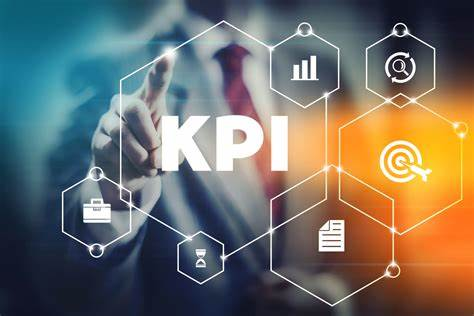

故事拥有将信息转化为令人信服的叙述的独特能力，从而显著提高业务成功率。

通过获得对业务数据的集中访问，并以遵循逻辑的方式呈现业务数据。更重要的是，如果您就特定主题或专业领域能提出您宝贵的见解，您将脱颖而出，成为某领域的领导者。

今天我们将继续讨论用数据讲故事拥有的强大力量，同时它在实际案例中发挥的作用。

**什么是数据讲故事？**

数据讲故事的过程，是将数据驱动的分析转换成一种易于广泛访问的视觉格式的过程，并且通过利用分析信息来影响业务决策、战略或行动，最终转变为可执行的见解。

此外，数据故事的力量就在于我们对传达信息的情节和叙述的自然亲和力。利用正确的工具，采用KPI指标及其它信息，更有逻辑地、更简单化地呈现信息。

数据讲故事也有很多促进业务的好处。

**数据讲故事的好处**

故事有助于理解我们周围的世界，而这个概念正是利用数据讲述故事的核心。

根据Skyword进行的一项研究显示，和全文本文章或白皮书相比，具有文字和视觉效果混合的内容能推动观众34%的参与度。

你可以利用数据可视化、视觉性分析和相关见解来创造一段引人入胜的叙述，从而赢得业务。

以下是知道如何用数据讲述故事的关键优势：

1. 分享：故事帮助我们理解一个复杂和偶尔令人困惑的世界。通过使用正确的数据讲述故事，可以测量、提取并且跟踪相关的数据，把数据放入特定业务目标的可使格式，从而使你的分析信息可供更广泛的受众访问。通过这样做，您将能够以激励、鼓励来自利益相关者认同的方式分享重要的信息。
2. 决策：通过强大的KPI数据看板讲述数据故事，您可以在业务的关键点推动整个组织的改进决策。如果您的听众能够按照您讲述的逻辑和节奏并且能从您的PPT中提取正确的信息，他们将获得基于严密数据的战略所需的洞察力，从而使组织整体效率更高、更经济、更成功。
3. 高效：数据为主导的世界中，知道要挖掘哪些见解可能会让人望而生畏。但是，正确地使用数据讲故事，不仅可以简化分析过程，而且还能以高效的方式安排数据并节省您的时间。
4. 行动：如果听众能受到您展示的东西的启发，并且在深刻的层面上理解了它，他们会愿意按照您的预期付出行动。如果您的听众是公司内部员工，他们可能会制定一些加强公司营销工作的举措；又或者，您向外部利益相关者演示，可能会促使他们增加投资。

**如何用您的数据讲述故事？**

为了知道如何将这一概念放到实际的角度，我们来看看概念的组合以及案例，切实可行的建议以及用数据讲故事的模板。

1.将指标转化为可操作的概念

我们制定指标最终是为了指导实际行动。

将定量数据转化为结果驱动型叙述的最有效方式之一，就是使用关键绩效指标（KPI）。

通过借助交互式BI数据看板的力量，您可以选择合适的业务KPI，并使用图形、图表和视觉效果的完美组合来构建一段数据故事。

 2.通过绘图改进流程 每一个完整的故事，无论是什么主题或者形式，都有明确的情节：一个开始，一个中间，一个结束。

通过数据讲故事的模板、工具和平台，您可以将情节填充为可视化图表，从而推动叙述向前发展，同时用最有效的方式传递信息。

当然为了更有逻辑的阐述，您可以在概述开头、中间和结尾时考虑讲述的主要目标。

当整体故事框架都已确立，您应该开始将绘图填充到KPI和可视化内容中，这些可视化不仅代表您想传达的信息，而且与您想呈现的数据最相关。

通过逻辑完成绘图并且从BI工具中使用正确的可视化图表来充实绘图，这可以帮助您简化组织内部的流程，从而提升效率和生产率。

 3.简化和建立连接 通过数据讲故事的力量，您可以连接各个信息点，简化想法，并且建立一种连接，而这可以给您的业务要给新的战略方向感。

专注于在您的业务见解和听众之间建立互动对话，用历史、实时和预测数据的组合来推动您的信息叙述，财务报告或是战略发展都可以。

此外您害应该注意在语言和视觉效果之间创造一种平衡，让听众更容易理解和接收您的业务见解。

**通过数据可视化讲述故事**

通过数据可视化使用数据讲故事是您与听众分享故事的最佳方式。

为了通过数据可视化来展示讲故事的力量，这里有一些截然不同但同样强大的视觉效果，用于您的见解构建有效的叙事。

**网络浏览量数据大屏实例**

**特色KPI：**

年收入总额

年利润总额

运输成本费用

仓储费用

包装费用

装卸费用

这款专注于成本和利润的分析大屏主要用于物流行业，它包含了多种KPI，围绕收入、成本、利润构建全面的数据故事。

通过利用物流行业分析大屏，可以使用图表和图形信息的动态组合，并构建不同区域业务相关的有效叙述，创建令人信服的情节，从而提高收入和节约成本，并充分提升员工参与度的战略。

**RFM客户价值分类模型实例**

特色KPI：

消费平均时间间隔

平均消费次数

平均消费金额

这款图形组合是基于用户消费行为分析的KPI，并将客户按照不同消费行为习惯分群。它是个人可视化在传达重要信息方面具有多大影响力以及如何融入更广泛的叙述的一个最佳示例。

除了用户消费情况之外，还有可能将此KPI置于围绕客户成功和消费流程的故事的核心。

正如英国诗人罗·勃朗宁所言“故事永远是旧的，也永远是新的”，您讲述的故事中包含的商业见解是在持续更新的。
