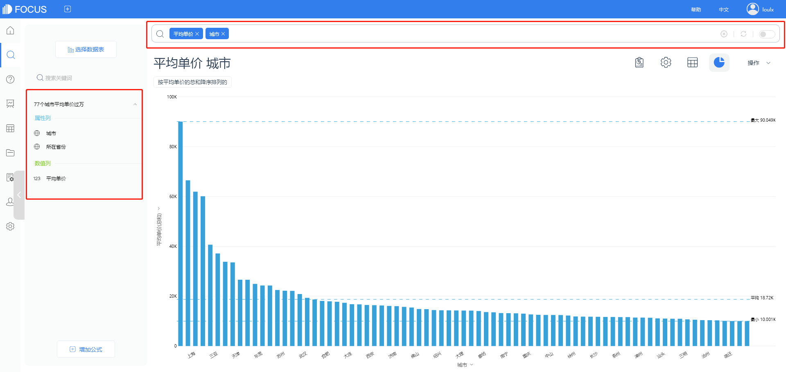

对于新零售行业来说，无论是线上店铺还是线下实体店，活动的策划和举办是必不可少的，是吸引新客、维护老客并让老客变为忠实粉丝的一大利器。电商崇尚“折腾”，按一定频次地“霸占”客户的眼球和时间，并通过一定的优惠手段及积分等项目让自己的客户群体更加的有活力。很多商家都会以数据分析的结果去赋能下一次活动，无论是聘用专门的数据分析师还是使用类似于DataFocus、Power BI等自用数据分析工具。

所谓万事开头难，很多商家头疼的就是活动主题和活动目的的确立。以前我们说过一个左右脑的理论，其实类似的，活动主题就是右脑思维，而活动目的就是左脑思维。因此，活动应有画面感的活动主题来让消费者更有认知感，以及数据画的活动目的让店铺更好的数据复盘和采集新数据。本次我们以春季新风尚活动为例。

首先是设置活动主题。我们要注意的是话题的新颖度，可以依据各类日热点数据进行分析参考。比如“我想去旅游”和“世界那么大，我想去看看”给人的感受与吸引度是完全不同的，所以在活动主题创建的时间要给买家营造一种画面感。举个我们合作商家的例子，整个新风尚活动里面，分为三个运营节奏点，预热期、热卖期和收尾期，分别是预热期的重新遇见你，热卖期的改变重现在开始，最后收尾阶段，重生更美的你，通过这三个阶段对店铺的上新产品的透出，销量的引爆，最后的活动收尾进行实施。取这三个主题名字的目的就是给我们的买家营造画面感：首先给予每一个买家一个重新遇见更美的自己的机会；机会给到了，就来店铺做改变吧；最后下单付款，收到衣服了，得到一次重生，变成了内心那个更美的自己。既然画面已经营造出来了，接下来就是重头戏：数据化的活动目的。

我们还是以我们合作商家为案例，整套方案的目的有三点，皆可数据化。一、新增年轻粉丝数量。就是字面意思吸引年轻客群的新粉丝进店的数量。二、新增有效客户占比。三、春夏新款销量。以此目的来引爆春夏新品的销售。

数据化的活动目的看起来非常简单，但其实细分下去还是会有不少的工作量，可以以项目制实施或是借助一些BI工具完成，真正实现店铺“左右脑”协同高效工作。
