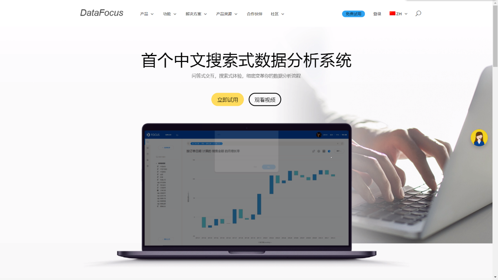
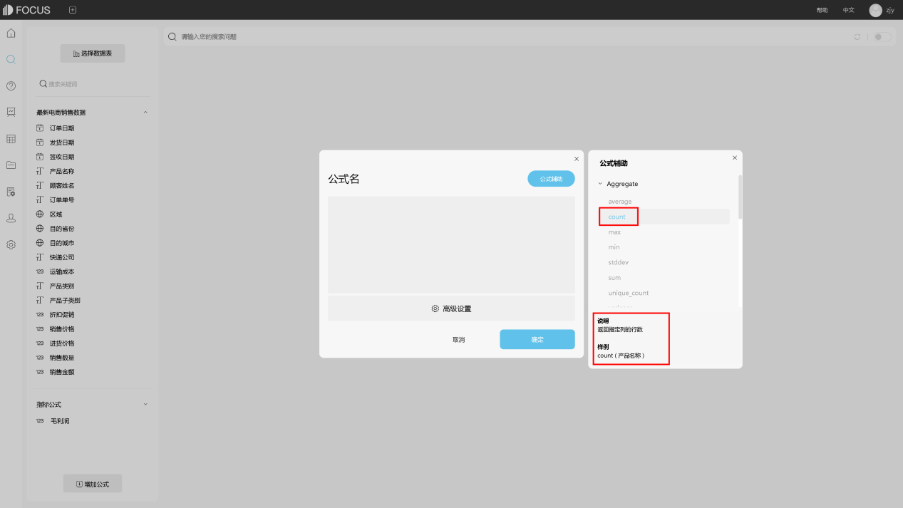

现如今进入大数据时代，无论是企业还是个人，都能深刻的感受到节奏在加快，信息在爆炸，知识在迭代。对于企业来说，有很多方法去应对大数据时代所产生的机遇和挑战，比如雇佣数据分析师或干脆使用DataFocus或tableau等数据分析工具。企业尚在大数据环境中深谙生存之道，而能在大数据环境中意识到这一点并不断迭代的个人，却寥寥无几，大部分人意识到了这个问题，但却一直徘徊在所谓10000小时的大师之路上。但其实，从新手到大师，就是对自己本身不断的数据分析以及策略实施行为。

很多人会有共鸣，在这个飞速发展的时代，我们总想通过不断的学习，去追寻最新的知识，最新的技术，让自己产生最新的数据，生怕被这个时代所抛弃，然而一个不可否认的事实是在这个信息爆炸的时代，信息和知识产生的速度远远超过我们所能接受的速度，也就是说我们会被这个社会的发展速度越抛越远，凭借个人的能力你永远无法赶上这是时代的发展速度。那我们要怎么办？

我们反而应该反思这样一个问题。每天我们都在利用大量碎片化的时间在学习，这种学习造成的结果就是我们涉及面很广，似乎什么都见过，什么都懂一点，但是又没办法深挖，就像一大堆数据，看似非常丰富，其实没有什么地方能进行深度的钻取。而且看着每天身边的朋友分享的各种朋友圈干货，似乎觉得自己要是不学习，先别说被时代抛弃，首先要被身边的人所抛弃了。

我们可以给这群人下一个定义，或者说对自己的数据情况并不明确的人下一个定义，我们都是知识焦虑者。我们期望学到更多的干货，得到更多的数据。但是这些干货和数据我们却不知道怎么用，也没有琢磨怎么去用，因为数据更新的速度太快了，我们还来不及消化，新的数据就来了，旧的数据就过时了，我们一直在引入新的数据，但是却一直只是浮于皮毛，如此陷入循环，以至最后及其焦虑。

怎么破解知识的焦虑，首先我们要知道我们在学什么。我们可以把个人的数据导入分为三个层次。从浅到深依次是

1、给与启发阶段。我们每天大部分的学习是给我们启发，碎片化的，刷朋友圈，看书，包括一些公众号，和一些我们花钱买的类似于5分钟商学院的语音栏目等等，这个阶段是我们大量获取数据的阶段，但是大量的数据是无效的，对我们并无大用，并不能对能力的提升有很大的促进，但是这个阶段又是不可或缺的，因为没有这个阶段就没办法进入到下一个阶段。

2、构建方法阶段。当我们获得了数据，我们开始实践数据分析后的内容，然后总结经验，注意在这个阶段我们不仅仅是看了，对于数据分析了并找规律以及总结，但是仅仅有总结还不够，还不足以快速的转化成为能力，

3、举一反三阶段。真正能力的提升是在第三阶段，也就是再遇到第二阶段我们所遇到的问题的时候，我们举一反三之后，这样才能够将数据本身变成我们的能力。这也就是解决知识焦虑者最好的方法——自我数据分析及挖掘。

