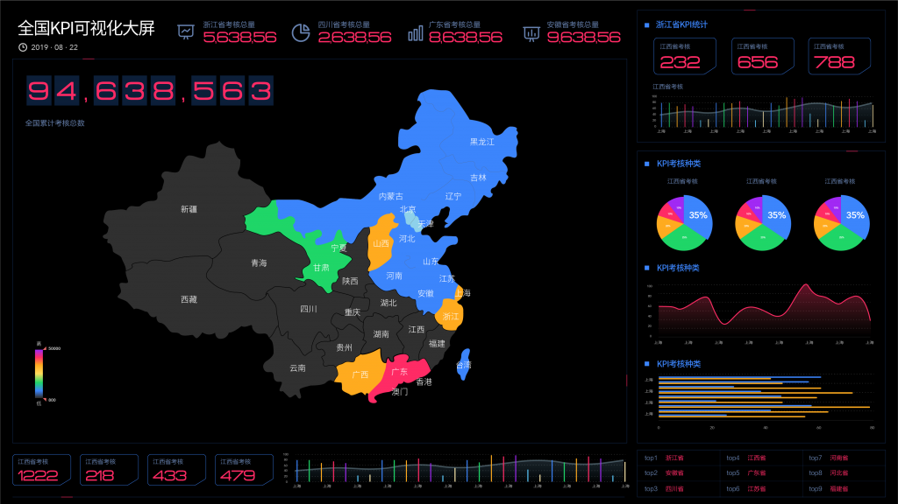

大数据和物联网技术的蓬勃发展，使得企业组织的数据沉淀越来越大，信息化行业多年的深入积累也为企业储存了大量有价值的商用数据。如今，全球经济扩张乏力的大环境下，传统的增量式扩张模式渐渐变得无效，企业需要通过苦练内功提升组织竞争力，重塑竞争优势。商业智能BI产品可以通过打破企业数据孤岛，联通业务，从企业的业务数据中挖掘价值，为企业制定更加精细的运营政策提供辅助，而变得越来越受重视。

市场上的商业智能BI产品种类繁多，既存在十年前的产品和技术，一些创新的技术和产品也层出不穷。那么企业该如何挑选合适的BI产品呢？ 笔者前期帮助企业进行BI选型时也曾遇到过多个坑，这里分享给大家，希望帮助您避免重犯同样的错误。

1、通过需求制定合理的功能边界

大部分时候，BI的需求都是由领导直接发起，需求都不是一开始就很明确的，这需要你结合公司实际情况和老板的想法，细心的整理好需求。举个例子，比如我们的BI项目需求，就是老板忽然有一天把我叫到办公室，给我看了一篇文章，然后告诉我，我们公司也得整一个。一开始遇到这种事情都会有点懵圈。正确的做法是看过这篇文章后，和老板认真的交流一次，了解清楚，她想通过BI产品解决哪些问题。

这里我整理了以下个要点：（1）、我们有哪些数据需要进行分析？数据的即时性要求是怎样的？（2）、有哪些人要用，他们希望用BI解决什么问题？（3）、项目谁来落实，需要做哪些准备工作？（4）、大致预算是多少，有明确的收益期待吗？

2、结合使用场景挑选产品功能

根据上面列出来的问题，你要一一去解答。可以说，很好的回答了以上问题，你就可以清楚的对商业智能BI产品的功能边界进行界定了。比如，需要进行分析的数据，如果包含了多个业务系统，那就的搞清楚，这些业务系统的数据库型号、数据表结构，是否清楚的掌握这些知识。数据量较大的，就需要DataFocus这种带有数据仓库功能的BI产品。此外，商业智能BI的功能边界业界并没有标准的定义，有的BI产品并没有数仓功能，或者需要另外核算价格；有的BI产品对大屏展示支持并不友好，有的BI产品在大数据量的情况下，效率很低。还有些BI产品，需要工程师写SQL代码才能进行分析。除此之外，还有许多细节的功能点，比如是否支持填报、数据库直连、嵌入式分析等等。

如果不能清楚的确定BI产品的功能边界，或者考虑到未来的可扩展性，可以考虑采用DataFocus这种全栈式BI产品，包含从数据抽取、同步到报表分析、智能分析和机器学习全部技术栈，用户可以从较低的版本逐步升级到包含所有功能的高级版本，所有的数据分析工作都可以在其中完成。DataFocus还支持私有化部署，并且能够按用量付费，用户的BI建设可以循序渐进，这样可以有效控制项目建设风险。
