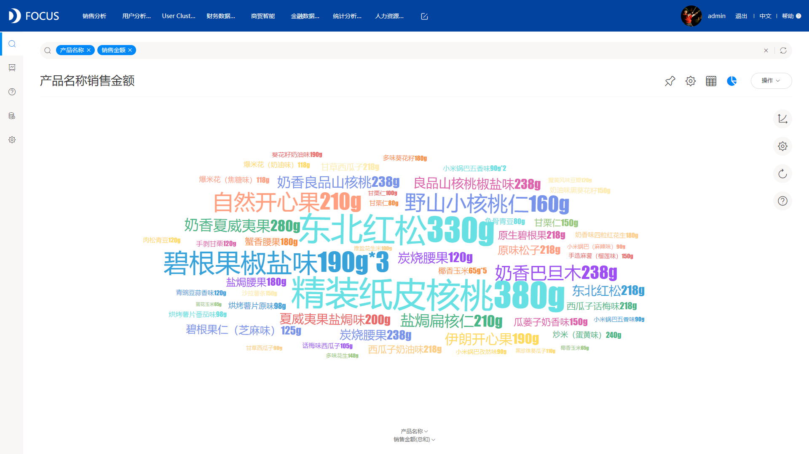
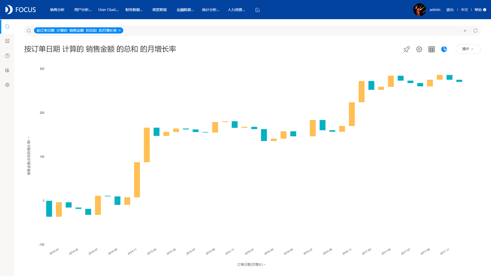

BI的本质是技术和工具的集合，通过处理原始数据，产出对商业行为有价值的洞察。那自助式BI又是什么？自助式BI主要是相对于传统式BI，自助式BI面向的是不具备IT基础的部门业务人员，而传统BI，主要面向于专业的IT人员或者数据分析专家，相比于传统BI，自助式BI更灵活更易于使用，而且一定程度上也摆脱了各业务部门对IT部门的依赖，自助式BI的出现标志着商业智能分析正在从“IT主导的报表模式”向“业务主导的自助分析模式”转变。

DataFocus，就是一款新型的自助式BI，为什么说新型，因为其采用的交互方式不同于其他自助式BI，非常有创新性。目前市场上基本采用的都是拖拽的交互方式或者是写代码的方式，而DataFocus，采用的是自主开发的中文自然语言搜索的方式，这种搜索式分析有什么优势呢？

1、简单高效。搜索，类似于谷歌搜索，搜索框内输入问题，系统对你的问题自动识别分析，实时地返回搜索结果，操作非常简单，只要会搜索的都会使用DataFocus进行数据分析，而且配合DataFocus的智能提示功能，在输入内容时，系统会猜想用户的下一次输入，并且进行智能提示，用户只需要根据提示进行选择即可，不需要自己实际手动输入内容。

2、化繁为简。在数据分析过程中，经常会遇到计算某些增长率，同比，环比或者分组统计等，在一般的数据分析工具中，需要经过一些计算处理转换配置，然后才能得到想要的结果，但是在DataFocus中，可以直接在搜索框内输入相关的词句，系统会自动计算并且实时返回想要的结果，无需多余操作或者配置。

环比

DataFocus除了数据分析非常简单之外，可视化功能也不弱，可视化图表样式多，制作简单，而且效果也不错，如下图。

