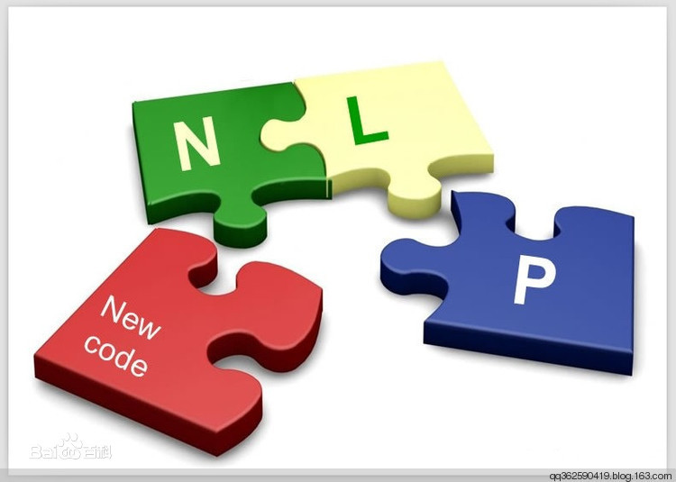

自然语言（Natural language）通常是指一种自然地随文化演化的语言，如汉语、英语、日语都是自然语言的例子，而世界语则为人造语言。人类是会说话的高等动物，拥有自然语言及其智慧能力是人类的基本特征。而为了让计算机之间互相交流，人们让所有计算机都遵守一些规则，计算机的这些规则就是计算机之间的语言。不同人类语言之间需要有翻译才能相互理解，那么人类和机器之间是否可以通过“翻译”的方式进行交流呢？[NLP](https://www.datafocus.ai)就是人类和机器之间沟通的桥梁。

自然语言处理（Natural Language Processing，简称NLP），就是用计算机来处理、理解以及运用人类各种语言，是人工智能（AI）的一个子领域，是研究计算机处理人类语言的一门技术。对于人类来说很自然的内容对于计算机而言却非常困难，因为存在大量非结构化数据、缺乏正式规则以及缺少实际上下文或意图。因此，机器学习和人工智能（AI）获得越来越多的关注，并呈现出良好的发展势头，并且人们越来越依赖计算系统来通信和执行任务。随着 AI 越来越复杂，[自然语言处理 （NLP）](https://www.datafocus.ai)也将随之变得复杂。虽然 AI 和 NLP 这两个术语可能会让人联想到未来机器人的场景，但其实我们的日常生活中已存在 许多 NLP 发挥作用场景。

## 电子邮件筛选器

电子邮件筛选是 NLP 早期最基础的在线应用之一。最开始的垃圾邮件筛选器，可以发现指示垃圾邮件信息的某些字词或短语。但是目前功能已经得到升级，NLP 更加普及、更新颖的应用之一是 Gmail 的电子邮件分类。系统根据电子邮件的内容识别电子邮件属于三个类别中的哪一个（主要、社交或促销）。对于所有 Gmail 用户而言，此功能使收件箱保持可管理的大小，您可以快速查看和回复相关的重要电子邮件。

## 智能助手

智能助手（例如 Apple 的 Siri 和 Amazon 的 Alexa）可通过语音识别推断含义并提供有用的回复。我们已经习惯于说“你好 Siri”，然后提出问题，她会明白我们所说的话并根据语境做出相应的回答。

## 搜索结果

搜索引擎使用 NLP 根据类似的搜索行为或用户意图来显示相关结果，因此普通人无需成为搜索词专家即可找到所需的内容。

例如，Google 不仅会在您开始键入文字时预测哪些热门搜索可能适用于您的查询，而且会基于全局（而不是确切的搜索词）来识别您所需的内容。有人可能会在 Google 中输入航班号后看到航班状态，可能在键入股票代码后看到股票信息，或者在输入数学公式时看到计算器。当您完成搜索时可能会看到这些变化，因为搜索中的 NLP 会将模糊查询与相关实体相关联，并提供有用的结果。

## 预测性文本

自动更正、自动填写和预测性文本等功能在我们的智能手机上很常见，我们已经习以为常。自动填写和预测性文本类似于搜索引擎，因为它们都会根据您键入的内容预测要说的话，然后完成后面的内容或建议相关内容。自动更正有时甚至会更改字词，使整体信息更有意义。它们也会向您学习。随着您使用的时间增加，预测性文本将根据您的个人语言习惯进行调整。

## 语言翻译

借助 NLP，在线翻译人员可以更加准确地翻译语言，并提供语法正确的结果。尝试与使用其他语言的人交流时，这非常有用。此外，从其他语言翻译为您自己的语言时，现在工具可根据输入的文本识别语言并翻译出来。

## 数字电话

我们都听到过“此通话可能会被录音用于培训目的”这句话，但我们很少好奇这意味着什么。原来如果客户感到不满，这些录音可能会用于培训目的，但大多数时候，这些录音会进入数据库，供 NLP 系统学习并在将来做出改进。自动化系统将客户呼叫转至服务代表或在线聊天机器人，然后他们会针对客户请求回复有用信息。这种 NLP 实践已经被包括大型电信提供商在内的许多公司所采用。

## 文本分析

文本分析使用不同的语言、统计和机器学习技术，将非结构化文本数据转换为有意义的数据以进行分析。

虽然情绪分析听上去对品牌而言很难（尤其是在拥有庞大客户群的情况下），但使用 NLP 的工具通常会搜索客户交互（例如社交媒体评论或评价，甚至是品牌名提及）以了解所述内容。分析这些交互有助于品牌确定营销活动的效果或监控热门客户问题，从而决定如何加强服务以提供更好的客户体验。NLP 促进文本分析的其他方法包括关键字提取以及在非结构化文本数据中查找结构或模式。

## 数据分析

随着越来越多的 BI 供应商向数据可视化提供自然语言接口，自然语言功能正在集成到数据分析工作流。例如，更智能的可视化编码，根据数据的语义为合适的任务提供最佳可视化。这为人们提供了更多机会，使他们能够利用自然语言语句或由几个关键词（可解释和赋予含义）组成的问题片段来探索他们的数据。

应用语言来调查数据不仅增强了可访问性级别，而且减少了跨组织分析的障碍，覆盖范围超越了预期的分析师和软件开发人员。

## 第一个中文自然语言搜索式BI

DataFocus 就是这样一款利用了 NLP 技术，将自然语言通过神经网络转化为计算机可以识别的数据库查询语言的智能[搜索式 BI](https://www.datafocus.ai) 产品。用户通过语音（手机端）或者键盘输入后，DataFocus 会将输入的自然语言转为语言元模型的形式，通过语义解析引擎，转化为机器可以理解的数据库语言。最后通过预置的查询引擎和可视化引擎，自适应地选择最适合的图形进行输出。

目前，DataFocus的[NLP](https://www.datafocus.ai)引擎已经经过数十亿次使用，每次都能返回精确的结果，极大地提升了数据分析与可视化的效率，让数据分析师和业务人员都能享受到NLP带来的变革。
