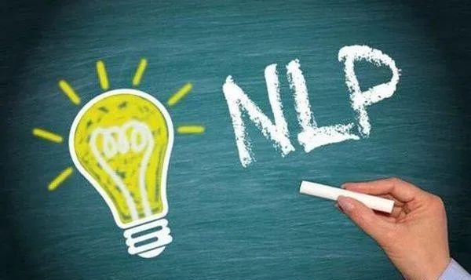

##  **一、什么是自然语言处理（NLP）**

自然语言处理（Natural Language Processing，NLP）是计算机科学，人工智能，语言学关注计算机和人类（自然）语言之间的相互作用的领域。自然语言处理，是指用计算机对自然语言的形、音、义等信息进行处理，即对字、词、句、篇章的输入、输出、识别、分析、理解、生成等的操作和加工，实现人机间的信息交流，是人工智能、计算机科学和语言学所共同关注的重要问题。自然语言处理的具体表现形式包括**机器翻译、文本摘要、文本分类、文本校对、信息抽取、语音合成、语音识别**等。

用自然语言与计算机进行通信，这是人们长期以来所追求的。因为它既有明显的实际意义，同时也有重要的理论意义：人们可以用自己最习惯的语言来使用计算机，而无需再花大量的时间和精力去学习不很自然和习惯的各种计算机语言；人们也可通过它进一步了解人类的语言能力和智能的机制。

## ****二、自然语言处理的发展趋势****

趋势1：语义表示——从符号表示到分布表示。举个例子，荷兰和德国这两个国家名是两个词。如果我们把这两个词放到一个语义的空间里，把它们表示为连续、低维、稠密的向量的话，就可以计算不同层次的语言单元之间的语义相似度。

趋势2：学习模式——从浅层学习到深度学习。基于浅层模型的学习（如SVM和逻辑回归），大多数的语言信息用稀疏表示（高维特征）表示，会导致诸如维数灾难之类的问题。基于密集向量表示的神经网络在各种NLP任务中取得了较好的效果。这一趋势是由词嵌入和深度学习方法的成功引发的。

趋势3：NLP平台化——从封闭走向开放。NLP领域的研究程序和数据越来越走向开放，各学校和各大企业提供的开放平台越来越多，使用的门槛也越来越降低。

趋势4：语言知识——从人工构建到自动构建。NLP领域需要的大量显性知识现在已经有自动的方法来构建，比如自动发现词汇与词汇之间的关系。

趋势5：对话机器人——从通用到场景化把对话机器人和特定场景结合，进行问答或者执行任务，做有用的人机对话。场景化对话机器人，非常有趣味性和实用价值。

趋势6：文本理解与推理——从浅层分析向深度理解迈进。给计算机一篇文章，让它去理解，然后人问计算机各种问题，看计算机是否能回答，答案来自于这篇文章。

趋势7：文本情感分析——从事实性文本到情感文本文本。情感分析在商业和政府舆情方面越来越得到广泛应用。

趋势8：社会媒体处理——从传统媒体到社交媒体。人们越来越多地把文本情感分析应用到电影票房的预测以及股票价格的预测中。

趋势9：文本生成——从规范文本到自由文本文本生成近几年很火，从利用模板生成规范性的文本到生成自由文本。

趋势10：NLP+行业——与领域深度结合，为行业创造价值NLP已广泛应用在金融、电商、医药、司法、教育等多个行业中。

## ****三、自然语言处理在BI领域的应用****

根据Gartner 2017年BI魔力象限分析报告显示，到2020年，自然语言处理和人工智能将成为90%以上BI分析平台的标准特性；到2020年，50%的分析查询将通过即时搜索，自然语言处理或语音处理的方式，甚至是全自动生成。

而汇数智通就是将自然语言处理技术运用在BI领域的先行者，在2018年便开始自主研发自然语言搜索式BI产品DataFocus，期望通过引入自然语言处理、知识图谱、推荐算法和机器问答等人工智能技术，使得DataFocus可以理解用户的数据分析需求，并帮助其快速完成分析任务获得数据洞见。

DataFocus能将用户的自然语句转为计算机可以执行的SQL语句，从而免除业务用户学习SQL语言的烦恼，成功将NLP应用于BI领域。用户输入数据问题后，系统会将输入的自然语言转为语言元模型的形式，通过内置的算法，经过深度学习模型将元模型转化为机器可以理解的数据库语言。最后通过DataFocus 预置的高性能搜索引擎和可视化引擎，获取数据结果并自动生成图形输出。

目前，DataFocus的NLP引擎已经经过数十亿次使用，每次都能返回精确的结果，极大地提升了数据分析与可视化的效率，让数据分析师和业务人员都能享受到NLP带来的变革。

[DataFocus搜索式分析](https://www.datafocus.ai)让你实现所思即所得，让业务人员在NLP技术的帮助下，零门槛使用数据分析。注册官网获取30天免费试用，让你提前感受未来。
