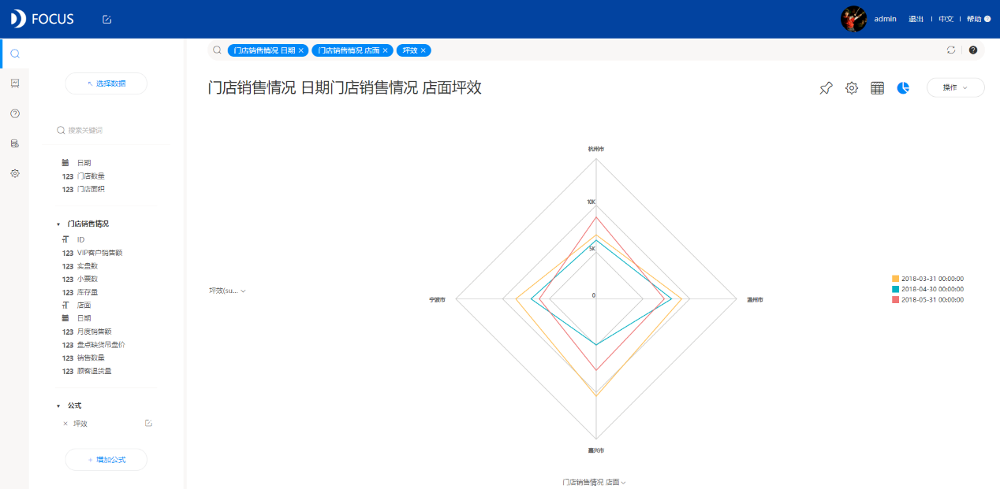

新零售，即企业以互联网为依托，通过运用[大数据](https://www.datafocus.ai)、[人工智能](https://www.datafocus.ai)等先进技术手段并运用心理学知识，对商品的生产、流通与销售过程进行升级改造，进而重塑业态结构与生态圈，并对线上服务、线下体验以及现代物流进行深度融合的零售新模式。而其中最重要的一环，便是以AI为基础的分析和决策系统，包含基于生产、物流等大数据的智能决策系统以及基于消费者画像的决策辅助系统，这为新零售企业的营销数字化提供了有利的先决条件。

在新零售客户经营策略中，做到营销数字化的基础，便是信息数字化后的智能数据分析。在人、货、场三者重构的基础上产生的大数据分析效率和精准性，决定了企业营销数字化策略的效益。一般来说，新零售客户经营方案，主要分为三个方面。

1. 服务体验建设。如何做到真正的场景革命，其要理便是深度做好客户的体验。以客户满意度和口碑为目标，进行全链路的服务细节打造。很多运营者会把重心放在新科技本身，诸如AR、VR系统在服装行业的“试穿”、“切换背景”等方面的应用。但其实核心还是背后的数据，是这些科技所带来的使用率、满意率、转化率等等，是在不同的业务场景下的实时数据分析，而AI要做的便是能够实时的响应这些“实时”。
2. 智能营销建设。针对纷繁的销售数据，客户数据以及商品数据等进行的有效数据分析，以在未来能够进行更精准的内容发放。比如想要看“最近一年怀孕三个月的母亲好评率最高的产品”，就需要结合不同的数据维度甚至不同的平台，进行整合，然后结合到SNS, EDM的营销手段。但是此过程必须要快准狠，所以需要AI手段进行辅助，如自然语言搜索技术等。
3. 忠诚度管理建设。目的是为了打造可持续发展的客户成长体系，而不是一次性生意。如会员体系的管理，包括等级、门槛、权益等。需要注意的是，这些指标并不是一蹴而就且长期有效的，需要根据会员在不同阶级的数量、升迁情况等数据不断进行优化。这一块数据分析在很多客户关系管理系统已经做得比较完备，但其缺乏的是能够实时转化为可视化结果的工具，以在不同类型图表下看到会员不同的静态/动态结果。

综合来说，新零售客户运营，不仅需要建立所谓的企业全景数据库，更重要的是对此数据库的使用效率和使用价值。AI的优势就在于能突破人类本身的极限，如自然语言搜索技术或是其他商业智能工具，能够实时的响应各类数据分析需求并秒出可视化结果，为新零售客户运营提供最完备的决策支持。
